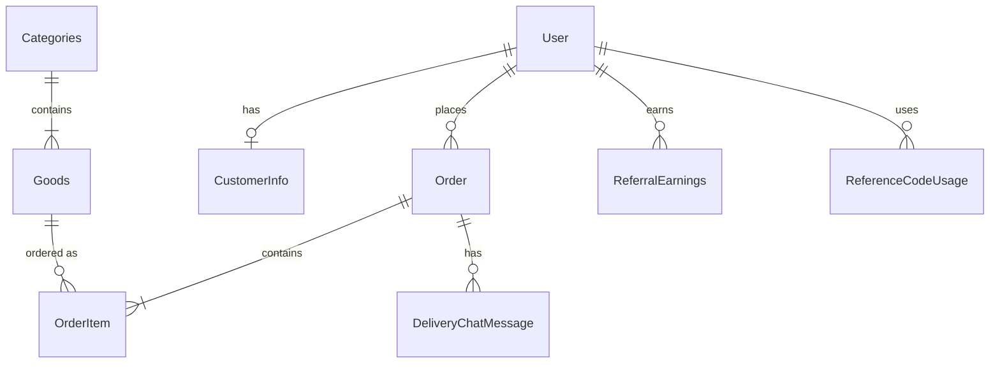
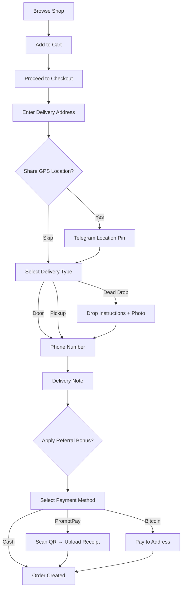
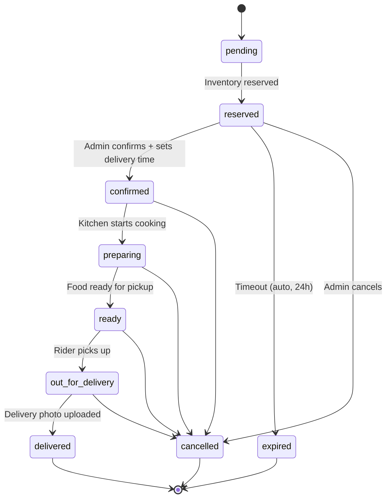

# 🛒 Telegram Physical Goods Shop Bot

A production-ready Telegram bot for selling physical goods with comprehensive inventory management, Bitcoin/cash
payments, referral system, and advanced order tracking capabilities.

[](https://www.python.org/downloads/)
[](https://docs.aiogram.dev/)
[](https://www.postgresql.org/)
[](https://www.docker.com/)
[](LICENSE)

---

## 🔀 Looking for Digital Goods Shop?

**📦 This version is for PHYSICAL GOODS** (inventory, shipping, delivery addresses, etc.)

**💾 Need to sell DIGITAL GOODS instead?** (accounts, keys, licenses, etc.)
👉 **Use this version**: [Telegram Digital Goods Shop](https://github.com/interlumpen/Telegram-shop)

The digital goods version features instant delivery, ItemValues storage, and automatic content distribution without
inventory management.

---

## 📋 Table of Contents

- [Overview](#-overview)
- [Key Features](#-key-features)
- [Architecture](#-architecture)
- [Requirements](#-requirements)
- [Environment Variables](#-environment-variables)
- [Installation](#-installation)
- [Bot CLI Commands](#-bot-cli-commands)
- [Order Lifecycle](#-order-lifecycle)
- [Background Tasks](#-background-tasks)
- [Database Schema](#-database-schema)
- [Security Features](#-security-features)
- [Monitoring & Logging](#-monitoring--logging)
- [Testing](#-testing)
- [License](#-license)
- [Contributing](#-contributing)
- [Acknowledgments](#-acknowledgments)
- [Support](#-support)
- [Additional Documentation](#-additional-documentation)

## 🎯 Overview

This bot is specifically designed for **physical goods** (not digital products) with:

- **Inventory management** with stock tracking and reservation system
- **Three payment methods**: PromptPay QR, Cash on Delivery, Bitcoin
- **Shopping cart** with checkout flow
- **GPS delivery** with Telegram location sharing + Google Maps links
- **Delivery options**: Door delivery, dead drop, self-pickup
- **Restaurant menu modifiers**: Spice level, extras, removals with price adjustments
- **Kitchen & delivery workflow**: Extended statuses with group notifications
- **Driver-customer chat**: Recorded message relay + live location tracking
- **Delivery zone pricing**: Distance-based fees with configurable zones
- **Thai language** (default), English, Russian
- **THB currency** with ฿ formatting (configurable)
- **Asia/Bangkok timezone** by default
- **Reference codes** for controlled user registration
- **Referral bonuses** for customer acquisition
- **CLI tool** for comprehensive shop administration

### What Makes This Different

Built for **Thailand restaurant delivery** on Telegram. Key features:

- ✅ PromptPay QR payment (90%+ of Thai users)
- ✅ GPS pin delivery with Google Maps links
- ✅ Dead drop / leave-at-door / self-pickup options
- ✅ Photo proof of delivery (required for dead drops)
- ✅ Driver-customer chat relay with full audit trail
- ✅ Driver live location tracking via Telegram
- ✅ Kitchen → Rider → Customer status workflow
- ✅ Menu modifiers (spice level, extras, removals)
- ✅ Distance-based delivery zone pricing
- ✅ Thai language + THB currency + Bangkok timezone
- ✅ Multi-stage order lifecycle (pending → reserved → confirmed → preparing → ready → out_for_delivery → delivered)
- ✅ Admin CLI for order & inventory management

## ✨ Key Features

### 🏪 Shop Management

- **Categories & Products**: Organize items by categories
- **Stock Tracking**: Real-time inventory with `stock_quantity` and `reserved_quantity`
- **Reservation System**: Items reserved for 24 hours (configurable) during checkout
- **Shopping Cart**: Add multiple items before checkout
- **Lazy Loading**: Efficient pagination for large catalogs

### 💰 Payment System

**Three Payment Methods:**

#### 1. PromptPay QR (Thailand)

- **Dynamic QR**: EMVCo-standard QR codes with embedded amount
- **Receipt Upload**: Customer uploads payment slip photo
- **Admin Verification**: Manual verification via bot button
- **Thai Banks**: Works with SCB, KBank, Bangkok Bank, TrueMoney, etc.

#### 2. Cash on Delivery (เก็บเงินปลายทาง)

- **Manual Confirmation**: Admin/rider confirms cash receipt
- **No Prepayment**: Customer pays upon delivery
- **Rider Notification**: COD amount displayed prominently for rider

#### 3. Bitcoin Payments

- **Address Pool**: Load Bitcoin addresses from `btc_addresses.txt`
- **One-Time Use**: Each address used only once per order
- **Auto-Reload**: File watcher automatically loads new addresses when file changes

### 🚚 Thailand Delivery Features

- **GPS Location**: Telegram location sharing during checkout + Google Maps links
- **Delivery Types**: Door delivery, dead drop (leave at location), self-pickup
- **Dead Drop**: Custom instructions + optional photo of drop location
- **Photo Proof**: Rider must upload delivery photo (required for dead drops)
- **Delivery Zones**: Distance-based pricing (Haversine formula from restaurant GPS)
- **Time Slots**: Configurable delivery windows (lunch, dinner, ASAP)
- **Driver Chat**: Recorded message relay between driver and customer
- **Live Location**: Driver shares Telegram live location for real-time tracking
- **Menu Modifiers**: Spice level, extras, removals with price adjustments

### 👥 User Management

- **Reference Code Required**: Users must enter valid code on first `/start`
- **User Types**: Regular users and admins (with different code creation privileges)
- **User Banning**: Ban/unban users via admin panel or CLI with optional reason tracking
- **Referral System**: Track who referred whom with configurable bonus percentage
- **Bonus Balance**: Accumulated referral bonuses can be applied to orders
- **Customer Profiles**: Saved delivery address, phone, order history

### 📦 Order Management

- **Order Codes**: 6-character unique codes (e.g., ECBDJI) for easy reference
- **Order Status**: `pending` → `reserved` → `confirmed` → `preparing` → `ready` → `out_for_delivery` → `delivered` (or `cancelled`/`expired`)
- **Delivery Information**: Address, phone number, optional delivery note
- **Delivery Time**: Admin-set planned delivery time
- **Reservation Timeout**: Configurable timeout (default 24h) with automatic cleanup
- **Order Modifications**: Add/remove items, update delivery time via CLI

### 🔧 Administration

- **Role-Based Access**: USER, ADMIN, OWNER roles with granular permissions
- **CLI Tool** (`bot_cli.py`): Comprehensive command-line interface for shop management
- **Statistics**: Real-time shop statistics and analytics
- **Broadcast**: Send messages to all users or specific groups
- **Export**: CSV export for customers, orders, reference codes

### 📊 Monitoring & Logging

- **Web Dashboard**: Real-time metrics at `http://localhost:9090/dashboard`
- **Health Checks**: System status monitoring
- **Structured Logging**: Separate logs for orders, reference codes, customer changes
- **Timezone Support**: Configurable timezone for all logs
- **Inventory Audit**: Complete audit trail of all inventory changes

### 🔒 Security

- **Rate Limiting**: Configurable limits per action
- **Security Middleware**: SQL injection, XSS, CSRF protection
- **Cryptographic Codes**: Secure reference code generation
- **Bot Detection**: Automatic blocking of bot accounts
- **Transaction Safety**: Row-level locking prevents overselling

## 🏗️ Architecture

### 📁 Project Structure

<details>
<summary>Project Structure Schema (click to expand)</summary>

```
telegram_shop/
├── run.py                          # Entry point
├── bot_cli.py                      # CLI admin tool
├── btc_addresses.txt               # Bitcoin address pool
├── requirements.txt                # Python dependencies
├── Dockerfile                      # Docker image definition
├── docker-compose.yml              # Multi-container setup
├── .env.example                    # Environment template
│
├── bot/
│   ├── __init__.py
│   ├── main.py                     # Bot initialization & startup
│   ├── logger_mesh.py              # Logging configuration
│   │
│   ├── config/                     # Configuration management
│   │   ├── env.py                  # Environment variables
│   │   ├── storage.py              # Redis/Memory storage
│   │   ├── timezone.py             # Timezone handling (default: Asia/Bangkok)
│   │   └── delivery_zones.py       # Zone pricing + time slots
│   │
│   ├── database/                   # Database layer
│   │   ├── main.py                 # Database engine & session
│   │   ├── dsn.py                  # Connection string builder
│   │   ├── models/                 # SQLAlchemy models
│   │   │   └── main.py             # All model definitions
│   │   └── methods/                # Database operations
│   │       ├── create.py           # INSERT operations
│   │       ├── read.py             # SELECT operations
│   │       ├── update.py           # UPDATE operations
│   │       ├── delete.py           # DELETE operations
│   │       ├── inventory.py        # Inventory management
│   │       ├── cache_utils.py      # Cache invalidation
│   │       └── lazy_queries.py     # Pagination queries
│   │
│   ├── handlers/                   # Request handlers
│   │   ├── main.py                 # Handler registration
│   │   ├── other.py                # Misc handlers
│   │   ├── user/                   # User-facing handlers
│   │   │   ├── main.py             # /start, /help
│   │   │   ├── shop_and_goods.py   # Browse catalog
│   │   │   ├── cart_handler.py     # Shopping cart
│   │   │   ├── order_handler.py    # Checkout, payments (PromptPay/Cash/BTC)
│   │   │   ├── orders_view_handler.py  # Order history
│   │   │   ├── delivery_chat_handler.py # Driver-customer chat relay
│   │   │   ├── reference_code_handler.py  # Code entry
│   │   │   └── referral_system.py  # Referral bonuses
│   │   └── admin/                  # Admin-only handlers
│   │       ├── main.py             # Admin menu
│   │       ├── broadcast.py        # Mass messaging
│   │       ├── shop_management_states.py      # Shop stats
│   │       ├── goods_management_states.py     # Product CRUD
│   │       ├── categories_management_states.py # Category CRUD
│   │       ├── adding_position_states.py      # Add products
│   │       ├── update_position_states.py      # Edit products
│   │       ├── user_management_states.py      # User admin
│   │       ├── reference_code_management.py   # Code admin
│   │       └── settings_management.py         # Bot settings
│   │
│   ├── states/                     # FSM states
│   │   ├── user_state.py           # User flow states
│   │   ├── shop_state.py           # Shopping states
│   │   ├── payment_state.py        # Payment flow
│   │   ├── goods_state.py          # Product management
│   │   ├── category_state.py       # Category management
│   │   └── broadcast_state.py      # Broadcast states
│   │
│   ├── keyboards/                  # Inline keyboards
│   │   └── inline.py               # Keyboard builders
│   │
│   ├── middleware/                 # Request middleware
│   │   ├── security.py             # CSRF, injection detection
│   │   └── rate_limit.py           # Rate limiting
│   │
│   ├── filters/                    # Custom filters
│   │   └── main.py                 # Role filters, etc.
│   │
│   ├── i18n/                       # Internationalization
│   │   ├── main.py                 # Locale manager
│   │   └── strings.py              # Translations
│   │
│   ├── payments/                   # Payment processing
│   │   ├── bitcoin.py              # BTC address management
│   │   ├── promptpay.py            # PromptPay QR generation (EMVCo)
│   │   └── notifications.py        # Payment notifications
│   │
│   ├── referrals/                  # Referral system
│   │   └── codes.py                # Code generation & validation
│   │
│   ├── tasks/                      # Background tasks
│   │   ├── reservation_cleaner.py  # Expire old reservations
│   │   └── file_watcher.py         # Watch btc_addresses.txt
│   │
│   ├── caching/                    # Caching layer
│   │   ├── cache.py                # CacheManager & decorators
│   │   ├── scheduler.py            # Cache maintenance scheduler
│   │   └── stats_cache.py          # Statistics caching
│   │
│   ├── monitoring/                 # Observability
│   │   ├── metrics.py              # MetricsCollector
│   │   ├── dashboard.py            # Web dashboard
│   │   └── recovery.py             # Error recovery
│   │
│   ├── communication/              # User communication
│   │   └── broadcast_system.py     # Mass messaging
│   │
│   └── export/                     # Data export
│       ├── customer_csv.py         # Customer data export
│       └── custom_logging.py       # Structured logging
│
├── logs/                           # Log files
│   ├── bot.log                     # Main log
│   ├── audit.log                   # Security events
│   ├── orders.log                  # Order lifecycle
│   ├── reference_code.log          # Code operations
│   └── changes.log                 # Customer changes
│
├── data/                           # Runtime data
    └── final_metrics.json          # Shutdown metrics

```

</details>

### System Components

```
┌─────────────────────────────────────────────────────────────┐
│                     Telegram Bot API                        │
└──────────────────────┬──────────────────────────────────────┘
                       │
                       ▼
┌─────────────────────────────────────────────────────────────┐
│                   Aiogram Bot (main.py)                     │
│  ┌────────────────┬──────────────┬────────────────────────┐ │
│  │   Handlers     │  Middleware  │   Background Tasks     │ │
│  │  (user/admin)  │ (security/   │  (reservation cleanup, │ │
│  │                │  rate limit) │   file watcher)        │ │
│  └────────────────┴──────────────┴────────────────────────┘ │
└──────────────────────┬──────────────────────────────────────┘
                       │
        ┌──────────────┼──────────────┬──────────────┐
        ▼              ▼              ▼              ▼
┌──────────────┐ ┌──────────┐ ┌───────────┐ ┌──────────────┐
│ PostgreSQL   │ │  Redis   │ │ Bot CLI   │ │  Monitoring  │
│  Database    │ │  Cache   │ │ (bot_cli. │ │   Server     │
│ (inventory,  │ │  & FSM   │ │  py)      │ │  (port 9090) │
│  orders,     │ │ Storage  │ └───────────┘ └──────────────┘
│  users, etc.)│ └──────────┘
└──────────────┘
```

### Database Models



**Core Models:**

| Model | Key Fields | Purpose |
|-------|-----------|---------|
| `User` | telegram_id, role_id, referral_id, is_banned | Telegram users with role + referral tracking |
| `Role` | name, permissions (bitmask) | USER, ADMIN, OWNER access control |
| `Categories` | name, **sort_order** | Product categories with menu ordering |
| `Goods` | name, price, stock_quantity, reserved_quantity, **modifiers** (JSON) | Products with stock tracking + restaurant modifiers |
| `ShoppingCart` | user_id, item_name, quantity, **selected_modifiers** (JSON) | Cart items with modifier choices |

**Order System:**

| Model | Key Fields | Purpose |
|-------|-----------|---------|
| `Order` | order_code, buyer_id, total_price, payment_method, order_status, **delivery_type**, **latitude/longitude**, **delivery_zone**, **delivery_fee**, **delivery_photo**, **driver_id** | Orders with full Thailand delivery support |
| `OrderItem` | order_id, item_name, price, quantity, **selected_modifiers** (JSON) | Line items with modifier choices |
| `CustomerInfo` | telegram_id, phone, address, bonus_balance, **latitude/longitude**, **address_structured** (JSON) | Customer profiles with GPS + Thai address |

**Delivery & Chat:**

| Model | Key Fields | Purpose |
|-------|-----------|---------|
| `DeliveryChatMessage` | order_id, sender_id, sender_role, message_text, photo_file_id, location_lat/lng | Recorded driver-customer chat messages |
| `InventoryLog` | item_name, change_type, quantity_change, order_id | Audit trail for all inventory changes |

**Payment & Referral:**

| Model | Key Fields | Purpose |
|-------|-----------|---------|
| `BitcoinAddress` | address, is_used, used_by, order_id | Bitcoin address pool with usage tracking |
| `ReferenceCode` | code, created_by, expires_at, max_uses | Invite codes with expiry + usage limits |
| `ReferralEarnings` | referrer_id, referral_id, amount | Referral bonus transactions |
| `BotSettings` | setting_key, setting_value | Dynamic config (timezone, bonus %, etc.) |

**Fields in bold** were added for the Thailand restaurant conversion.

## 📋 Requirements

- Python 3.11+
- PostgreSQL 16+
- Redis 7+
- Docker & Docker Compose (recommended)

## ⚙️ Environment Variables

### Required Variables

| Variable | Description | Example |
|----------|-------------|---------|
| `TOKEN` | [Bot Token from @BotFather](https://telegram.me/BotFather) | `123456:ABC-DEF` |
| `OWNER_ID` | [Your Telegram ID](https://telegram.me/myidbot) | `123456789` |
| `POSTGRES_DB` | PostgreSQL database name | `telegram_shop` |
| `POSTGRES_PASSWORD` | PostgreSQL password | `strong_password_here` |

### Thailand Configuration

| Variable | Description | Default |
|----------|-------------|---------|
| `PAY_CURRENCY` | Display currency code | `THB` |
| `BOT_LOCALE` | Interface language (`th`, `en`, `ru`) | `th` |
| `TIMEZONE` | Timezone for all timestamps | `Asia/Bangkok` |
| `PROMPTPAY_ID` | PromptPay phone number or national ID for QR payments | `0812345678` |
| `PROMPTPAY_ACCOUNT_NAME` | Display name shown on payment instructions | `Restaurant Name` |

### Delivery & Operations

| Variable | Description | Default |
|----------|-------------|---------|
| `KITCHEN_GROUP_ID` | Telegram group ID for kitchen staff notifications | - |
| `RIDER_GROUP_ID` | Telegram group ID for rider/driver notifications + chat relay | - |
| `RESTAURANT_LAT` | Restaurant GPS latitude (for delivery zone calculation) | `13.7563` |
| `RESTAURANT_LNG` | Restaurant GPS longitude | `100.5018` |

### Infrastructure

<details>
<summary><b>Database, Redis, Monitoring (click to expand)</b></summary>

| Variable | Description | Default |
|----------|-------------|---------|
| `POSTGRES_USER` | PostgreSQL username | `postgres` |
| `DB_PORT` | PostgreSQL port | `5432` |
| `DB_DRIVER` | Database driver | `postgresql+psycopg2` |
| `REDIS_HOST` | Redis server address | `localhost` |
| `REDIS_PORT` | Redis server port | `6379` |
| `REDIS_DB` | Redis database number | `0` |
| `REDIS_PASSWORD` | Redis password (if enabled) | - |
| `MONITORING_HOST` | Monitoring server bind address (`0.0.0.0` for Docker) | `localhost` |
| `MONITORING_PORT` | Monitoring server port | `9090` |

</details>

<details>
<summary><b>Links, UI, Logging (click to expand)</b></summary>

| Variable | Description | Default |
|----------|-------------|---------|
| `CHANNEL_URL` | News channel link | - |
| `HELPER_ID` | Support user Telegram ID | - |
| `RULES` | Bot usage rules text | - |
| `MIN_AMOUNT` | Minimum payment amount | `20` |
| `MAX_AMOUNT` | Maximum payment amount | `10000` |
| `LOG_TO_STDOUT` | Console logging (1/0) | `1` |
| `LOG_TO_FILE` | File logging (1/0) | `1` |
| `DEBUG` | Debug mode (1/0) | `0` |

</details>

## 🚀 Installation & Deployment Guide

### Option 1: Docker (Recommended)

```bash
# 1. Clone
git clone https://github.com/yourusername/telegram_shop.git
cd telegram_shop

# 2. Configure
cp .env.example .env
nano .env  # Fill in required values (see below)

# 3. Start
docker compose up -d --build bot

# 4. Verify
docker compose logs -f bot
```

### Option 2: Manual Installation

```bash
# 1. Clone & setup Python
git clone https://github.com/yourusername/telegram_shop.git
cd telegram_shop
python3.11 -m venv venv
source venv/bin/activate
pip install -r requirements.txt

# 2. Setup PostgreSQL + Redis
createdb telegram_shop
createuser shop_user -P

# 3. Configure environment
cp .env.example .env
nano .env

# 4. Run
python run.py
```

### Thailand Restaurant Setup Checklist

After basic installation, configure these Thailand-specific settings:

#### Step 1: PromptPay Payment Setup

```env
# In .env — set your PromptPay account for QR payments
PROMPTPAY_ID=0812345678              # Your phone number (10 digits) or national ID (13 digits)
PROMPTPAY_ACCOUNT_NAME=ร้านอาหาร     # Restaurant name shown to customers
```

The bot generates EMVCo-standard QR codes that work with **all Thai banking apps** (SCB, KBank, Bangkok Bank, Krungthai, TrueMoney, etc.). When a customer selects PromptPay:
1. Bot generates a QR code with the exact amount embedded
2. Customer scans with their banking app and pays
3. Customer uploads a screenshot of the payment slip
4. Admin receives the slip and clicks "Verify Payment"

> **Note:** If `PROMPTPAY_ID` is not set, PromptPay will not appear as a payment option. Cash on Delivery and Bitcoin remain available.

#### Step 2: Telegram Groups for Kitchen & Riders

Create two Telegram groups and add the bot as admin:

```env
# In .env
KITCHEN_GROUP_ID=-1001234567890      # Kitchen staff group
RIDER_GROUP_ID=-1001234567891        # Delivery riders group
```

**How to get group IDs:** Add the bot to each group, then send a message. Check bot logs for the chat ID, or use `@userinfobot` in the group.

**Kitchen group** receives order details (items, modifiers, notes) when an order is confirmed.
**Rider group** receives delivery details (address, GPS link, phone, COD amount) when food is ready.

**Driver-Customer Chat:** When `RIDER_GROUP_ID` is set, drivers can send messages in the rider group that get relayed to the customer (and vice versa). All messages are recorded in the `delivery_chat_messages` table for dispute resolution.

**Driver Live Location:** Drivers share Telegram's live location in the rider group → bot forwards it to the customer. The customer sees a real-time moving pin (Telegram native feature, up to 8 hours).

> **Note:** If group IDs are not set, kitchen/rider notifications and driver chat are disabled. Orders still work normally via admin CLI.

#### Step 3: Restaurant Location (for Delivery Zones)

```env
# In .env — your restaurant's GPS coordinates
RESTAURANT_LAT=13.7563               # Latitude
RESTAURANT_LNG=100.5018              # Longitude
```

Used to calculate delivery zones and fees based on distance from the restaurant:

| Zone | Distance | Default Fee |
|------|----------|-------------|
| Zone 1 - Central | 0-3 km | Free |
| Zone 2 - Inner | 3-7 km | ฿30 |
| Zone 3 - Mid | 7-12 km | ฿50 |
| Zone 4 - Outer | 12-20 km | ฿80 |
| Zone 5 - Far | 20+ km | ฿120 |

Zone configuration is in `bot/config/delivery_zones.py`. Fees are added to the order total.

#### Step 4: Language & Currency (already defaulted for Thailand)

```env
# These default to Thai values — only change if needed
BOT_LOCALE=th                        # Thai language (also: en, ru)
PAY_CURRENCY=THB                     # Thai Baht with ฿ symbol
TIMEZONE=Asia/Bangkok                # ICT +07:00
```

#### Step 5: Bitcoin Addresses (optional)

Only needed if accepting Bitcoin payments alongside PromptPay/COD:

```bash
nano btc_addresses.txt
# Add addresses one per line:
# bc1qxy2kgdygjrsqtzq2n0yrf2493p83kkfjhx0wlh
```

### Runtime Settings (via CLI)

```bash
# Timezone (stored in database, survives restarts)
python bot_cli.py settings set timezone "Asia/Bangkok"

# Referral bonus percentage
python bot_cli.py settings set reference_bonus_percent 5

# Order reservation timeout (hours)
python bot_cli.py settings set cash_order_timeout_hours 24

# Enable/disable reference codes
python bot_cli.py settings set reference_codes_enabled true
```

## 🔧 Bot CLI Commands

The `bot_cli.py` script provides comprehensive shop management while the bot is running.

### Order Management

#### Complete Order Flow (Recommended)

```bash
# 1. User places order → order is 'pending', inventory reserved
# 2. Confirm order with delivery time
python bot_cli.py order --order-code ABCDEF --status-confirmed --delivery-time "2025-11-20 14:30"

# 3. Mark as delivered (deducts inventory from stock)
python bot_cli.py order --order-code ABCDEF --status-delivered
```

#### Cancel Order

```bash
# Cancel order (releases reserved inventory, refunds bonus if applied)
python bot_cli.py order --order-code ABCDEF --cancel
```

#### Modify Order

```bash
# Add item to order
python bot_cli.py order --order-code ABCDEF --add-item "Product Name" --quantity 2 --notify

# Remove item from order
python bot_cli.py order --order-code ABCDEF --remove-item "Product Name" --quantity 1 --notify

# Update delivery time
python bot_cli.py order --order-code ABCDEF --update-delivery-time --delivery-time "2025-11-21 16:00" --notify
```

### Inventory Management

```bash
# Set inventory to specific value
python bot_cli.py inventory "Product Name" --set 100

# Add to current inventory
python bot_cli.py inventory "Product Name" --add 50

# Remove from inventory
python bot_cli.py inventory "Product Name" --remove 25
```

### Reference Code Management

```bash
# Create admin reference code
python bot_cli.py refcode create --expires-hours 48 --max-uses 10 --note "VIP customers"

# Create unlimited code (no expiry, unlimited uses)
python bot_cli.py refcode create --expires-hours 0 --max-uses 0 --note "Permanent invite"

# Disable code
python bot_cli.py refcode disable CODE123 --reason "No longer valid"

# List all codes
python bot_cli.py refcode list

# List only active codes
python bot_cli.py refcode list --active-only
```

### Bitcoin Address Management

```bash
# Add single address
python bot_cli.py btc add --address bc1qxy2kgdygjrsqtzq2n0yrf2493p83kkfjhx0wlh

# Add addresses from file
python bot_cli.py btc add --file new_addresses.txt

# Check address pool status
python bot_cli.py btc list

# Show all addresses with details
python bot_cli.py btc list --show-all

# Sync addresses (cleanup)
python bot_cli.py btc sync
```

### Data Export

```bash
# Export all data
python bot_cli.py export --all --output-dir backups/

# Export only customers
python bot_cli.py export --customers --output-dir backups/

# Export only reference codes
python bot_cli.py export --refcodes --output-dir backups/

# Export only orders
python bot_cli.py export --orders --output-dir backups/
```

### Settings Management

```bash
# Set a setting
python bot_cli.py settings set reference_codes_enabled true
python bot_cli.py settings set reference_bonus_percent 5
python bot_cli.py settings set timezone "UTC"

# Get a setting value
python bot_cli.py settings get reference_codes_enabled

# List all settings
python bot_cli.py settings list
```

### User Ban Management

```bash
# Ban a user
python bot_cli.py ban 123456789 --reason "Violating terms of service" --notify

# Ban a user without notification
python bot_cli.py ban 123456789 --reason "Spam"

# Unban a user
python bot_cli.py unban 123456789 --notify

# Unban a user without notification
python bot_cli.py unban 123456789
```

## 📦 Order Lifecycle

### Checkout Flow



### Order Status Flow



### Status Definitions

| Status | Description | Triggered By |
|--------|-------------|--------------|
| `pending` | Order just created | User checkout |
| `reserved` | Inventory held (24h timeout) | Automatic after payment method selection |
| `confirmed` | Payment verified, delivery time set | Admin via CLI or bot |
| `preparing` | Kitchen is cooking the order | Kitchen group button |
| `ready` | Food ready, waiting for rider | Kitchen group button |
| `out_for_delivery` | Rider has picked up the food | Rider group button |
| `delivered` | Completed — inventory deducted, customer notified | Rider uploads delivery photo |
| `cancelled` | Admin cancelled — inventory released, bonus refunded | Admin via CLI |
| `expired` | Reservation timeout — inventory auto-released | Background task (every 60s) |

### Delivery Features During Active Orders

When an order is `out_for_delivery`:

- **Driver-Customer Chat**: Driver messages in rider group → relayed to customer (and vice versa). All messages (text, photo, location) recorded in `delivery_chat_messages` table.
- **Live Location Tracking**: Driver shares Telegram live location → forwarded to customer as a real-time moving pin.
- **Photo Proof**: Before marking as `delivered`, rider must upload a delivery photo (required for dead drop orders, optional for door delivery). Photo is auto-sent to customer as confirmation.

### Delivery Types

| Type | Description | Photo Required? |
|------|-------------|-----------------|
| `door` | Standard delivery to customer's door | Optional |
| `dead_drop` | Leave at specified location (guard desk, under mat, etc.) | **Required** |
| `pickup` | Customer picks up from restaurant | No |

For dead drop orders, the customer provides:
1. Text instructions (e.g., "leave with security guard at lobby desk")
2. Optional photo of the drop location (for rider reference)

### Inventory Flow

#### Reserve (on order creation)

```
stock_quantity: 100
reserved_quantity: 0 → 5
available_quantity: 100 → 95
```

#### Deduct (on order delivery)

```
stock_quantity: 100 → 95
reserved_quantity: 5 → 0
available_quantity: 95 (unchanged)
```

#### Release (on cancel/expire)

```
stock_quantity: 100 (unchanged)
reserved_quantity: 5 → 0
available_quantity: 95 → 100
```

## 🔄 Background Tasks

### 1. Reservation Cleaner

**File**: `bot/tasks/reservation_cleaner.py`

Runs every 60 seconds to:

- Find orders with `order_status='reserved'` and `reserved_until < now()`
- Release reserved inventory back to available stock
- Mark orders as `expired`
- Refund referral bonus if applied
- Notify customers about expired orders
- Log all actions to `inventory_log`

### 2. Bitcoin Address File Watcher

**File**: `bot/tasks/file_watcher.py`

Monitors `btc_addresses.txt` for changes:

- Watches file for modifications
- Debounces rapid changes (2-second default)
- Automatically loads new addresses into database
- Logs all operations
- Thread-safe with locking

## 🔒 Security Features

### Middleware Chain

The bot implements a layered middleware architecture for security, performance, and observability:

```
Request Flow:
User → Telegram API → aiogram Dispatcher
         ↓
    AnalyticsMiddleware (tracks all events)
         ↓
    AuthenticationMiddleware (verifies user identity, caches roles)
         ↓
    SecurityMiddleware (CSRF protection, suspicious pattern detection)
         ↓
    RateLimitMiddleware (prevents spam, configurable limits)
         ↓
    Handler (business logic)
```

**Middleware Details:**

1. **AnalyticsMiddleware** (`bot/monitoring/metrics.py`)
    - Tracks every event (messages, callbacks)
    - Measures handler execution time
    - Records errors and conversion funnels
    - Sends metrics to Prometheus

2. **AuthenticationMiddleware** (`bot/middleware/security.py`)
    - Verifies user identity
    - Caches user roles (5-minute TTL)
    - Blocks bot accounts automatically
    - Prevents unauthorized admin access

3. **SecurityMiddleware** (`bot/middleware/security.py`)
    - Generates CSRF tokens for critical actions
    - Detects SQL injection, XSS, command injection patterns
    - Validates callback data age (1-hour max)
    - Logs all security events to audit log

4. **RateLimitMiddleware** (`bot/middleware/rate_limit.py`)
    - Global limit: 30 requests/60 seconds (configurable)
    - Action-specific limits:
        - Broadcast: 1/hour
        - Shop views: 60/minute
        - Purchases: 5/minute
    - Temporary bans: 5 minutes after limit exceeded
    - Admin bypass support

## 📊 Monitoring & Logging

### Web Dashboard

Access at `http://localhost:9090/dashboard` (or your configured host/port):

- Real-time metrics
- Event tracking
- Performance analysis
- Error tracking
- System health

**MetricsCollector** (`bot/monitoring/metrics.py`) tracks:

**1. Events:**

- Order lifecycle: created, reserved, confirmed, delivered, cancelled, expired
- Cart operations: add, remove, view, clear, checkout
- Payment events: initiated, bonus applied, completed
- Referral actions: code created/used, bonus paid
- Inventory changes: reserved, released, deducted
- Security alerts: suspicious patterns, rate limits, unauthorized access

**2. Timings:**

- Handler execution duration
- Database query latency
- Cache operation speed
- External API calls

**3. Errors:**

- Error type categorization
- Error frequency tracking
- Stack trace logging

**4. Conversions:**

```python
# Customer journey funnel
shop → category → item → cart → checkout → payment → order

# Referral funnel
code_created → code_used → bonus_paid
```

### Log Files

**Log Levels:**

- `DEBUG`: Development debugging (disabled in production)
- `INFO`: Normal operations, startup/shutdown
- `WARNING`: Recoverable issues, rate limits
- `ERROR`: Errors that need attention
- `CRITICAL`: System failures

**Specialized Logs:**

1. **bot.log** - Main application log
    - Bot startup/shutdown
    - Handler execution
    - Database operations
    - Background tasks

2. **audit.log** - Security events
    - Critical action attempts
    - Failed authorization
    - Suspicious patterns
    - Rate limit violations

3. **orders.log** - Order operations
    - Order creation
    - Status changes
    - Delivery updates
    - Completions/cancellations

4. **reference_code.log** - Code lifecycle
    - Code generation
    - Code usage
    - Code deactivation

5. **changes.log** - Customer data modifications
    - Profile updates
    - Spending changes
    - Bonus adjustments

**Log Format:**

```
[2025-11-19 14:30:45] [INFO] [bot.main:239] Starting bot: @shopbot (ID: 123456789)
[2025-11-19 14:30:46] [INFO] [bot.tasks.reservation_cleaner:14] Reservation cleaner started
```

### CSV Exports

Automatic CSV generation in `logs/`:

- `customer_list.csv`: Customer database with all details
- Updated in real-time as customer data changes

### Prometheus Metrics

Metrics available at `http://localhost:9090/metrics/prometheus` for Grafana integration.

### Health Check

System health at `http://localhost:9090/health` for uptime monitoring.

# Test Suite Documentation

Comprehensive test suite for the Telegram Physical Goods Shop Bot.

## Overview

This test suite provides comprehensive coverage for all major components of the bot:

- Database models and relationships
- CRUD operations
- Inventory management system
- Order lifecycle
- Shopping cart
- Referral system
- Reference code system
- Bitcoin payment system
- Validators and utilities

## Test Structure

```
tests/
├── conftest.py                        # Shared fixtures (Asia/Bangkok timezone)
├── unit/
│   ├── config/
│   │   └── test_timezone.py           # Timezone defaults + Bangkok (Card 12)
│   ├── database/
│   │   ├── test_models.py             # Core model tests
│   │   ├── test_crud.py               # CRUD operations
│   │   ├── test_inventory.py          # Inventory management
│   │   ├── test_cart.py               # Shopping cart
│   │   ├── test_gps_location.py       # GPS fields on Order/CustomerInfo (Card 2)
│   │   ├── test_delivery_types.py     # Delivery type + photo proof (Cards 3, 4)
│   │   ├── test_thai_address.py       # Structured Thai address JSON (Card 7)
│   │   └── test_delivery_chat.py      # Driver-customer chat recording (Card 13)
│   ├── i18n/
│   │   └── test_strings.py            # Thai locale completeness (Cards 5, 11)
│   ├── payments/
│   │   ├── test_bitcoin.py            # Bitcoin address pool
│   │   └── test_promptpay.py          # PromptPay QR + receipt fields (Card 1)
│   ├── utils/
│   │   ├── test_validators.py         # Input validation
│   │   ├── test_order_codes.py        # Order code generation
│   │   ├── test_currency.py           # THB formatting (Card 6)
│   │   ├── test_modifiers.py          # Menu modifier pricing (Card 8)
│   │   ├── test_order_status.py       # Status transition validation (Card 9)
│   │   └── test_delivery_zones.py     # Haversine + zone pricing (Card 10)
│   └── referrals/
│       └── test_reference_codes.py    # Reference code lifecycle
└── integration/
    └── test_order_lifecycle.py         # Complete order flow
```

**247 tests passing** (including 101 new Thailand feature tests).

## 🧪 Testing

### Run All Tests

```bash
pytest
```

### Run with Coverage Report

```bash
pytest --cov=bot --cov-report=html --cov-report=term-missing
```

Coverage report will be generated in `htmlcov/` directory.

### Run Specific Test Categories

Run only unit tests:

```bash
pytest -m unit
```

Run only integration tests:

```bash
pytest -m integration
```

Run only database tests:

```bash
pytest -m database
```

Run only model tests:

```bash
pytest -m models
```

### Run Specific Test Files

```bash
# Run model tests
pytest tests/unit/database/test_models.py

# Run CRUD tests
pytest tests/unit/database/test_crud.py

# Run inventory tests
pytest tests/unit/database/test_inventory.py

# Run order lifecycle tests
pytest tests/integration/test_order_lifecycle.py
```

### Run Specific Test Classes or Functions

```bash
# Run specific test class
pytest tests/unit/database/test_models.py::TestRoleModel

# Run specific test function
pytest tests/unit/database/test_models.py::TestRoleModel::test_create_role
```

### Verbose Output

```bash
pytest -v
```

### Show Print Statements

```bash
pytest -s
```

### Stop on First Failure

```bash
pytest -x
```

### Run Failed Tests Only

```bash
pytest --lf
```

### Test Markers

Tests are organized with markers for easy filtering:

- `unit` - Unit tests
- `integration` - Integration tests
- `database` - Tests requiring database
- `slow` - Slow running tests
- `models` - Database model tests
- `crud` - CRUD operation tests
- `inventory` - Inventory management tests
- `orders` - Order management tests
- `cart` - Shopping cart tests
- `referrals` - Referral system tests
- `bitcoin` - Bitcoin payment tests
- `validators` - Validator tests

### Fixtures

#### Database Fixtures

- `db_engine` - Test database engine (in-memory SQLite)
- `db_session` - Test database session
- `db_with_roles` - Database session with roles initialized

#### Model Fixtures

- `test_user` - Sample user
- `test_admin` - Sample admin user
- `test_category` - Sample category
- `test_goods` - Sample goods with stock
- `test_goods_low_stock` - Sample goods with low stock
- `test_order` - Sample order with items
- `test_customer_info` - Sample customer information
- `test_bitcoin_address` - Sample Bitcoin address
- `test_reference_code` - Sample reference code
- `test_shopping_cart` - Sample cart item
- `test_bot_settings` - Sample bot settings

#### Complex Fixtures

- `populated_database` - Database with all test data
- `multiple_products` - List of multiple products
- `multiple_categories` - List of multiple categories

### Test Coverage

| Area | Tests | Coverage |
|------|-------|----------|
| Database Models (core + all new fields) | 17 + 30 | All models, relationships, new Card fields |
| CRUD Operations | 37 | Create/Read/Update/Delete + ban flows |
| Inventory Management | 16 | Reserve, release, deduct, add, stats |
| Order System | 5 | Full lifecycle, cancellation, multi-item |
| Shopping Cart | 7 | Add, update, totals, stock validation |
| Referral System | 30 | Code generation, validation, usage, expiry |
| Bitcoin Payments | 12 | Address loading, assignment, tracking |
| **PromptPay QR (Card 1)** | **18** | **EMVCo payload, QR PNG, receipt fields, payment verification** |
| **GPS Location (Card 2)** | **6** | **Lat/lng on Order + CustomerInfo, maps link** |
| **Delivery Types (Cards 3, 4)** | **8** | **Door/dead drop/pickup, photo proof enforcement** |
| **Thai i18n (Cards 5, 11)** | **6** | **All th keys present, placeholders match, locale switch** |
| **THB Currency (Card 6)** | **8** | **฿ symbol, comma formatting, edge cases** |
| **Thai Address (Card 7)** | **3** | **JSON structured address on Order + CustomerInfo** |
| **Menu Modifiers (Card 8)** | **21** | **Price calc, validation, Goods/Cart/OrderItem JSON fields** |
| **Kitchen Workflow (Card 9)** | **15** | **Status transitions, terminal states, reservation cleaner** |
| **Delivery Zones (Card 10)** | **12** | **Haversine distance, zone detection, time slots** |
| **Timezone (Card 12)** | **8** | **Bangkok default, fallback, reload, TZ-aware datetime** |
| **Driver Chat (Card 13)** | **7** | **Chat recording, history ordering, driver fields** |
| Validators | 23 | Input validation, sanitization |
| Order Codes | 4 | Generation, uniqueness |

## 📄 License

This project is licensed under the MIT License - see the [LICENSE](LICENSE) file for details.

## 🤝 Contributing

1. Fork the repository
2. Create a feature branch (`git checkout -b feature/amazing-feature`)
3. Commit your changes (`git commit -m 'Add amazing feature'`)
4. Push to the branch (`git push origin feature/amazing-feature`)
5. Open a Pull Request

## 🙏 Acknowledgments

- [Aiogram](https://github.com/aiogram/aiogram) - Telegram Bot framework
- [SQLAlchemy](https://www.sqlalchemy.org/) - Database ORM
- [Redis](https://redis.io/) - Cache and FSM storage
- [PostgreSQL](https://www.postgresql.org/) - Database
- [Watchdog](https://github.com/gorakhargosh/watchdog) - File system monitoring

## 📞 Support

- **Issues**: Report bugs via GitHub Issues
- **Logs**: Check `logs/` directory for detailed error information

## 📚 Additional Documentation

- `.env.example` — Complete environment variable reference with Thailand defaults
- `FEATURE_CARDS.md` — All 13 feature cards with implementation details, test plans, and database migration summary
- `docs/done/` — Individual feature card documents with mermaid diagrams and acceptance criteria
- `bot_cli.py --help` — CLI usage help

### Feature Cards Index

| Card | Feature | Status |
|------|---------|--------|
| [Card 1](docs/done/CARD-01-promptpay-qr-payment.md) | PromptPay QR Payment | 90% |
| [Card 2](docs/done/CARD-02-gps-delivery-address.md) | GPS Delivery Address | 90% |
| [Card 3](docs/done/CARD-03-dead-drop-delivery.md) | Dead Drop / Pickup Options | 90% |
| [Card 4](docs/done/CARD-04-photo-proof-delivery.md) | Photo Proof of Delivery | 80% |
| [Card 5](docs/done/CARD-05-thai-language-i18n.md) | Thai Language (i18n) | 100% |
| [Card 6](docs/done/CARD-06-thb-currency.md) | THB Currency Formatting | 100% |
| [Card 7](docs/done/CARD-07-thai-address-format.md) | Thai Address Format | 100% |
| [Card 8](docs/done/CARD-08-menu-modifiers.md) | Menu Modifiers (Spice/Extras) | 85% |
| [Card 9](docs/done/CARD-09-kitchen-delivery-workflow.md) | Kitchen & Delivery Workflow | 70% |
| [Card 10](docs/done/CARD-10-delivery-zones-timeslots.md) | Delivery Zones + Time Slots | 100% |
| [Card 11](docs/done/CARD-11-cod-thai-localization.md) | COD Thai Localization | 100% |
| [Card 12](docs/done/CARD-12-timezone-bangkok.md) | Timezone (Asia/Bangkok) | 100% |
| [Card 13](docs/done/CARD-13-driver-chat-live-location.md) | Driver Chat + Live Location | 85% |
