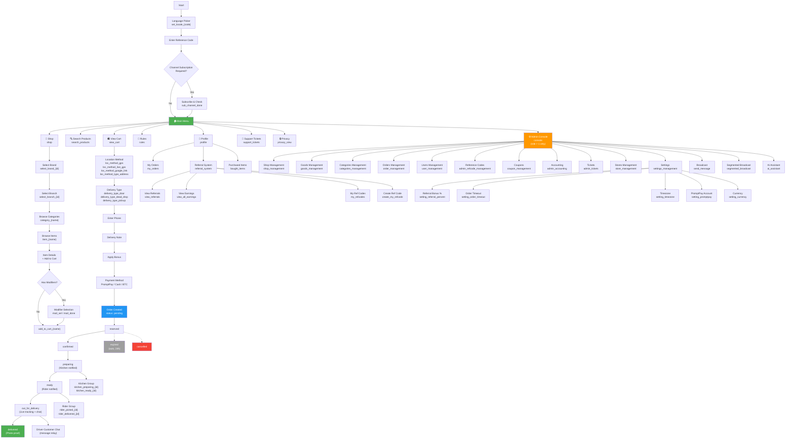

# Telegram Physical Goods Shop Bot

A Telegram bot for selling physical goods with delivery — built for Thailand restaurant delivery but works for any physical goods business. Supports PromptPay QR payments with automatic slip verification, cash on delivery, and Bitcoin. Includes GPS delivery, driver-customer chat, kitchen workflow, and a full admin panel.

[](https://www.python.org/downloads/)
[](https://docs.aiogram.dev/)
[](https://www.postgresql.org/)
[](https://www.docker.com/)
[](LICENSE)

---

> **This version is for PHYSICAL GOODS** (inventory, delivery, addresses).
> Need to sell **digital goods** (keys, accounts, licenses)? Use [Telegram Digital Goods Shop](https://github.com/interlumpen/Telegram-shop) instead.

---

## Table of Contents

- [Features at a Glance](#features-at-a-glance)
- [How It Works](#how-it-works)
- [Deployment](#deployment)
- [First-Time Setup](#first-time-setup)
- [Admin Guide](#admin-guide)
- [Payment Methods](#payment-methods)
- [Delivery System](#delivery-system)
- [Customer Features](#customer-features)
- [CLI Reference](#cli-reference)
- [Monitoring](#monitoring)
- [Testing](#testing)
- [Menu Structure & Data Model](#menu-structure--data-model)
- [Additional Docs](#additional-docs)

---

## Features at a Glance

| Feature | Description |
|---------|-------------|
| **PromptPay QR Payments** | Auto-generated QR codes, automatic slip verification via SlipOK/EasySlip/RDCW |
| **Cash on Delivery** | Rider confirms cash receipt on delivery |
| **Bitcoin Payments** | One-time-use address pool from file |
| **GPS Delivery** | Customers share location pin, drivers get Google Maps links |
| **Delivery Types** | Door delivery, dead drop (leave at location), self-pickup |
| **Photo Proof** | Rider uploads delivery photo — required for dead drops |
| **Driver-Customer Chat** | Message relay between rider and customer during delivery |
| **Live Location Tracking** | Driver shares real-time GPS via Telegram live location |
| **Kitchen Workflow** | Order flows through kitchen → rider → customer with group notifications |
| **Delivery Zones** | Distance-based pricing calculated from your restaurant GPS |
| **Menu Modifiers** | Spice levels, extras, removals with price adjustments |
| **Referral System** | Customers earn bonus balance for referring others |
| **Multi-Language** | Thai, English, Russian, Arabic, Persian, Pashto, French |
| **Admin Panel** | In-bot settings + CLI tool for full shop management |
| **Slip Verification** | Auto-verify PromptPay slips via 3rd-party APIs (SlipOK, EasySlip, RDCW) |

---

## How It Works

### Customer Flow

```
Browse Shop → Add to Cart → Checkout → Share Location → Choose Delivery Type
→ Enter Phone → Select Payment → Pay → Upload Slip → Order Confirmed
→ Kitchen Prepares → Rider Delivers → Done
```

### Order Lifecycle

```
pending → reserved → confirmed → preparing → ready → out_for_delivery → delivered
                  ↘ expired (auto, 24h)
                  ↘ cancelled (by admin)
```

| Status | What Happens |
|--------|-------------|
| **pending** | Customer just placed the order |
| **reserved** | Inventory held for 24 hours (configurable) |
| **confirmed** | Admin verified payment and set delivery time |
| **preparing** | Kitchen is making the order (notification sent to kitchen group) |
| **ready** | Food ready, rider notified in rider group |
| **out_for_delivery** | Rider picked up — customer gets live tracking |
| **delivered** | Rider uploaded delivery photo — inventory deducted, order complete |
| **expired** | Customer didn't pay in time — inventory auto-released |
| **cancelled** | Admin cancelled — inventory released, bonus refunded |

---

## Deployment

### Requirements

- Python 3.11+
- PostgreSQL 16+
- Redis 7+
- Docker & Docker Compose (recommended)

### Option 1: Docker (Recommended)

```bash
git clone https://github.com/yourusername/telegram_shop.git
cd telegram_shop
cp .env.example .env
nano .env                    # Fill in your values (see First-Time Setup below)
docker compose up -d --build bot
docker compose logs -f bot   # Watch for startup confirmation
```

### Option 2: Manual

```bash
git clone https://github.com/yourusername/telegram_shop.git
cd telegram_shop
python3.11 -m venv venv
source venv/bin/activate
pip install -r requirements.txt

# Setup PostgreSQL and Redis separately, then:
cp .env.example .env
nano .env
python run.py
```

---

## First-Time Setup

After deployment, configure these settings. Only the first two are required — everything else has sensible defaults.

### 1. Telegram Bot Token (Required)

Get a token from [@BotFather](https://telegram.me/BotFather) and your user ID from [@userinfobot](https://telegram.me/myidbot):

```env
TOKEN=123456:ABC-DEF1234ghIkl-zyx57W2v1u123ew11
OWNER_ID=123456789
```

### 2. Database (Required)

```env
POSTGRES_DB=telegram_shop
POSTGRES_PASSWORD=your_strong_password_here
```

### 3. PromptPay Account

You can configure this in two ways:

**Option A — From the bot (recommended):**
Go to Admin Panel → Settings → PromptPay Account. You can either upload a screenshot of your existing PromptPay QR code (the bot reads it automatically) or type your ID manually.

**Option B — In `.env` file:**
```env
PROMPTPAY_ID=0812345678              # Your phone (10 digits) or national ID (13 digits)
PROMPTPAY_ACCOUNT_NAME=My Restaurant  # Name on the bank account
```

If not configured, PromptPay won't appear as a payment option. Cash and Bitcoin still work.

### 4. Automatic Slip Verification (Optional)

Without this, an admin must manually verify every payment slip. With it, the bot auto-verifies slips in seconds.

Configure one or more providers. The bot tries them in order and falls back to the next if one fails:

```env
# SlipOK (free tier: 100 slips/month) — best for getting started
SLIPOK_API_KEY=your_key
SLIPOK_BRANCH_ID=your_branch_id

# EasySlip — best for production (has duplicate slip detection)
EASYSLIP_API_KEY=your_key

# RDCW — best for high volume (pay-as-you-go)
RDCW_CLIENT_ID=your_id
RDCW_CLIENT_SECRET=your_secret
```

All three verify slips from **any Thai bank** (KBank, SCB, KTB, BBL, TTB, GSB, TrueMoney, etc.) with a single API key. See [Slip Verification Setup Guide](docs/SLIP-VERIFICATION-SETUP.md) for signup instructions and pricing.

Set `SLIP_AUTO_VERIFY=0` to disable auto-verification and use manual admin review only.

### 5. Kitchen & Rider Groups (Optional)

Create two Telegram groups and add the bot as admin:

```env
KITCHEN_GROUP_ID=-1001234567890    # Kitchen staff see order details when confirmed
RIDER_GROUP_ID=-1001234567891      # Riders see delivery details when food is ready
```

**How to get group IDs:** Add the bot to each group, send a message, then check bot logs for the chat ID.

Without these, the kitchen/rider workflow and driver chat features are disabled. Orders still work via the admin panel and CLI.

### 6. Restaurant Location (Optional)

For delivery zone pricing based on distance:

```env
RESTAURANT_LAT=13.7563
RESTAURANT_LNG=100.5018
```

Default zones:

| Zone | Distance | Fee |
|------|----------|-----|
| Central | 0–3 km | Free |
| Inner | 3–7 km | 30 THB |
| Mid | 7–12 km | 50 THB |
| Outer | 12–20 km | 80 THB |
| Far | 20+ km | 120 THB |

Customize zones in `bot/config/delivery_zones.py`.

### 7. Language & Currency

Defaults to Thai. Change if needed:

```env
BOT_LOCALE=th          # th, en, ru, ar, fa, ps, fr
PAY_CURRENCY=THB
TIMEZONE=Asia/Bangkok
```

Customers can also switch language in the bot via the language picker button.

---

## Admin Guide

### In-Bot Admin Panel

Accessible to users with ADMIN or OWNER roles. The admin panel provides:

**Settings** (Settings button in admin console):
- **Referral Bonus %** — percentage of order total given to referrers (0 to disable)
- **Order Timeout** — hours before unpaid orders auto-expire (default: 24)
- **Timezone** — affects all log timestamps
- **PromptPay Account** — set/change recipient account via QR upload or manual entry

**Shop Management:**
- Add/edit/delete categories and products
- Set stock quantities and prices
- Configure menu modifiers (spice levels, extras, removals with price adjustments)

**Order Management:**
- View all orders with filters (by status, date, customer)
- Verify PromptPay payments (click "Verify Payment" on receipt notification)
- Advance order status through the workflow
- Cancel orders with automatic inventory release

**User Management:**
- View customer profiles and order history
- Ban/unban users
- Manage reference codes for controlled registration

**Broadcast:**
- Send messages to all users or specific groups

### Reference Codes

Users must enter a valid reference code on first `/start`. This controls who can access the bot.

- Create codes from the admin panel or CLI
- Set expiry time and max uses per code
- Codes can be for regular users or admins (admins can create their own codes)

### Referral System

When enabled (bonus % > 0):
1. Each user gets a unique referral link
2. When a referred customer completes an order, the referrer earns a bonus
3. Bonus is added to the referrer's balance, which can be applied to future orders

---

## Payment Methods

### PromptPay QR (Thailand)

The primary payment method for Thai customers (90%+ adoption).

1. Customer selects PromptPay at checkout
2. Bot generates an EMVCo-standard QR code with the exact amount embedded
3. Customer scans with any Thai banking app (KBank, SCB, BBL, KTB, TrueMoney, etc.)
4. Customer uploads a screenshot of the payment slip
5. **With auto-verification:** Bot calls SlipOK/EasySlip/RDCW API to verify the slip instantly. If verified, order is auto-confirmed. Admin gets a notification with verification details.
6. **Without auto-verification:** Admin receives the slip photo and manually clicks "Verify Payment"

**What gets verified automatically:**
- Transaction exists in the banking network
- Amount matches the order total
- Receiver matches your PromptPay account name
- Slip hasn't been used before (EasySlip only — duplicate detection)

**If verification fails:** The order stays pending and the admin is notified with the specific issue (amount mismatch, receiver mismatch, duplicate slip, etc.) for manual review.

### Cash on Delivery

1. Customer selects Cash at checkout
2. Order is created with COD status
3. Rider sees the COD amount prominently in delivery details
4. Rider confirms cash collection
5. Admin marks payment as received

### Bitcoin

1. Add Bitcoin addresses to `btc_addresses.txt` (one per line)
2. Customer selects Bitcoin at checkout
3. Bot assigns a unique address from the pool (each address used only once)
4. Customer sends BTC to the address
5. Admin confirms payment received

The bot watches `btc_addresses.txt` for changes and auto-loads new addresses.

---

## Delivery System

### Delivery Types

| Type | Description | Photo Proof |
|------|-------------|-------------|
| **Door** | Standard delivery to customer's address | Optional |
| **Dead Drop** | Leave at specified location (e.g., guard desk, under mat) | Required |
| **Pickup** | Customer picks up from restaurant | No |

For dead drops, the customer provides text instructions and an optional photo of the drop location for the rider.

### GPS & Location

During checkout, customers can share their Telegram location pin. The bot:
- Saves GPS coordinates to the order
- Generates a Google Maps link for the rider
- Calculates the delivery zone and fee based on distance from the restaurant

### Kitchen → Rider → Customer Workflow

When kitchen and rider groups are configured:

1. **Order confirmed** → Kitchen group gets a notification with all items, modifiers, and notes
2. Kitchen marks order as **preparing**, then **ready**
3. **Order ready** → Rider group gets delivery details: address, GPS link, phone number, COD amount
4. Rider picks up and marks **out for delivery**
5. Customer gets notified at each stage

### Driver-Customer Chat

While an order is out for delivery:
- The driver sends messages in the rider group → bot relays them to the customer
- The customer replies in the bot → bot relays to the rider group
- Supports text, photos, and location messages
- All messages are recorded in the database for dispute resolution

### Live Location Tracking

The driver shares Telegram's live location in the rider group → bot forwards the real-time moving pin to the customer. Works for up to 8 hours (Telegram's built-in feature).

### Photo Proof of Delivery

Before marking an order as delivered, the rider uploads a delivery photo. For dead drop orders, this is mandatory. The photo is automatically sent to the customer as confirmation and stored in the order record.

### Menu Modifiers

Products can have configurable modifiers:
- **Spice levels** (e.g., mild / medium / hot / extra hot)
- **Extras** (e.g., extra cheese +20 THB, add egg +15 THB)
- **Removals** (e.g., no onion, no sugar)

Modifiers with price adjustments are added to the item price. Modifier choices appear on the order in kitchen notifications.

---

## Customer Features

### Shopping

- Browse categories and products with lazy-loaded pagination
- View product details, price, stock status, and available modifiers
- Add items to cart with modifier selections
- Update quantities or remove items from cart
- See running total including modifier prices

### Checkout

1. Enter or confirm delivery address (saved for future orders)
2. Share GPS location (optional but recommended)
3. Select delivery type (door / dead drop / pickup)
4. Enter phone number
5. Add delivery note (optional)
6. Apply referral bonus balance (if available)
7. Select payment method
8. Complete payment

### Order Tracking

- View all past and current orders
- See real-time status updates
- Receive notifications when order status changes
- Chat with driver during delivery
- See driver's live location on a map

### Language

Customers can switch the bot's language at any time. Supported languages:
- Thai (default)
- English
- Russian
- Arabic
- Persian
- Pashto
- French

### Referral Bonuses

Each customer gets a referral link. When someone they referred completes an order, the referrer earns a configurable percentage as bonus balance, which can be applied to future orders.

---

## CLI Reference

The `bot_cli.py` tool manages the shop while the bot is running.

### Orders

```bash
# Confirm order with delivery time
python bot_cli.py order --order-code ABCDEF --status-confirmed --delivery-time "2025-11-20 14:30"

# Mark as delivered
python bot_cli.py order --order-code ABCDEF --status-delivered

# Cancel order (releases inventory, refunds bonus)
python bot_cli.py order --order-code ABCDEF --cancel

# Add/remove items from an order
python bot_cli.py order --order-code ABCDEF --add-item "Product Name" --quantity 2 --notify
python bot_cli.py order --order-code ABCDEF --remove-item "Product Name" --quantity 1 --notify

# Update delivery time
python bot_cli.py order --order-code ABCDEF --update-delivery-time --delivery-time "2025-11-21 16:00" --notify
```

### Inventory

```bash
python bot_cli.py inventory "Product Name" --set 100    # Set to exact value
python bot_cli.py inventory "Product Name" --add 50     # Add to current stock
python bot_cli.py inventory "Product Name" --remove 25  # Remove from stock
```

### Reference Codes

```bash
python bot_cli.py refcode create --expires-hours 48 --max-uses 10 --note "VIP customers"
python bot_cli.py refcode create --expires-hours 0 --max-uses 0 --note "Permanent invite"
python bot_cli.py refcode disable CODE123 --reason "No longer valid"
python bot_cli.py refcode list
python bot_cli.py refcode list --active-only
```

### Bitcoin Addresses

```bash
python bot_cli.py btc add --address bc1qxy2kgdygjrsqtzq2n0yrf2493p83kkfjhx0wlh
python bot_cli.py btc add --file new_addresses.txt
python bot_cli.py btc list
```

### Settings

```bash
python bot_cli.py settings set timezone "Asia/Bangkok"
python bot_cli.py settings set reference_bonus_percent 5
python bot_cli.py settings set cash_order_timeout_hours 24
python bot_cli.py settings get timezone
python bot_cli.py settings list
```

### Users

```bash
python bot_cli.py ban 123456789 --reason "Violating terms" --notify
python bot_cli.py unban 123456789 --notify
```

### Data Export

```bash
python bot_cli.py export --all --output-dir backups/
python bot_cli.py export --customers --output-dir backups/
python bot_cli.py export --orders --output-dir backups/
python bot_cli.py export --refcodes --output-dir backups/
```

---

## Monitoring

### Web Dashboard

Access at `http://localhost:9090/dashboard`:
- Real-time order and event metrics
- Handler performance timing
- Error tracking
- System health status

### Health Check

`http://localhost:9090/health` — for uptime monitoring services.

### Prometheus Metrics

`http://localhost:9090/metrics/prometheus` — for Grafana integration.

### Log Files

| File | Contents |
|------|----------|
| `logs/bot.log` | Main application log |
| `logs/audit.log` | Security events (failed auth, injection attempts, rate limits) |
| `logs/orders.log` | Order creation, status changes, delivery updates |
| `logs/reference_code.log` | Code generation, usage, deactivation |
| `logs/changes.log` | Customer profile modifications |

---

## Testing

```bash
pytest                          # Run all tests
pytest -v                       # Verbose output
pytest --cov=bot                # With coverage report
pytest tests/unit/payments/     # Run only payment tests
pytest -m unit                  # Run only unit tests
pytest -m integration           # Run only integration tests
```

---

## Menu Structure & Data Model

### Navigation Flow (Mermaid)



### All Menu Options

#### User Main Menu

| Button | Callback Data | Description |
|--------|--------------|-------------|
| Shop | `shop` | Browse brands → branches → categories → items |
| Search | `search_products` | Free-text product search |
| View Cart | `view_cart` | View current shopping cart and proceed to checkout |
| Rules | `rules` | Display shop rules |
| Profile | `profile` | User profile and order history |
| Support Tickets | `support_tickets` | Open/view support tickets |
| Privacy | `privacy_view` | Privacy notice and data policy |
| Support | _(URL button)_ | Link to support helper |
| Channel | _(URL button)_ | Link to shop channel |
| Admin Console | `console` | Admin panel (only visible for role > 1) |

#### Profile Submenu

| Button | Callback Data | Condition |
|--------|--------------|-----------|
| My Orders | `my_orders` | Always shown |
| Referral System | `referral_system` | Only if referral_percent > 0 |
| Purchased Items | `bought_items` | Only if user has purchased items |
| Back | `back_to_menu` | Returns to main menu |

#### Referral System Submenu

| Button | Callback Data | Condition |
|--------|--------------|-----------|
| View Referrals | `view_referrals` | Only if user has referrals |
| View Earnings | `view_all_earnings` | Only if user has earnings |
| My Reference Codes | `my_refcodes` | Always shown |
| Create Reference Code | `create_my_refcode` | Always shown |
| Back | `profile` | Returns to profile |

#### Shop Navigation

| Step | Callback Pattern | Description |
|------|-----------------|-------------|
| Brand Selection | `select_brand_{brand_id}` | Choose brand (auto-selects if only one) |
| Branch Selection | `select_branch_{store_id}` | Choose branch (GPS auto-select or list) |
| Switch Brand | `switch_brand` | Return to brand list from branch level |
| Category Page | `categories-page_{page}` | Paginated category list |
| Select Category | `category_{name}_categories-page_{page}` | View items in category |
| Items Page | `goods-page_{category}_{page}` | Paginated item list |
| Select Item | `item_{name}_{category}_goods-page_{category}_{page}` | View item details |
| Add to Cart | `add_to_cart_{item_name}` | Add item (may trigger modifier selection) |

#### Modifier Selection

| Button | Callback Pattern | Description |
|--------|-----------------|-------------|
| Select Option | `mod_sel:{item_name}:{group_key}:{option_id}` | Toggle/select a modifier option |
| Done (multi-choice) | `mod_done:{item_name}:{group_key}` | Finish multi-choice group |
| Cancel | `mod_cancel` | Cancel modifier selection |

#### Checkout Flow

| Step | Callback / State | Options |
|------|-----------------|---------|
| Location Method | `loc_method_gps` | Share static GPS pin |
| | `loc_method_live_gps` | Share live GPS |
| | `loc_method_google_link` | Paste a Google Maps link |
| | `loc_method_type_address` | Type address manually |
| Delivery Type | `delivery_type_door` | Standard door delivery |
| | `delivery_type_dead_drop` | Leave at location (photo proof required) |
| | `delivery_type_pickup` | Self-pickup from store |
| Delivery GPS | `delivery_gps_static` | Share static location for dead drop |
| | `delivery_gps_live` | Share live location for dead drop |
| | `delivery_gps_skip` | Skip GPS for dead drop |

#### Admin Console

| Button | Callback Data | Description |
|--------|--------------|-------------|
| Shop Management | `shop_management` | Manage brands and general shop config |
| Goods Management | `goods_management` | Add/edit/delete menu items |
| Categories Management | `categories_management` | Add/edit/delete categories |
| Orders Management | `order_management` | View/filter/update orders |
| Users Management | `user_management` | View users, ban/unban |
| Reference Codes | `admin_refcode_management` | Create/list/disable reference codes |
| Coupons | `coupon_management` | Create/manage discount coupons |
| Accounting | `admin_accounting` | Revenue and sales reports |
| Tickets | `admin_tickets` | Manage support tickets |
| Stores Management | `store_management` | Add/edit branches (multi-store) |
| Settings | `settings_management` | Bot-wide settings |
| Broadcast | `send_message` | Send message to all users |
| Segmented Broadcast | `segmented_broadcast` | Send to user segments |
| AI Assistant | `ai_assistant` | AI-powered admin assistant |
| Back | `back_to_menu` | Return to main menu |

#### Settings Submenu

| Button | Callback Data | Description |
|--------|--------------|-------------|
| Referral Bonus % | `setting_referral_percent` | Set referral bonus percentage (0 = disabled) |
| Order Timeout | `setting_order_timeout` | Hours before unpaid orders expire |
| Timezone | `setting_timezone` | Set bot timezone |
| PromptPay Account | `setting_promptpay` | Configure PromptPay recipient |
| Currency | `setting_currency` | Set display currency |
| Back | `console` | Return to admin console |

#### Timezone Presets

| Button | Callback Data |
|--------|--------------|
| UTC | `tz_select:UTC` |
| Moscow | `tz_select:Europe/Moscow` |
| New York | `tz_select:America/New_York` |
| London | `tz_select:Europe/London` |
| Tokyo | `tz_select:Asia/Tokyo` |
| Berlin | `tz_select:Europe/Berlin` |
| Manual Entry | `tz_manual` |

#### Kitchen & Rider Group Buttons

| Button | Callback Data | Who Sees It |
|--------|--------------|-------------|
| Start Preparing | `kitchen_preparing_{order_id}` | Kitchen group |
| Mark Ready | `kitchen_ready_{order_id}` | Kitchen group |
| Picked Up | `rider_picked_{order_id}` | Rider group |
| Delivered | `rider_delivered_{order_id}` | Rider group |

#### Order Status Transitions (Admin)

| Callback Pattern | Description |
|-----------------|-------------|
| `order_status_{order_id}_{new_status}` | Change order status (only allowed transitions shown) |
| `orders_filter_{status}` | Filter order list by status |
| `admin_order_{order_id}` | View specific order details |

#### Utility Buttons

| Button | Callback Data | Description |
|--------|--------------|-------------|
| Back | `back_to_menu` or custom | Navigate back |
| Close | `close` | Dismiss message |
| Yes/No | `{question}_yes` / `{question}_no` | Confirmation dialogs |
| Check Subscription | `sub_channel_done` | Verify channel membership |
| Language | `set_locale_{code}` | Switch language (th, en, ru, ar, fa, ps, fr) |

### Core Data Models

#### Multi-Brand Architecture

```
Brand
├── brand_id (PK)
├── name, slug, description
├── logo_file_id
├── promptpay_id, promptpay_name
├── timezone
├── is_active
│
├── Store (branches)
│   ├── store_id (PK), brand_id (FK)
│   ├── name, address, latitude, longitude, phone
│   ├── kitchen_group_id, rider_group_id
│   └── is_active
│
├── BrandStaff
│   ├── brand_id (FK), user_id (FK)
│   ├── role: owner | admin | kitchen | rider
│   └── store_id (FK, optional)
│
├── Categories
│   ├── name (PK), brand_id (FK)
│   ├── sort_order, description, image_file_id
│   └── available_from, available_until
│
└── Goods (menu items)
    ├── name (PK), brand_id (FK), category_name (FK)
    ├── item_type: "product" | "prepared"
    ├── price, description, image_file_id, media (JSON)
    ├── stock_quantity, reserved_quantity
    ├── prep_time_minutes, allergens, calories
    ├── is_active, sold_out_today
    ├── daily_limit, daily_sold_count
    ├── available_from, available_until
    └── modifiers (JSON) — see Modifier Schema below
```

#### Modifier Schema (JSON)

Stored in `Goods.modifiers` as a JSON object:

```json
{
  "group_key": {
    "label": "Spice Level",
    "type": "single",
    "required": true,
    "options": [
      {"id": "mild", "label": "Mild", "price": 0},
      {"id": "hot", "label": "Hot", "price": 0},
      {"id": "extra_hot", "label": "Extra Hot", "price": 10}
    ]
  },
  "extras": {
    "label": "Extras",
    "type": "multi",
    "required": false,
    "options": [
      {"id": "cheese", "label": "Extra Cheese", "price": 20},
      {"id": "egg", "label": "Add Egg", "price": 15}
    ]
  }
}
```

| Field | Type | Description |
|-------|------|-------------|
| `group_key` | string | Unique key for the modifier group |
| `label` | string | Display name (e.g., "Spice Level") |
| `type` | `"single"` or `"multi"` | Single-choice (radio) or multi-choice (checkbox) |
| `required` | boolean | Whether the customer must select an option |
| `options[].id` | string | Unique option identifier |
| `options[].label` | string | Display label |
| `options[].price` | number | Price adjustment (added to item price; 0 for no extra charge) |

#### User & Roles

```
User
├── telegram_id (PK)
├── role_id (FK → Role)
├── referral_id (referrer's telegram_id)
├── locale (language code)
├── registration_date
├── is_banned
└── privacy_accepted_at

Role
├── id (PK)
├── name
└── permissions (bitfield)
    ├── USE
    ├── BROADCAST
    ├── SETTINGS_MANAGE
    ├── USERS_MANAGE
    ├── SHOP_MANAGE
    ├── ADMINS_MANAGE
    ├── OWN
    └── SUPER
```

#### Order & Cart

```
Order
├── id (PK), order_code (unique 6-char)
├── buyer_id (FK → User), brand_id, store_id
├── total_price, bonus_applied
├── payment_method, order_status
├── delivery_type: "door" | "dead_drop" | "pickup"
├── delivery_address, latitude, longitude, google_maps_link
├── drop_instructions, drop_latitude, drop_longitude, drop_media (JSON)
├── delivery_zone, delivery_fee, preferred_time_slot
├── kitchen_group_message_id, rider_group_message_id
├── estimated_ready_at, total_prep_time_minutes
├── driver_id, driver_live_location_message_id
├── bitcoin_address, payment_receipt_photo
└── slip verification fields

OrderItem
├── order_id (FK), item_name
├── price, quantity
└── selected_modifiers (JSON)

ShoppingCart
├── user_id, item_name
├── quantity, selected_modifiers (JSON)
└── brand_id, store_id
```

#### Promotions & Referrals

```
Coupon
├── code (PK)
├── discount_type: "percent" | "fixed"
├── discount_value, min_order, max_discount
├── valid_from, valid_until
├── max_uses, max_uses_per_user, is_active

ReferenceCode
├── code (PK), created_by
├── expires_at, max_uses, current_uses
├── note, is_active, is_admin_code

ReferralEarnings
├── referrer_id, referral_id
├── amount, original_amount, created_at

CustomerInfo
├── telegram_id (PK)
├── phone_number, delivery_address, delivery_note
├── total_spendings, completed_orders_count
├── bonus_balance
└── latitude, longitude, address_structured
```

#### Inventory & Delivery

```
InventoryLog
├── item_name
├── change_type: reserve | release | deduct | add | manual | expired
├── quantity_change, order_id, admin_id
├── timestamp, comment

BranchInventory
├── store_id (FK), item_name
├── stock_quantity, reserved_quantity

DeliveryChatMessage
├── order_id, sender_id
├── sender_role: "driver" | "customer"
├── message_text, photo_file_id
├── location_lat, location_lng
├── is_live_location, live_location_update_count
└── telegram_message_id
```

#### Bot Settings

```
BotSettings
├── setting_key (PK per brand)
├── setting_value
└── brand_id (FK, nullable — null = global)
```

### FSM States

The bot uses finite state machines (aiogram FSM) to manage multi-step interactions:

| State Group | States | Purpose |
|-------------|--------|---------|
| **ShopStates** | selecting_brand, selecting_branch, viewing_categories, viewing_goods, viewing_bought_items | Shop browsing |
| **CartStates** | viewing_cart, waiting_quantity | Cart management |
| **OrderStates** | waiting_location_method, waiting_delivery_address, waiting_address_confirm, waiting_google_maps_link, waiting_location, waiting_live_location, waiting_delivery_type, waiting_drop_instructions, waiting_drop_gps, waiting_drop_media, waiting_drop_photo, waiting_phone_number, waiting_delivery_note, waiting_bonus_amount, waiting_payment_method | Full checkout flow |
| **ModifierSelectionFSM** | selecting_modifiers | Modifier group/option selection |
| **AddItemFSM** | waiting_item_type, waiting_item_name, waiting_item_description, waiting_item_image, waiting_item_price, waiting_category, waiting_stock_quantity, waiting_prep_time, waiting_allergens, waiting_availability, waiting_daily_limit, waiting_modifiers_json, waiting_modifier_group_name, waiting_modifier_group_type, waiting_modifier_option_label, waiting_modifier_option_price | Admin: add menu item |
| **UpdateItemFSM** | waiting_item_name_for_update, waiting_item_new_name, waiting_item_description, waiting_item_price, waiting_item_name_for_stock_mgmt, waiting_stock_action, waiting_stock_quantity | Admin: edit item |
| **CategoryFSM** | waiting_add_category, waiting_delete_category, waiting_update_category, waiting_update_category_name | Admin: category management |
| **SettingsFSM** | waiting_referral_percent, waiting_order_timeout, waiting_timezone, waiting_promptpay_id, waiting_promptpay_name | Admin: settings |
| **DeliveryChatStates** | chatting_with_driver, waiting_customer_gps_choice | Driver-customer chat |
| **SupportStates** | choosing_type, waiting_subject, waiting_description, waiting_screenshot, live_chatting | Support tickets |
| **LanguageStates** | waiting_language | Language selection |
| **ReferenceCodeStates** | waiting_reference_code, waiting_refcode_note, waiting_refcode_expires, waiting_refcode_max_uses | Reference code creation |
| **GrokAssistantStates** | chatting, awaiting_confirmation, awaiting_file | AI assistant |

---

## Additional Docs

| Document | Description |
|----------|-------------|
| [Slip Verification Setup](docs/SLIP-VERIFICATION-SETUP.md) | How to sign up for SlipOK, EasySlip, RDCW — API keys, pricing, bank coverage |
| [.env.example](.env.example) | Complete environment variable reference with all defaults |
| `bot_cli.py --help` | Full CLI usage help |

---

## License

MIT License — see [LICENSE](LICENSE).

## Contributing

1. Fork the repository
2. Create a feature branch (`git checkout -b feature/amazing-feature`)
3. Commit your changes
4. Push and open a Pull Request
