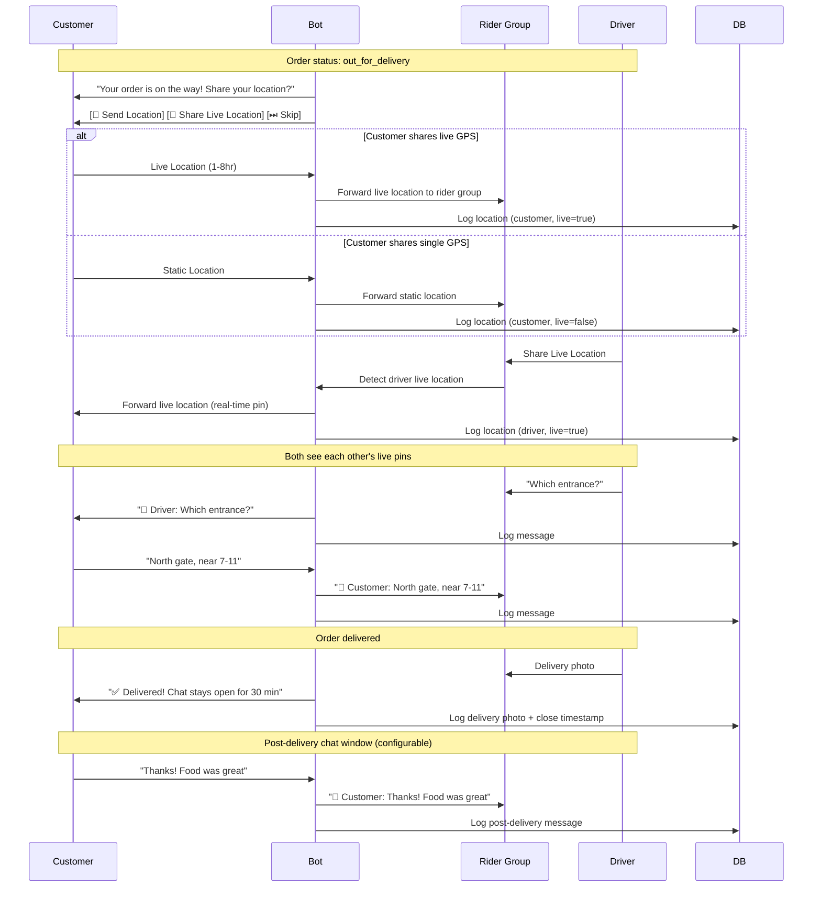

# Card 15: GPS Live Tracking + Delivery Chat Session

## Implementation Status

> **100% Complete** | `████████████████████` | Models, handler, keyboards, states, i18n, router wiring, and tests all done.

**Phase:** 4 — Delivery Experience
**Priority:** High
**Effort:** Medium-High (1.5 days)
**Dependencies:** Card 2 (GPS), Card 9 (Kitchen/Rider groups), Card 13 (Driver-Customer Chat)

---

## Why

Currently GPS is only collected once at checkout (Card 2) and driver chat only relays messages during `out_for_delivery` (Card 13). Real-world delivery needs:

1. **Recipient** should be able to share live GPS so the driver can track them in real-time (moving target — e.g., customer is walking, at a park, etc.)
2. **Driver** should share live GPS so the customer knows when they'll arrive
3. Both should be connected in a **bot-managed chat** that stays active for the full order lifecycle and after delivery (for disputes, thank-you messages, etc.)
4. **All data must be logged** — every GPS point, every message, every photo — for audit, dispute resolution, and analytics

## Flow Diagram



## Scope

### Customer GPS Options (during active delivery)
- **Single GPS pin**: Customer taps "Share Location" — static lat/lng sent once
- **Live GPS**: Customer taps "Share Live Location" — Telegram live location (1-8 hours), driver sees moving pin
- **Skip**: Customer can skip location sharing entirely (text address from checkout is still on the order)
- GPS prompt sent automatically when order status changes to `out_for_delivery`

### Driver Live GPS
- Driver shares live location in rider group → bot forwards to customer (already in Card 13)
- Enhanced: store all location update points, not just the initial share

### Bot-Managed Chat Session
- **Active from**: order status `confirmed` (so customer can send clarifications to kitchen/driver)
- **Active through**: `out_for_delivery` → `delivered`
- **Post-delivery window**: Configurable (default 30 minutes after delivery) for follow-up messages
- **After window closes**: Messages are rejected with "Chat session closed" notice
- Chat supports: text, photos, locations, live locations, voice messages (as file)
- All messages logged in `delivery_chat_messages` table

### Data Logging
- Every GPS point (static or live update) logged with timestamp, sender, lat/lng
- Every chat message logged with full metadata
- Live location edit events captured via `edited_message` handler
- Chat session open/close timestamps logged
- Admin can pull full chat + location history for any order

## Files to Modify

| File | Changes |
|------|---------|
| `bot/database/models/main.py` | Add `customer_live_location_message_id`, `chat_opened_at`, `chat_closed_at`, `chat_post_delivery_until` to Order. Add `is_live_location`, `live_location_update_count` to DeliveryChatMessage |
| `bot/handlers/user/delivery_chat_handler.py` | Add customer live location handling, live location edit tracking, chat session lifecycle management, post-delivery chat window logic |
| `bot/states/user_state.py` | Add `DeliveryChatStates` group with `waiting_customer_gps_choice` |
| `bot/keyboards/inline.py` | Add `delivery_gps_choice_keyboard()` with static/live/skip buttons |
| `bot/i18n/strings.py` | Add GPS tracking + chat session strings for all 7 locales |
| `bot/handlers/main.py` | Register edited_message handler for live location updates |
| `bot/config/env.py` | Add `POST_DELIVERY_CHAT_MINUTES` env var (default 30) |

## Model Changes

### Order additions
```python
# Customer live location tracking (Card 15)
customer_live_location_message_id = Column(Integer, nullable=True)

# Chat session lifecycle (Card 15)
chat_opened_at = Column(DateTime(timezone=True), nullable=True)
chat_closed_at = Column(DateTime(timezone=True), nullable=True)
chat_post_delivery_until = Column(DateTime(timezone=True), nullable=True)  # delivery time + N minutes
```

### DeliveryChatMessage additions
```python
# GPS tracking metadata (Card 15)
is_live_location = Column(Boolean, nullable=False, default=False)  # True if from live location share
live_location_update_count = Column(Integer, nullable=True)  # Nth update of a live location session
```

## Implementation Details

### Customer GPS Prompt
When order transitions to `out_for_delivery`, bot sends:
```
📍 Your order [ORDER_CODE] is on the way!

Help your driver find you faster — share your location:

[📍 Send Location]  [📡 Live Location]  [⏭ Skip]
```

### Live Location Tracking
- Telegram's `live_period` supports 1hr, 2hr, 4hr, 8hr auto-expiry
- Bot captures initial location + all `edited_message` location updates
- Each update logged as a new `DeliveryChatMessage` row with `is_live_location=True`
- `live_location_update_count` increments per update for ordering
- Both customer and driver live locations relayed bidirectionally

### Chat Session Lifecycle
```python
def is_chat_active(order: Order) -> bool:
    """Check if chat is still active for this order."""
    if order.order_status in ('confirmed', 'preparing', 'ready', 'out_for_delivery'):
        return True
    if order.order_status == 'delivered' and order.chat_post_delivery_until:
        return datetime.now(timezone.utc) < order.chat_post_delivery_until
    return False
```

### Post-Delivery Window
- When order is marked `delivered`, set `chat_post_delivery_until = now + POST_DELIVERY_CHAT_MINUTES`
- Messages after window: "This chat session has ended. Contact support for help."
- All post-delivery messages still logged even after window closes (admin can see them)

## Acceptance Criteria

- [x] Customer receives GPS prompt when order goes `out_for_delivery`
- [x] Customer can send single static GPS location
- [x] Customer can share live GPS location (Telegram live location)
- [x] Customer's live location forwarded to rider group for driver
- [x] Driver's live location forwarded to customer (Card 13 enhancement)
- [x] Live location edit events captured and logged
- [x] Chat session active from `confirmed` through `delivered` + post-delivery window
- [x] Post-delivery chat window configurable via env var
- [x] Chat session closed message after window expires
- [x] All GPS points logged in `delivery_chat_messages` with `is_live_location` flag
- [x] All chat messages logged with full metadata
- [x] Admin can retrieve full chat + location history via `get_chat_history()`
- [x] i18n strings for 5 main locales (ru, en, th, ar, fa — ps/fr fallback to en)
- [x] Wire into main router (edited_message handler for live location updates)
- [x] GPS choice callback handlers (static/live/skip)
- [x] Rider group edited_message listener for driver live location updates
- [x] Customer private chat edited_message listener with relay to rider group
- [x] Unit tests (19 tests passing)

## Test Plan

| Test | What to Assert |
|------|----------------|
| `test_order_customer_live_location_fields` | `customer_live_location_message_id`, `chat_opened_at`, `chat_closed_at`, `chat_post_delivery_until` nullable |
| `test_delivery_chat_message_gps_fields` | `is_live_location`, `live_location_update_count` default correctly |
| `test_is_chat_active_during_delivery` | Returns True for confirmed/preparing/ready/out_for_delivery |
| `test_is_chat_active_post_delivery_window` | Returns True within window, False after |
| `test_customer_static_location_logged` | Static GPS from customer recorded with `is_live_location=False` |
| `test_customer_live_location_logged` | Live GPS from customer recorded with `is_live_location=True` |
| `test_live_location_updates_counted` | Each edit increments `live_location_update_count` |
| `test_chat_history_includes_all_locations` | `get_chat_history()` returns location entries with GPS metadata |
| `test_post_delivery_message_rejected` | Message after window returns closed notice |
| `test_post_delivery_message_still_logged` | Even rejected messages are recorded for admin |
