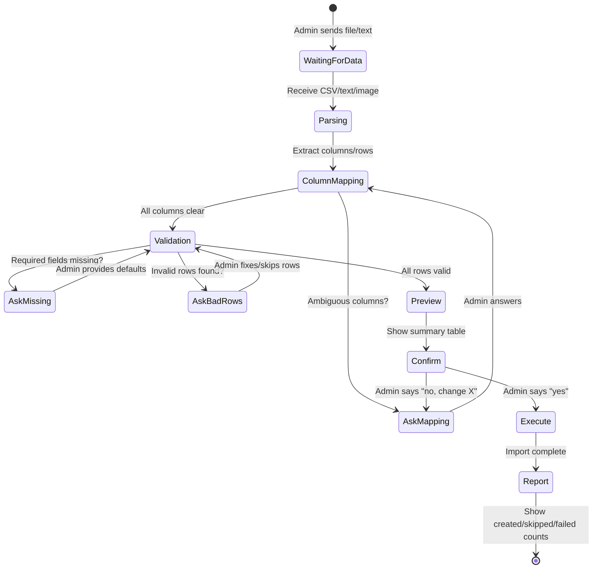

# Card 17: Grok AI Admin Assistant — Natural Language Menu Management & Data Import

## Implementation Status

> **0% Complete** | `░░░░░░░░░░░░░░░░░░░` | Design only — no implementation started.

**Phase:** 5 — Admin Intelligence
**Priority:** Medium
**Effort:** High (5-7 days)
**Dependencies:** All database models finalized, admin permissions system (existing)

---

## Why

Admin currently manages the menu, orders, and users through a rigid button-based UI in Telegram and a CLI tool. Both require knowing exact commands, field names, and valid values. This creates friction for:

1. **Menu updates** — changing prices, descriptions, or images requires navigating multiple menus step-by-step
2. **Data import** — adding 50 menu items from a spreadsheet requires manual entry one-by-one
3. **Order lookup** — checking order status, searching past deliveries, or finding what a customer said in chat requires knowing exact order codes or user IDs
4. **Bulk operations** — no way to say "increase all dessert prices by 10%" or "show me all failed deliveries this week"

A natural language assistant powered by Grok (xAI) lets the admin describe what they want in plain language. Pydantic schemas act as guardrails — the AI can only produce validated, structured actions that the system knows how to execute.

---

## Architecture Overview

```
┌─────────────────────────────────────────────────────┐
│                  Admin (Telegram)                     │
│  "Import this CSV as menu items"                      │
│  "Change pad thai price to 150"                       │
│  "Show me all orders from last week with dead drops"  │
└──────────────────────┬──────────────────────────────┘
                       │
                       ▼
┌──────────────────────────────────────────────────────┐
│              Grok Conversation Handler                │
│  bot/handlers/admin/grok_assistant.py                 │
│                                                       │
│  • Maintains conversation state (FSM)                 │
│  • Sends user message + system prompt to Grok API     │
│  • Receives structured tool calls from Grok           │
│  • Validates tool calls against Pydantic schemas      │
│  • Executes validated actions OR asks follow-up Qs    │
│  • Loops until task is complete                        │
└──────────┬───────────────────────┬───────────────────┘
           │                       │
           ▼                       ▼
┌─────────────────────┐  ┌─────────────────────────────┐
│   Pydantic Schemas   │  │     Grok API (xAI)          │
│   (Action Contracts)  │  │                             │
│                       │  │  Model: grok-3 or grok-3-mini│
│  CreateItemAction     │  │  Mode: function calling      │
│  UpdateItemAction     │  │  System prompt: restricted   │
│  DeleteItemAction     │  │  tools: validated schemas    │
│  SearchOrdersAction   │  │                             │
│  ImportMenuAction     │  │  Conversation history kept   │
│  QueryDatabaseAction  │  │  per admin session           │
│  ...                  │  │                             │
└─────────┬─────────────┘  └─────────────────────────────┘
          │
          ▼
┌──────────────────────────────────────────────────────┐
│              Action Executor                          │
│  bot/ai/executor.py                                   │
│                                                       │
│  • Takes validated Pydantic model                     │
│  • Calls existing database methods                    │
│  • Returns structured result                          │
│  • All mutations audit-logged with admin_id           │
└──────────────────────────────────────────────────────┘
```

---

## Pydantic Schema Definitions

Every action the AI can take is defined as a strict Pydantic model. The AI cannot bypass these — if validation fails, the action is rejected and the AI must ask for corrections.

### Menu Mutation Schemas

```python
# bot/ai/schemas.py
from pydantic import BaseModel, Field, field_validator
from decimal import Decimal
from typing import Optional
from enum import Enum

class CreateItemAction(BaseModel):
    """Add a new menu item."""
    action: Literal["create_item"] = "create_item"
    item_name: str = Field(..., min_length=1, max_length=100)
    description: str = Field(..., min_length=1, max_length=500)
    price: Decimal = Field(..., gt=0, le=99999, decimal_places=2)
    category_name: str = Field(..., min_length=1, max_length=100)
    stock_quantity: int = Field(..., ge=0, le=99999)
    modifiers: Optional[dict] = None  # extras, removals, spice levels

    @field_validator("price")
    @classmethod
    def price_reasonable(cls, v):
        if v > 10000:
            raise ValueError("Price exceeds 10,000 — confirm with admin")
        return v

class UpdateItemAction(BaseModel):
    """Update an existing menu item. Only provided fields are changed."""
    action: Literal["update_item"] = "update_item"
    item_name: str = Field(..., min_length=1, max_length=100)
    new_name: Optional[str] = Field(None, min_length=1, max_length=100)
    new_description: Optional[str] = Field(None, max_length=500)
    new_price: Optional[Decimal] = Field(None, gt=0, le=99999)
    new_category: Optional[str] = Field(None, max_length=100)

class UpdateItemImageAction(BaseModel):
    """Update a menu item's image. Photo must be sent as attachment."""
    action: Literal["update_item_image"] = "update_item_image"
    item_name: str = Field(..., min_length=1, max_length=100)
    # photo_file_id populated by handler from Telegram message attachment

class DeleteItemAction(BaseModel):
    """Delete a menu item. Requires explicit confirmation."""
    action: Literal["delete_item"] = "delete_item"
    item_name: str = Field(..., min_length=1, max_length=100)
    confirm: bool = Field(..., description="Must be True to proceed")

class BulkPriceUpdateAction(BaseModel):
    """Change prices for multiple items at once."""
    action: Literal["bulk_price_update"] = "bulk_price_update"
    updates: list[dict] = Field(
        ..., min_length=1, max_length=50,
        description="List of {item_name: str, new_price: Decimal}"
    )

class CreateCategoryAction(BaseModel):
    action: Literal["create_category"] = "create_category"
    category_name: str = Field(..., min_length=1, max_length=100)
    sort_order: int = Field(default=0, ge=0, le=999)

class DeleteCategoryAction(BaseModel):
    action: Literal["delete_category"] = "delete_category"
    category_name: str = Field(..., min_length=1, max_length=100)
    confirm: bool = Field(...)

class AdjustStockAction(BaseModel):
    action: Literal["adjust_stock"] = "adjust_stock"
    item_name: str = Field(..., min_length=1, max_length=100)
    operation: Literal["set", "add", "remove"]
    quantity: int = Field(..., ge=0, le=99999)
    comment: Optional[str] = Field(None, max_length=200)
```

### Query / Search Schemas

```python
class SearchOrdersAction(BaseModel):
    """Search orders by various filters."""
    action: Literal["search_orders"] = "search_orders"
    order_code: Optional[str] = Field(None, max_length=6)
    buyer_id: Optional[int] = None
    status: Optional[Literal[
        "pending", "reserved", "confirmed", "preparing",
        "ready", "out_for_delivery", "delivered",
        "cancelled", "expired"
    ]] = None
    payment_method: Optional[Literal["bitcoin", "cash", "promptpay"]] = None
    delivery_type: Optional[Literal["door", "dead_drop", "pickup"]] = None
    date_from: Optional[str] = Field(None, pattern=r"^\d{4}-\d{2}-\d{2}$")
    date_to: Optional[str] = Field(None, pattern=r"^\d{4}-\d{2}-\d{2}$")
    limit: int = Field(default=20, ge=1, le=100)

class SearchChatMessagesAction(BaseModel):
    """Search delivery chat messages."""
    action: Literal["search_chat"] = "search_chat"
    order_id: Optional[int] = None
    order_code: Optional[str] = None
    sender_role: Optional[Literal["driver", "customer"]] = None
    keyword: Optional[str] = Field(None, max_length=100)
    has_photo: Optional[bool] = None
    has_location: Optional[bool] = None
    date_from: Optional[str] = Field(None, pattern=r"^\d{4}-\d{2}-\d{2}$")
    date_to: Optional[str] = Field(None, pattern=r"^\d{4}-\d{2}-\d{2}$")
    limit: int = Field(default=20, ge=1, le=100)

class SearchDeliveriesAction(BaseModel):
    """Search delivery data — zones, GPS, photos, proof."""
    action: Literal["search_deliveries"] = "search_deliveries"
    delivery_zone: Optional[str] = None
    has_delivery_photo: Optional[bool] = None
    has_gps: Optional[bool] = None
    driver_id: Optional[int] = None
    delivery_type: Optional[Literal["door", "dead_drop", "pickup"]] = None
    date_from: Optional[str] = Field(None, pattern=r"^\d{4}-\d{2}-\d{2}$")
    date_to: Optional[str] = Field(None, pattern=r"^\d{4}-\d{2}-\d{2}$")
    limit: int = Field(default=20, ge=1, le=100)

class LookupUserAction(BaseModel):
    """Look up a user profile, their orders, referrals, spending."""
    action: Literal["lookup_user"] = "lookup_user"
    telegram_id: Optional[int] = None
    phone_number: Optional[str] = None
    include_orders: bool = Field(default=False)
    include_referrals: bool = Field(default=False)

class GetStatsAction(BaseModel):
    """Get shop statistics for a date range."""
    action: Literal["get_stats"] = "get_stats"
    date_from: Optional[str] = Field(None, pattern=r"^\d{4}-\d{2}-\d{2}$")
    date_to: Optional[str] = Field(None, pattern=r"^\d{4}-\d{2}-\d{2}$")
    include_revenue: bool = True
    include_top_items: bool = False
    include_user_growth: bool = False

class ViewInventoryAction(BaseModel):
    """View current inventory status."""
    action: Literal["view_inventory"] = "view_inventory"
    category_filter: Optional[str] = None
    only_low_stock: bool = False
    low_stock_threshold: int = Field(default=5, ge=0)
```

### Data Import Schema (CSV / Bulk)

```python
class MenuImportRow(BaseModel):
    """Single row of imported menu data — validated per-item."""
    item_name: str = Field(..., min_length=1, max_length=100)
    description: str = Field(default="", max_length=500)
    price: Decimal = Field(..., gt=0, le=99999)
    category_name: str = Field(..., min_length=1, max_length=100)
    stock_quantity: int = Field(default=0, ge=0, le=99999)
    modifiers: Optional[dict] = None

class MenuImportAction(BaseModel):
    """Bulk import menu items from parsed data."""
    action: Literal["import_menu"] = "import_menu"
    items: list[MenuImportRow] = Field(..., min_length=1, max_length=500)
    create_missing_categories: bool = Field(default=True)
    skip_existing: bool = Field(
        default=True,
        description="Skip items that already exist instead of overwriting"
    )
    overwrite_existing: bool = Field(default=False)

class ColumnMappingGuess(BaseModel):
    """Grok's best guess at mapping CSV columns to menu fields."""
    source_column: str
    target_field: Literal[
        "item_name", "description", "price",
        "category_name", "stock_quantity", "modifiers",
        "skip"
    ]
    confidence: float = Field(ge=0, le=1)
    sample_values: list[str] = Field(default_factory=list, max_length=3)

class DataMappingProposal(BaseModel):
    """Grok proposes how to map incoming data columns to menu schema."""
    action: Literal["propose_mapping"] = "propose_mapping"
    mappings: list[ColumnMappingGuess]
    unmapped_required: list[str] = Field(
        default_factory=list,
        description="Required fields with no matching column — must ask admin"
    )
    warnings: list[str] = Field(default_factory=list)
```

---

## Data Import Flow — Interactive Loop

The core differentiator: the assistant accepts **any format** of data (CSV, pasted text, photos of menus, random spreadsheets) and iteratively maps it to the menu schema, asking questions until everything is resolved.



### Step-by-Step Loop

**1. Admin sends raw data**
```
Admin: [uploads menu.csv]
"Import this as menu items, everything is Thai food"
```

**2. Grok parses and proposes column mapping**
```
Bot: I found 45 rows with these columns:
  • "ชื่อ" → item_name (confidence: 0.9)
  • "ราคา" → price (confidence: 0.95)
  • "หมวดหมู่" → category_name (confidence: 0.85)
  • "รายละเอียด" → description (confidence: 0.8)
  • "จำนวน" → stock_quantity (confidence: 0.7)
  • "รูป" → skip (image URLs — not supported in this import)

  ⚠️ Column "รหัส" not mapped — skip it? Or is it something?
  ⚠️ 3 rows have empty prices — set a default or skip them?
```

**3. Admin answers questions**
```
Admin: "รหัส is just their internal code, skip it. Default price 100 for the missing ones"
```

**4. Grok validates all rows against MenuImportRow schema**
```
Bot: Validated 45 items:
  ✅ 42 items ready to import
  ⚠️ 2 items have names > 100 chars — truncated
  ❌ 1 item has price "ฟรี" (free) — what price should I use?

  New categories that will be created:
  • "ก๋วยเตี๋ยว" (noodles) — 12 items
  • "ข้าว" (rice) — 18 items
  • "ของหวาน" (desserts) — 8 items
  • "เครื่องดื่ม" (drinks) — 7 items
```

**5. Admin resolves remaining issues**
```
Admin: "Set the free item to 50 baht"
```

**6. Final preview and confirmation**
```
Bot: Ready to import 45 items into 4 categories.

  | Category    | Items | Price Range    |
  |-------------|-------|----------------|
  | Noodles     | 12    | ฿60 – ฿180     |
  | Rice        | 18    | ฿80 – ฿250     |
  | Desserts    | 8     | ฿40 – ฿120     |
  | Drinks      | 7     | ฿30 – ฿90      |

  3 categories will be created (new).
  0 existing items will be overwritten.

  Proceed? [✅ Import] [✏️ Make Changes] [❌ Cancel]
```

**7. Execute and report**
```
Bot: ✅ Import complete!
  • 45 items created
  • 4 categories created
  • 0 skipped, 0 failed
  • All logged under admin ID 12345
```

---

## Grok API Integration

### System Prompt

```python
GROK_SYSTEM_PROMPT = """
You are a restaurant menu management assistant for a Thai delivery shop.
You help the admin manage their menu, check orders, and import data.

RULES:
- You can ONLY use the provided tool functions. Never suggest raw SQL or code.
- For ANY mutation (create, update, delete, price change), always show a
  preview and ask for explicit confirmation before executing.
- For data imports, keep asking questions until EVERY row validates against
  the schema. Never skip invalid data silently.
- Prices are in THB (Thai Baht). Flag anything over ฿10,000 as suspicious.
- When searching, default to the last 7 days if no date range is given.
- Always respond in the same language the admin uses.
- You do NOT have access to: user banning, role changes, broadcasts,
  settings changes, or payment verification. Tell the admin to use the
  regular admin menu for those.
- Never fabricate order codes, user IDs, or item names. Always query first.

AVAILABLE TOOLS:
{tool_definitions_from_pydantic_schemas}

CURRENT MENU CATEGORIES:
{live_category_list}

CURRENT MENU ITEMS:
{live_item_summary}
"""
```

### API Client

```python
# bot/ai/grok_client.py
import httpx
from bot.config.env import GROK_API_KEY

GROK_API_URL = "https://api.x.ai/v1/chat/completions"

async def call_grok(
    messages: list[dict],
    tools: list[dict],
    model: str = "grok-3-mini"
) -> dict:
    async with httpx.AsyncClient() as client:
        response = await client.post(
            GROK_API_URL,
            headers={"Authorization": f"Bearer {GROK_API_KEY}"},
            json={
                "model": model,
                "messages": messages,
                "tools": tools,
                "tool_choice": "auto",
                "temperature": 0.1,  # Low temp for structured output
            },
            timeout=30.0,
        )
        response.raise_for_status()
        return response.json()
```

### Tool Definition Generation (Pydantic → OpenAI-compatible tools)

```python
# bot/ai/tool_defs.py
from bot.ai.schemas import (
    CreateItemAction, UpdateItemAction, DeleteItemAction,
    SearchOrdersAction, MenuImportAction, ...
)

def schema_to_tool(model_class) -> dict:
    """Convert Pydantic model to OpenAI-format tool definition."""
    schema = model_class.model_json_schema()
    return {
        "type": "function",
        "function": {
            "name": schema.get("title", model_class.__name__),
            "description": model_class.__doc__ or "",
            "parameters": schema,
        }
    }

ALL_TOOLS = [
    schema_to_tool(CreateItemAction),
    schema_to_tool(UpdateItemAction),
    schema_to_tool(DeleteItemAction),
    schema_to_tool(BulkPriceUpdateAction),
    schema_to_tool(AdjustStockAction),
    schema_to_tool(CreateCategoryAction),
    schema_to_tool(SearchOrdersAction),
    schema_to_tool(SearchChatMessagesAction),
    schema_to_tool(SearchDeliveriesAction),
    schema_to_tool(LookupUserAction),
    schema_to_tool(GetStatsAction),
    schema_to_tool(ViewInventoryAction),
    schema_to_tool(MenuImportAction),
    schema_to_tool(DataMappingProposal),
]

# Split into read-only vs mutation for permission checks
READ_TOOLS = {"search_orders", "search_chat", "search_deliveries",
              "lookup_user", "get_stats", "view_inventory", "propose_mapping"}
MUTATION_TOOLS = {"create_item", "update_item", "update_item_image",
                  "delete_item", "bulk_price_update", "adjust_stock",
                  "create_category", "delete_category", "import_menu"}
```

---

## Handler Implementation

### FSM States

```python
# Added to bot/states/user_state.py
class GrokAssistantStates(StatesGroup):
    chatting = State()              # Main conversation loop
    awaiting_confirmation = State() # Waiting for yes/no on mutation
    awaiting_file = State()         # Waiting for CSV/data upload
    awaiting_image = State()        # Waiting for menu item photo
```

### Conversation Handler

```python
# bot/handlers/admin/grok_assistant.py

@router.callback_query(F.data == "ai_assistant")
async def start_assistant(callback: CallbackQuery, state: FSMContext):
    """Entry point from admin console."""
    # Load current menu context for system prompt
    categories = await get_all_categories()
    items = await get_all_items_summary()

    await state.set_state(GrokAssistantStates.chatting)
    await state.update_data(
        grok_history=[{
            "role": "system",
            "content": build_system_prompt(categories, items)
        }],
        pending_action=None,
    )
    await callback.message.answer(
        "🤖 AI Assistant ready. You can:\n"
        "• Ask about orders, deliveries, or customers\n"
        "• Update menu items and prices\n"
        "• Send a CSV/file to import menu data\n"
        "• Ask anything about your shop data\n\n"
        "Type /exit to leave.",
        reply_markup=exit_assistant_keyboard()
    )

@router.message(GrokAssistantStates.chatting)
async def handle_chat_message(message: Message, state: FSMContext):
    """Main conversation loop — every message goes to Grok."""
    data = await state.get_data()
    history = data["grok_history"]

    # Handle file uploads (CSV, Excel, images)
    user_content = await extract_content(message)  # text, CSV parse, or OCR
    history.append({"role": "user", "content": user_content})

    # Call Grok with full conversation history + tools
    response = await call_grok(
        messages=history,
        tools=ALL_TOOLS,
        model="grok-3-mini"
    )

    assistant_msg = response["choices"][0]["message"]
    history.append(assistant_msg)

    # Did Grok call a tool?
    if assistant_msg.get("tool_calls"):
        for tool_call in assistant_msg["tool_calls"]:
            result = await process_tool_call(
                tool_call, message.from_user.id, state
            )
            history.append({
                "role": "tool",
                "tool_call_id": tool_call["id"],
                "content": json.dumps(result)
            })

        # Get Grok's follow-up response with tool results
        followup = await call_grok(messages=history, tools=ALL_TOOLS)
        followup_msg = followup["choices"][0]["message"]
        history.append(followup_msg)

        await message.answer(followup_msg["content"] or "Done.")
    else:
        # Plain text response (question, clarification, etc.)
        await message.answer(assistant_msg["content"])

    await state.update_data(grok_history=history)


async def process_tool_call(
    tool_call: dict, admin_id: int, state: FSMContext
) -> dict:
    """Validate tool call against Pydantic schema, execute if valid."""
    func_name = tool_call["function"]["name"]
    args = json.loads(tool_call["function"]["arguments"])

    # Find matching schema
    schema_class = TOOL_SCHEMA_MAP.get(func_name)
    if not schema_class:
        return {"error": f"Unknown tool: {func_name}"}

    # Pydantic validation — this is the guardrail
    try:
        validated = schema_class.model_validate(args)
    except ValidationError as e:
        return {
            "error": "Validation failed",
            "details": e.errors(),
            "hint": "Ask the admin for the missing/invalid fields"
        }

    # Mutations require confirmation (already in preview from Grok prompt)
    if func_name in MUTATION_TOOLS:
        # Execute with audit logging
        return await execute_mutation(validated, admin_id)
    else:
        # Read-only — execute immediately
        return await execute_query(validated)
```

### Action Executor

```python
# bot/ai/executor.py

async def execute_query(action: BaseModel) -> dict:
    """Execute read-only database queries."""
    match action.action:
        case "search_orders":
            orders = await query_orders_filtered(
                code=action.order_code,
                buyer_id=action.buyer_id,
                status=action.status,
                payment_method=action.payment_method,
                delivery_type=action.delivery_type,
                date_from=action.date_from,
                date_to=action.date_to,
                limit=action.limit,
            )
            return {"orders": [order_to_dict(o) for o in orders]}

        case "search_chat":
            messages = await query_chat_messages(
                order_id=action.order_id,
                keyword=action.keyword,
                sender_role=action.sender_role,
                has_photo=action.has_photo,
                has_location=action.has_location,
                date_from=action.date_from,
                date_to=action.date_to,
                limit=action.limit,
            )
            return {"messages": [msg_to_dict(m) for m in messages]}

        case "search_deliveries":
            deliveries = await query_deliveries_filtered(...)
            return {"deliveries": [...]}

        case "view_inventory":
            items = await get_inventory_overview(
                category=action.category_filter,
                low_stock_only=action.only_low_stock,
                threshold=action.low_stock_threshold,
            )
            return {"inventory": items}

        case "get_stats":
            stats = await compute_stats(action.date_from, action.date_to, ...)
            return stats

        case "lookup_user":
            user = await find_user(
                telegram_id=action.telegram_id,
                phone=action.phone_number,
            )
            return {"user": user_to_dict(user, action.include_orders, ...)}

        case "propose_mapping":
            # Return the mapping proposal as-is for Grok to present
            return {"mapping": action.model_dump()}


async def execute_mutation(action: BaseModel, admin_id: int) -> dict:
    """Execute validated mutation with audit logging."""
    match action.action:
        case "create_item":
            await create_item(
                action.item_name, action.description,
                float(action.price), action.category_name
            )
            if action.stock_quantity > 0:
                await add_inventory(
                    action.item_name, action.stock_quantity,
                    admin_id, comment="AI assistant import"
                )
            log_admin_action(admin_id, "ai_create_item", action.item_name)
            return {"success": True, "created": action.item_name}

        case "update_item":
            await update_item(
                action.item_name,
                new_name=action.new_name,
                description=action.new_description,
                price=float(action.new_price) if action.new_price else None,
                category=action.new_category,
            )
            log_admin_action(admin_id, "ai_update_item", action.item_name)
            return {"success": True, "updated": action.item_name}

        case "delete_item":
            if not action.confirm:
                return {"error": "Deletion requires confirm=True"}
            await delete_item(action.item_name)
            log_admin_action(admin_id, "ai_delete_item", action.item_name)
            return {"success": True, "deleted": action.item_name}

        case "bulk_price_update":
            results = []
            for update in action.updates:
                await update_item(update["item_name"],
                                  price=float(update["new_price"]))
                results.append(update["item_name"])
            log_admin_action(admin_id, "ai_bulk_price", f"{len(results)} items")
            return {"success": True, "updated": results}

        case "import_menu":
            created, skipped, failed = [], [], []
            if action.create_missing_categories:
                existing = {c.name for c in await get_all_categories()}
                needed = {row.category_name for row in action.items} - existing
                for cat in needed:
                    await create_category(cat)

            for row in action.items:
                existing = await check_item(row.item_name)
                if existing and action.skip_existing:
                    skipped.append(row.item_name)
                    continue
                if existing and action.overwrite_existing:
                    await update_item(row.item_name,
                                      description=row.description,
                                      price=float(row.price),
                                      category=row.category_name)
                else:
                    await create_item(row.item_name, row.description,
                                      float(row.price), row.category_name)
                    if row.stock_quantity > 0:
                        await add_inventory(row.item_name, row.stock_quantity,
                                            admin_id, comment="AI bulk import")
                created.append(row.item_name)

            log_admin_action(admin_id, "ai_import_menu",
                             f"{len(created)} created, {len(skipped)} skipped")
            return {
                "success": True,
                "created": len(created),
                "skipped": len(skipped),
                "failed": len(failed),
            }

        # adjust_stock, create_category, delete_category ...
```

---

## Data Ingestion — Format Handling

```python
# bot/ai/data_parser.py

async def extract_content(message: Message) -> str:
    """Extract text content from any message format."""

    # Plain text
    if message.text:
        return message.text

    # Document upload (CSV, Excel, TXT)
    if message.document:
        file = await message.bot.download(message.document)
        raw = file.read()

        if message.document.file_name.endswith(".csv"):
            return parse_csv_to_text(raw)
        elif message.document.file_name.endswith((".xlsx", ".xls")):
            return parse_excel_to_text(raw)
        elif message.document.file_name.endswith(".json"):
            return f"JSON data:\n{raw.decode('utf-8')}"
        else:
            return f"File content:\n{raw.decode('utf-8', errors='replace')}"

    # Photo (menu photo, receipt, etc.)
    if message.photo:
        # Send to Grok vision or OCR
        return "[Admin sent a photo — describe what you see for data extraction]"

    return "[Empty message]"

def parse_csv_to_text(raw: bytes) -> str:
    """Parse CSV and present as structured text for Grok."""
    import csv, io
    reader = csv.DictReader(io.StringIO(raw.decode("utf-8-sig")))
    headers = reader.fieldnames
    rows = list(reader)

    preview = f"CSV with {len(rows)} rows, columns: {headers}\n\n"
    preview += "First 5 rows:\n"
    for row in rows[:5]:
        preview += str(dict(row)) + "\n"
    preview += f"\n... and {max(0, len(rows)-5)} more rows."
    preview += f"\n\nFull data (all {len(rows)} rows):\n"
    for row in rows:
        preview += str(dict(row)) + "\n"

    return f"Admin uploaded a CSV file. Please map these columns to menu items.\n\n{preview}"
```

---

## Scope Boundaries — What the Assistant CANNOT Do

Enforced at two levels: Grok system prompt (soft) + Pydantic schemas (hard).

| Action | Allowed? | Enforcement |
|--------|----------|-------------|
| View orders, deliveries, chat logs | **Yes** | Query schemas |
| Search by date, status, user, keyword | **Yes** | Query schemas |
| Create/update/delete menu items | **Yes** (with confirmation) | Mutation schemas + confirm field |
| Bulk import from CSV/file | **Yes** (with preview loop) | MenuImportAction schema |
| Adjust stock levels | **Yes** (audit logged) | AdjustStockAction schema |
| Change prices (single or bulk) | **Yes** (with preview) | UpdateItemAction, BulkPriceUpdateAction |
| Ban/unban users | **No** | No schema exists, blocked in system prompt |
| Change user roles | **No** | No schema exists |
| Modify bot settings | **No** | No schema exists |
| Send broadcasts | **No** | No schema exists |
| Verify payments | **No** | No schema exists |
| Change order status | **No** | No schema exists — admin must use order management UI |
| Access Telegram bot token or secrets | **No** | Not in context, no schema |
| Execute raw SQL | **No** | No schema, blocked in system prompt |

---

## Config

```python
# New env vars in bot/config/env.py
GROK_API_KEY = os.getenv("GROK_API_KEY", "")
GROK_MODEL = os.getenv("GROK_MODEL", "grok-3-mini")
GROK_MAX_HISTORY = int(os.getenv("GROK_MAX_HISTORY", "50"))  # messages per session
GROK_TIMEOUT = int(os.getenv("GROK_TIMEOUT", "30"))          # seconds
```

---

## Files to Create

```
bot/ai/__init__.py
bot/ai/schemas.py              # All Pydantic action schemas
bot/ai/grok_client.py          # xAI API client
bot/ai/tool_defs.py            # Pydantic → OpenAI tool format conversion
bot/ai/executor.py             # Validated action → database calls
bot/ai/data_parser.py          # CSV/Excel/JSON/photo content extraction
bot/ai/prompts.py              # System prompt templates
bot/handlers/admin/grok_assistant.py  # Telegram handler + conversation loop
```

## Files to Modify

```
bot/states/user_state.py       # Add GrokAssistantStates
bot/keyboards/inline.py        # Add "AI Assistant" button to admin console
bot/handlers/admin/main.py     # Register grok_assistant router
bot/config/env.py              # Add GROK_* env vars
bot/database/methods/read.py   # Add filtered query methods for search actions
requirements.txt               # Add httpx (if not present)
docker-compose.yml             # Add GROK_API_KEY to env
```

---

## Estimated Effort

| Task | Effort | Description |
|------|--------|-------------|
| Pydantic schemas | 0.5 day | All action models with validation rules |
| Grok API client + tool defs | 0.5 day | API wrapper, schema→tool conversion |
| Action executor | 1-1.5 days | Wire all schemas to existing DB methods, add missing query methods |
| Data parser (CSV/Excel/JSON) | 0.5 day | Multi-format ingestion |
| Conversation handler + FSM | 1 day | Telegram handler, history management, confirmation flow |
| Import loop (interactive mapping) | 1-1.5 days | Column mapping, validation loop, preview, bulk execute |
| Testing | 1 day | Mock Grok responses, schema validation tests, import edge cases |
| **Total** | **5-7 days** | |

---

## Risks & Mitigations

| Risk | Impact | Mitigation |
|------|--------|------------|
| Grok hallucinates item names that don't exist | Creates ghost items or fails updates | Executor checks item exists before update/delete; Grok system prompt includes live menu |
| Admin uploads malformed CSV | Import fails silently | Pydantic validates every row; loop asks about failures |
| Grok API latency (2-5s per call) | Slow responses in chat | Use grok-3-mini for speed; show "thinking..." indicator |
| Conversation history grows too large | Token limit exceeded | Cap at GROK_MAX_HISTORY, summarize older messages |
| Admin tries restricted action via prompt injection | Security bypass | Pydantic schemas are the hard boundary — no schema = no execution. Tool call args are validated, not trusted |
| Cost of Grok API calls | Unexpected bills | Rate limit: max 100 API calls per admin per hour; log usage |
