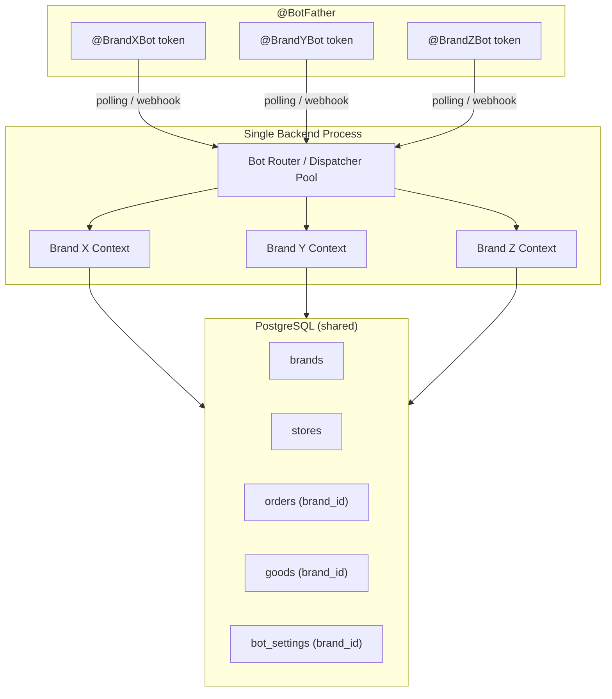
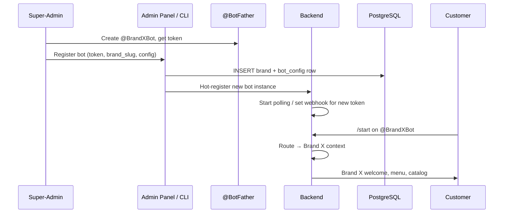

# Card 19: Multi-Brand / Multi-Store Telegram Bot Coordination Platform

## Implementation Status

> **15% Complete** | `███░░░░░░░░░░░░░░░░` | Database models exist — multi-bot runtime & admin UI not started.

**Phase:** 3 — Platform Scale
**Priority:** High
**Effort:** Very High (10–14 days)
**Dependencies:** Brand/Store/BrandStaff models (Card E8, merged), BotSettings per-brand support

---

## Flow Diagram





---

## Why

The database layer already supports multi-brand (`Brand`, `Store`, `BrandStaff`, per-brand `BotSettings`, `brand_id` on Orders/Cart/Goods/Categories). However the **runtime** is single-bot: one `Bot(token)` instance, one `Dispatcher`, one identity. This means:

- Every customer sees the same bot name, avatar, and description regardless of brand
- No brand isolation — a Thai street-food brand and a premium electronics brand share `@OneGenericBot`
- Franchise operators can't give each location its own identity
- The `brand_id` fields in the DB are unused at the handler layer

**This card bridges the gap:** one backend process manages N independent Telegram bots, each representing a brand. Customers interact with `@BrandXBot` and see only Brand X's catalog, prices, language, and payment methods — while the operator manages everything from a single backend.

### Target Users

- Retail chains, franchises, restaurant groups
- Multi-brand companies (fashion, electronics, food delivery)
- Agencies managing Telegram stores for multiple clients

---

## Scope

### In Scope

1. **Multi-bot runtime** — Run N `Bot` instances concurrently from one process (polling mode) or via per-bot webhook paths
2. **Bot ↔ Brand mapping** — `BotConfig` table linking each Telegram bot token to a `Brand`
3. **Brand context injection** — Middleware that resolves which bot received the update and injects `brand_id` + `store_id` into every handler
4. **Per-brand customisation** — Welcome message, menu layout, catalog subset, language, currency, payment methods, reply templates (stored in `BotSettings`)
5. **Hot registration** — Add/remove bots at runtime without full restart (CLI command or admin handler)
6. **Brand-scoped queries** — All handler-level DB queries filter by `brand_id`
7. **Super-admin dashboard** — Cross-brand analytics, bot list, per-bot settings (CLI first, web panel future)
8. **Store selector within a brand** — If a brand has multiple stores, customer picks one at `/start` or by location
9. **Security isolation** — Strict `brand_id` filtering; no cross-brand data leakage
10. **Per-brand rate limiting** — Independent rate-limit buckets per bot token
11. **Scalability** — Queue-based outgoing messages, handle 10–100+ bots on one backend

### Out of Scope (Future)

- Web-based admin panel (CLI-first for now)
- Automatic bot creation via Telegram API (manual @BotFather step remains)
- Cross-brand loyalty / shared user accounts
- Per-bot billing / revenue split
- White-label customer-facing web store

---

## Database Changes

### New: `BotConfig` table

```python
class BotConfig(Database.BASE):
    """Maps a Telegram bot token to a Brand. One brand = one bot."""
    __tablename__ = 'bot_configs'

    id = Column(Integer, primary_key=True)
    brand_id = Column(Integer, ForeignKey('brands.id', ondelete='CASCADE'), nullable=False, unique=True)
    bot_token = Column(String(100), nullable=False, unique=True)
    bot_username = Column(String(64), nullable=True)       # @BrandXBot (cached from getMe)
    bot_display_name = Column(String(128), nullable=True)  # Cached from getMe

    # Per-bot operational config
    is_active = Column(Boolean, nullable=False, default=True, index=True)
    webhook_url = Column(String(500), nullable=True)       # NULL = use polling
    webhook_secret = Column(String(128), nullable=True)    # Telegram webhook secret token
    allowed_updates = Column(JSON, nullable=True)          # Override default update types

    # Per-bot feature flags
    payments_enabled = Column(JSON, nullable=True)         # e.g. ["promptpay", "bitcoin", "cash"]
    default_language = Column(String(5), nullable=True)    # e.g. "th", "en"
    default_currency = Column(String(5), nullable=True)    # e.g. "THB", "USD"

    # Customisation
    welcome_message = Column(Text, nullable=True)          # Override default welcome
    menu_style = Column(String(20), nullable=True)         # 'grid', 'list', 'category_first'

    created_at = Column(DateTime(timezone=True), nullable=False, server_default=func.now())
    updated_at = Column(DateTime(timezone=True), nullable=True, onupdate=func.now())

    # Relationships
    brand = relationship('Brand', backref=backref('bot_config', uselist=False))
```

### Modify: `Brand` model

```python
# Add convenience property
@property
def bot(self) -> Optional['BotConfig']:
    """Get the bot configuration for this brand."""
    return self.bot_config
```

### Modify: `BotSettings` table — no schema change needed

Already has `brand_id` FK. Per-brand settings like reply templates, catalog visibility rules, and theme config will be stored as key-value pairs scoped to `brand_id`.

---

## Architecture: Multi-Bot Runtime

### Option A: Multi-Polling (development / small scale, ≤20 bots)

```python
# bot/multibot/pool.py

class BotPool:
    """Manages multiple Bot + Dispatcher pairs in one asyncio event loop."""

    def __init__(self):
        self._bots: dict[int, BotInstance] = {}  # brand_id -> BotInstance
        self._tasks: dict[int, asyncio.Task] = {}

    async def register(self, config: BotConfig):
        """Start polling for a new bot."""
        bot = Bot(token=config.bot_token, default=DefaultBotProperties(parse_mode="HTML"))
        dp = Dispatcher(storage=self._storage)
        register_handlers(dp)  # Same handlers for all bots
        dp.update.middleware(BrandContextMiddleware(config.brand_id))

        me = await bot.get_me()
        config.bot_username = me.username
        config.bot_display_name = me.first_name

        instance = BotInstance(bot=bot, dp=dp, config=config)
        self._bots[config.brand_id] = instance
        self._tasks[config.brand_id] = asyncio.create_task(
            dp.start_polling(bot, allowed_updates=config.allowed_updates)
        )

    async def unregister(self, brand_id: int):
        """Stop polling for a bot."""
        if brand_id in self._tasks:
            self._tasks[brand_id].cancel()
            await self._bots[brand_id].bot.session.close()
            del self._bots[brand_id]
            del self._tasks[brand_id]

    async def start_all(self):
        """Load all active BotConfigs from DB and start polling."""
        with Database().session() as session:
            configs = session.query(BotConfig).filter(BotConfig.is_active == True).all()
            for config in configs:
                await self.register(config)

    async def shutdown(self):
        """Gracefully stop all bots."""
        for brand_id in list(self._tasks.keys()):
            await self.unregister(brand_id)
```

### Option B: Webhook Mode (production / large scale, >20 bots)

```python
# bot/multibot/webhook_server.py

from aiohttp import web

class WebhookServer:
    """Single aiohttp server with per-bot webhook paths."""

    def __init__(self, pool: BotPool, base_url: str):
        self._pool = pool
        self._base_url = base_url
        self._app = web.Application()

    async def setup(self):
        """Register webhook routes for all active bots."""
        for brand_id, instance in self._pool._bots.items():
            path = f"/webhook/{instance.config.id}"
            self._app.router.add_post(path, self._make_handler(instance))

            webhook_url = f"{self._base_url}{path}"
            await instance.bot.set_webhook(
                url=webhook_url,
                secret_token=instance.config.webhook_secret,
                allowed_updates=instance.config.allowed_updates,
            )
            instance.config.webhook_url = webhook_url

    def _make_handler(self, instance: BotInstance):
        async def handle(request: web.Request):
            # Validate secret token
            if request.headers.get("X-Telegram-Bot-Api-Secret-Token") != instance.config.webhook_secret:
                return web.Response(status=403)
            update = Update.model_validate(await request.json(), context={"bot": instance.bot})
            await instance.dp.feed_update(instance.bot, update)
            return web.Response(status=200)
        return handle
```

### Recommendation

Start with **Option A (multi-polling)** — it matches the current architecture, requires no public endpoint, and works behind Tailscale VPN. Migrate to webhooks when bot count exceeds ~20 or latency requirements tighten.

---

## Brand Context Middleware

```python
# bot/middleware/brand_context.py

from aiogram import BaseMiddleware
from aiogram.types import TelegramObject
from typing import Any, Callable, Awaitable

class BrandContextMiddleware(BaseMiddleware):
    """Injects brand_id into handler data for every update."""

    def __init__(self, brand_id: int):
        self.brand_id = brand_id
        super().__init__()

    async def __call__(
        self,
        handler: Callable[[TelegramObject, dict[str, Any]], Awaitable[Any]],
        event: TelegramObject,
        data: dict[str, Any],
    ) -> Any:
        data["brand_id"] = self.brand_id
        data["brand_context"] = await self._load_brand_context(self.brand_id)
        return await handler(event, data)

    async def _load_brand_context(self, brand_id: int) -> "BrandContext":
        """Load brand + config from cache or DB."""
        # Redis cache key: f"brand_ctx:{brand_id}"
        # Contains: brand name, slug, stores, active settings, payment methods, language, currency
        ...
```

### Handler Changes

All existing handlers receive `brand_id` from middleware and must pass it to DB queries:

```python
# Before (single-brand)
goods = session.query(Goods).filter(Goods.is_active == True).all()

# After (multi-brand)
brand_id = data["brand_id"]
goods = session.query(Goods).filter(
    Goods.is_active == True,
    Goods.brand_id == brand_id,
).all()
```

---

## Store Selector (Multi-Store within a Brand)

When a brand has multiple stores, the customer chooses one at `/start` or when placing an order:

```python
# bot/handlers/user/store_selector.py

async def cmd_start(message: Message, brand_id: int, state: FSMContext):
    """On /start, check if brand has multiple stores."""
    with Database().session() as session:
        stores = session.query(Store).filter(
            Store.brand_id == brand_id,
            Store.is_active == True,
        ).all()

        if len(stores) == 1:
            # Single store — auto-select
            await state.update_data(store_id=stores[0].id)
            await show_main_menu(message, brand_id, stores[0].id)
        elif len(stores) > 1:
            # Multiple stores — show selector
            kb = InlineKeyboardMarkup(inline_keyboard=[
                [InlineKeyboardButton(
                    text=f"📍 {store.name}" + (f" — {store.address}" if store.address else ""),
                    callback_data=f"select_store:{store.id}"
                )] for store in stores
            ])
            # Optionally add "📍 Nearest to me" button for GPS-based selection
            await message.answer(
                brand_context.welcome_message or "Welcome! Choose your location:",
                reply_markup=kb,
            )
        else:
            await message.answer("This brand has no active stores.")
```

---

## Per-Brand Configuration Keys (BotSettings)

Stored in `bot_settings` table with `brand_id` FK:

| Setting Key | Example Value | Purpose |
|-------------|--------------|---------|
| `welcome_message` | `"Welcome to BrandX! 🍜"` | Custom greeting |
| `menu_style` | `"category_first"` | How catalog is displayed |
| `delivery_types` | `["door","pickup"]` | Enabled delivery methods |
| `payment_methods` | `["promptpay","cash"]` | Enabled payment methods |
| `order_confirmation_template` | `"Your order #{code} is confirmed!"` | Custom order messages |
| `business_hours` | `{"mon":"09:00-22:00",...}` | Per-brand operating hours |
| `min_order_amount` | `"150"` | Minimum order total |
| `delivery_fee_default` | `"50"` | Default delivery fee |
| `catalog_visible_categories` | `["food","drinks"]` | Which categories this brand shows |
| `theme_emoji` | `"🍕"` | Brand emoji for messages |
| `support_contact` | `"@BrandXSupport"` | Brand-specific support |

---

## Super-Admin CLI Commands

```bash
# List all registered bots
python bot_cli.py bots list

# Register a new bot
python bot_cli.py bots add \
    --brand-slug "brand-x" \
    --token "123456:ABC-DEF" \
    --language "th" \
    --currency "THB" \
    --payments "promptpay,cash"

# Deactivate a bot (stops polling, keeps data)
python bot_cli.py bots deactivate --brand-slug "brand-x"

# Reactivate
python bot_cli.py bots activate --brand-slug "brand-x"

# Show cross-brand analytics
python bot_cli.py analytics --all-brands --last 30d

# Show per-brand stats
python bot_cli.py analytics --brand "brand-x" --last 7d

# Update per-brand setting
python bot_cli.py settings set --brand "brand-x" --key "min_order_amount" --value "200"
```

---

## Security & Isolation

| Concern | Mitigation |
|---------|-----------|
| Cross-brand data leakage | Every DB query in handlers MUST include `brand_id` filter. Add a `BrandScopedQuery` helper that auto-appends the filter. |
| Token exposure | Bot tokens stored encrypted in DB (use `cryptography.fernet`). Decrypted only at runtime into `Bot()` constructor. |
| Staff cross-brand access | `BrandStaff` already enforces brand-scoped roles. Middleware checks `user.telegram_id` against `BrandStaff` for the active `brand_id`. |
| Payment credential isolation | Per-brand `promptpay_id` already on `Brand` model. Crypto address pools should be partitioned by `brand_id`. |
| Rate limit isolation | Each bot gets its own rate-limit bucket (keyed by `brand_id:user_id`), preventing one brand's traffic from throttling another. |
| Webhook secret validation | Each `BotConfig` has a unique `webhook_secret`; validated on every incoming webhook request. |

### Brand-Scoped Query Helper

```python
# bot/database/brand_scope.py

def brand_query(session, model, brand_id: int, **filters):
    """All handler-level queries go through this to enforce brand isolation."""
    q = session.query(model).filter(model.brand_id == brand_id)
    for key, value in filters.items():
        q = q.filter(getattr(model, key) == value)
    return q
```

---

## Onboarding Flow for a New Brand

1. **Super-admin** creates a new bot via `@BotFather` → gets `@BrandXBot` username + token
2. **Register** via CLI: `python bot_cli.py bots add --brand-slug brand-x --token <token> ...`
   - Creates `Brand` row (if not exists)
   - Creates `BotConfig` row (token, language, currency, payments)
   - Calls `bot.get_me()` to cache username + display name
3. **Configure** products/categories visible to this brand:
   - `python bot_cli.py categories assign --brand brand-x --categories "food,drinks"`
   - Or set via `BotSettings`: `catalog_visible_categories`
4. **Configure** stores (locations) under this brand:
   - `python bot_cli.py stores add --brand brand-x --name "Central Branch" --address "123 Sukhumvit"`
5. **Start** (if hot-registration): `python bot_cli.py bots activate --brand-slug brand-x`
   - Backend's `BotPool.register()` starts polling for this token
6. **Test**: Start chat with `@BrandXBot` → see brand-specific welcome, menu, catalog

---

## Files to Create

| File | Purpose |
|------|---------|
| `bot/multibot/__init__.py` | Multi-bot package init |
| `bot/multibot/pool.py` | `BotPool` — manages N Bot/Dispatcher instances |
| `bot/multibot/instance.py` | `BotInstance` dataclass (bot, dp, config) |
| `bot/multibot/webhook_server.py` | Webhook mode server (future, optional) |
| `bot/middleware/brand_context.py` | `BrandContextMiddleware` — injects `brand_id` into every handler |
| `bot/database/brand_scope.py` | `brand_query()` helper for enforced brand filtering |
| `bot/handlers/user/store_selector.py` | Store selection UI for multi-store brands |
| `tests/unit/multibot/test_pool.py` | BotPool registration, start, shutdown |
| `tests/unit/multibot/test_brand_context.py` | Middleware injects correct brand_id |
| `tests/unit/database/test_bot_config.py` | BotConfig model CRUD |
| `tests/integration/test_multi_brand_isolation.py` | Cross-brand query isolation |

## Files to Modify

| File | Changes |
|------|---------|
| `bot/database/models/main.py` | Add `BotConfig` model, add `bot_config` relationship to `Brand` |
| `bot/main.py` | Replace single `Bot()` + `Dispatcher()` with `BotPool`. Load all active `BotConfig` rows on startup. Graceful shutdown for all bots. |
| `bot/handlers/user/*.py` | Add `brand_id = data["brand_id"]` to all handlers. Filter all queries by `brand_id`. |
| `bot/handlers/admin/*.py` | Scope admin operations to `brand_id`. Add brand-management commands for super-admins. |
| `bot/handlers/other.py` | `/start` routes through store selector if brand has multiple stores. |
| `bot/middleware/rate_limit.py` | Key rate-limit buckets by `brand_id:user_id` instead of just `user_id`. |
| `bot/keyboards/*.py` | Accept `brand_id` parameter to customize button labels, catalog filters. |
| `bot/payments/notifications.py` | Include brand name in payment notification messages. |
| `bot/caching/cache_manager.py` | Namespace cache keys by `brand_id` to prevent cross-brand cache collision. |
| `bot/config/env.py` | Add `MULTI_BOT_ENABLED`, `WEBHOOK_BASE_URL`, `BOT_TOKEN_ENCRYPTION_KEY` env vars. |
| `bot/monitoring/metrics.py` | Add per-brand metrics (orders/brand, active users/brand, response time/brand). |
| `bot_cli.py` | Add `bots` command group (`list`, `add`, `activate`, `deactivate`), `analytics --all-brands`. |
| `.env.example` | Add new env vars for multi-bot mode. |
| `docker-compose.yml` | Add env vars. |

---

## Implementation Plan

### Phase 1: Foundation (Days 1–3)

1. Add `BotConfig` model + migration
2. Create `BotPool` with multi-polling support
3. Create `BrandContextMiddleware`
4. Modify `bot/main.py` to use `BotPool` (backward-compatible: if only 1 bot config, behave as today)
5. Unit tests for pool + middleware

### Phase 2: Handler Migration (Days 4–7)

6. Create `brand_query()` helper
7. Migrate all user handlers to accept and filter by `brand_id`
8. Migrate admin handlers — brand-scoped operations
9. Add store selector to `/start`
10. Update keyboards to accept brand context
11. Namespace rate-limit and cache keys by `brand_id`

### Phase 3: Administration (Days 8–10)

12. CLI commands for bot management (`bots add/list/activate/deactivate`)
13. CLI commands for per-brand settings
14. CLI cross-brand analytics
15. Token encryption at rest

### Phase 4: Polish & Testing (Days 11–14)

16. Integration tests for brand isolation (query leakage, cache collision, rate-limit independence)
17. Hot-registration test (add bot without restart)
18. Load test: 10+ bots polling concurrently
19. Documentation update
20. Backward compatibility: single-bot deployments work without `BotConfig` rows (auto-create from `BOT_TOKEN` env var)

---

## Scaling Considerations

| Bots | Mode | Infrastructure | Notes |
|------|------|---------------|-------|
| 1–5 | Polling | Single VPS (2 CPU, 2GB RAM) | Current setup works |
| 5–20 | Polling | Single VPS (4 CPU, 4GB RAM) | Each bot = ~1 coroutine, minimal overhead |
| 20–50 | Webhook | Single VPS + Redis queue | Webhook reduces idle connections; Redis queue for outgoing messages |
| 50–100+ | Webhook | Horizontal scale (2+ instances) | Load-balance webhooks; shared Redis + PostgreSQL; each instance handles a subset of bots |

### Telegram Limits

- **~20 bots per Telegram account** (40 for Premium)
- Use separate owner accounts if >40 brands needed
- Each bot has independent rate limits (30 msg/sec to different users)
- Webhook: Telegram retries for ~24h on failure

---

## Config

```env
# Multi-bot mode
MULTI_BOT_ENABLED=true                    # false = single-bot legacy mode (uses BOT_TOKEN)
BOT_TOKEN_ENCRYPTION_KEY=                  # Fernet key for encrypting tokens at rest

# Webhook mode (optional, default is polling)
WEBHOOK_MODE=false
WEBHOOK_BASE_URL=https://yourdomain.com    # Public URL for webhook callbacks
WEBHOOK_PORT=8443                          # Port for webhook server

# Legacy single-bot fallback
BOT_TOKEN=123456:ABC-DEF                   # Used when MULTI_BOT_ENABLED=false
```

---

## Backward Compatibility

When `MULTI_BOT_ENABLED=false` (default), the system behaves exactly as today:
- Uses `BOT_TOKEN` env var for a single bot
- No `BotPool` — direct `Bot()` + `Dispatcher()` as current code
- `brand_id` defaults to `1` (auto-created default brand)
- All existing deployments continue to work without any config change

When `MULTI_BOT_ENABLED=true`:
- `BOT_TOKEN` env var is ignored
- All bots loaded from `bot_configs` table
- `BotPool` manages lifecycle
- `BrandContextMiddleware` injects brand context

---

## Acceptance Criteria

- [ ] Multiple bots can run concurrently from one backend process
- [ ] Each bot shows its own brand name, catalog, and welcome message
- [ ] Customer on `@BrandXBot` sees only Brand X products
- [ ] Customer on `@BrandYBot` sees only Brand Y products
- [ ] Orders are attributed to the correct brand and store
- [ ] Admin on Brand X cannot see/modify Brand Y data
- [ ] New bot can be registered via CLI without backend restart
- [ ] Bot can be deactivated/reactivated without affecting other bots
- [ ] Multi-store brands show a store selector on `/start`
- [ ] Rate limits are independent per bot
- [ ] Cache keys are namespaced per brand (no cross-brand collision)
- [ ] Single-bot deployments (`MULTI_BOT_ENABLED=false`) work unchanged
- [ ] System handles 10+ bots polling concurrently without degradation
- [ ] Bot tokens are encrypted at rest in the database

---

## Test Plan

| Test File | Test | What to Assert |
|-----------|------|----------------|
| `tests/unit/multibot/test_pool.py` | `test_register_bot` | Bot + Dispatcher created, polling task started |
| | `test_unregister_bot` | Polling stopped, session closed, removed from pool |
| | `test_start_all_loads_from_db` | All active BotConfigs loaded and started |
| | `test_inactive_bot_not_started` | `is_active=False` bots skipped |
| `tests/unit/multibot/test_brand_context.py` | `test_middleware_injects_brand_id` | Handler receives correct `brand_id` in `data` |
| | `test_middleware_loads_brand_context` | Brand name, settings, stores available in context |
| `tests/unit/database/test_bot_config.py` | `test_create_bot_config` | BotConfig persists with all fields |
| | `test_one_bot_per_brand` | Unique constraint on `brand_id` enforced |
| | `test_unique_token` | Unique constraint on `bot_token` enforced |
| `tests/unit/database/test_brand_scope.py` | `test_brand_query_filters` | `brand_query()` only returns rows matching `brand_id` |
| | `test_no_cross_brand_leakage` | Brand A query returns 0 rows from Brand B data |
| `tests/integration/test_multi_brand_isolation.py` | `test_order_brand_isolation` | Order created on Brand A not visible to Brand B queries |
| | `test_cart_brand_isolation` | Cart items scoped to brand |
| | `test_goods_brand_isolation` | Goods query returns only brand-specific items |
| | `test_settings_brand_isolation` | BotSettings scoped per brand |
| `tests/integration/test_store_selector.py` | `test_single_store_auto_select` | Brand with 1 store skips selector |
| | `test_multi_store_shows_selector` | Brand with 2+ stores shows location picker |

---

## Risks & Mitigations

| Risk | Impact | Mitigation |
|------|--------|------------|
| Handler migration breaks existing single-bot setup | All users affected | Backward-compat mode: `MULTI_BOT_ENABLED=false` preserves current behavior exactly |
| Forgotten `brand_id` filter in a handler query | Cross-brand data leak | `brand_query()` helper + integration tests that seed 2 brands and assert isolation |
| Too many polling connections from one IP | Telegram throttles | Switch to webhook mode for >20 bots; stagger polling start by 1s per bot |
| Bot token leaked from DB | Full bot compromise | Fernet encryption at rest; token only decrypted into memory |
| One bot's error crashes the event loop | All bots go down | Each bot's polling runs in its own `asyncio.Task` with exception isolation |
| Redis cache key collision across brands | Wrong data served | Namespace all cache keys: `brand:{brand_id}:key` |
| Memory growth with many bots | OOM on small VPS | Each Bot instance is lightweight (~5MB); 50 bots ≈ 250MB. Monitor with existing metrics endpoint. |

---

## Future Enhancements

- **Web admin panel** — React/Vue dashboard for super-admins to manage all brands visually
- **Auto bot creation** — Telegram Bot API `createNewStickerSet`-style automation (not available for bot creation yet, but may come)
- **Cross-brand user accounts** — Optional shared loyalty / wallet across brands (opt-in per brand)
- **Per-brand billing** — Track costs per bot for agency use cases (API calls, message volume)
- **Brand templates** — Pre-built configurations (restaurant, retail, service) for quick onboarding
- **A/B testing** — Run two bot configs for the same brand to test different welcome messages / menu layouts
- **Analytics dashboard** — Per-brand and cross-brand Grafana boards
- **Webhook load balancer** — Distribute webhook handling across multiple backend instances for 100+ bots
