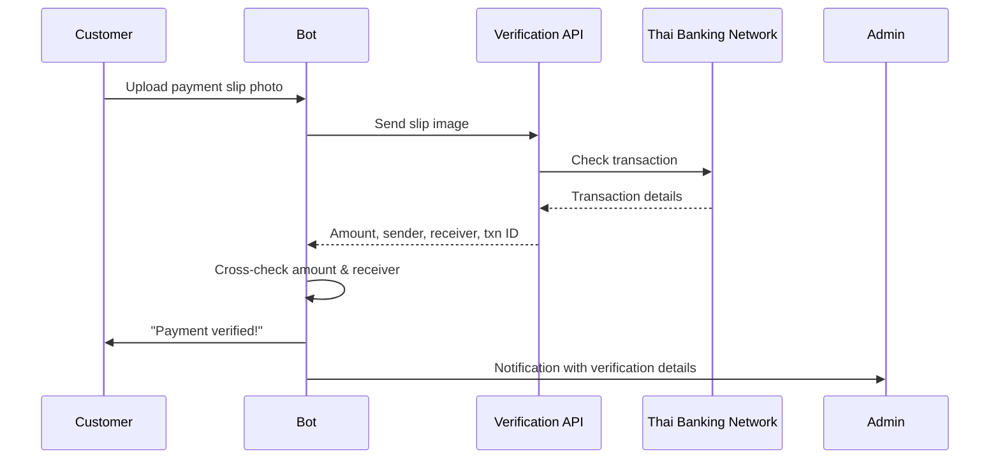

# Slip Verification Setup Guide

This guide walks you through setting up automatic PromptPay slip verification. Once configured, the bot will instantly verify customer payment slips instead of waiting for manual admin approval.

## How It Works



All three supported providers verify slips from **every Thai bank** — the slip doesn't need to come from any specific bank. A customer paying via KBank, SCB, Bangkok Bank, KTB, TTB, GSB, TrueMoney, or any other Thai bank will be verified through a single API.

## Supported Providers

| Provider | Free Tier | Duplicate Detection | Starting Price | Best For |
|----------|-----------|-------------------|---------------|----------|
| **SlipOK** | 100 slips/mo | No | 210 THB/mo (500 slips) | Getting started, testing |
| **EasySlip** | No | Yes (built-in) | 99 THB/mo (250 slips) | Production use, fraud prevention |
| **RDCW** | No | No | Pay-as-you-go (~0.19 THB/slip) | High volume |

You only need **one** provider. If you configure multiple, the bot tries them in order (SlipOK → EasySlip → RDCW) and falls back to the next if one fails or hits its quota.

## Banks Covered

All providers verify slips from any bank on the Thai PromptPay / National ITMX network:

| Bank | Code | Covered |
|------|------|---------|
| Bangkok Bank (BBL) | 002 | Yes |
| Kasikorn Bank (KBANK) | 004 | Yes |
| Krungthai Bank (KTB) | 006 | Yes |
| TMBThanachart (TTB) | 011 | Yes |
| Siam Commercial Bank (SCB) | 014 | Yes |
| Krungsri (Bank of Ayudhya) | 025 | Yes |
| CIMB Thai | 022 | Yes |
| UOB Thailand | 024 | Yes |
| Government Savings Bank (GSB) | 030 | Yes |
| BAAC (Agricultural Bank) | 034 | Yes |
| TrueMoney Wallet | 071 | Yes |
| Land & Houses Bank (LHBANK) | 073 | Yes |

This includes any bank that participates in the Bank of Thailand's PromptPay interbank transfer system.

---

## Provider 1: SlipOK

**Website:** https://slipok.com

**Best for:** Getting started. Has a free tier (100 slips/month) so you can test without paying.

### Sign-Up Steps

1. Go to https://slipok.com and click "Register" / "สมัครสมาชิก"
2. Create an account with your email
3. After login, go to **Dashboard** → **Branch Management**
4. Create a new branch (this represents your shop/business)
5. Note down your **Branch ID** (numeric ID shown on the dashboard)
6. Go to **API Key** section and generate a new API key
7. Copy the API key

### Environment Variables

```env
SLIPOK_API_KEY=your_api_key_here
SLIPOK_BRANCH_ID=your_branch_id_here
```

### Pricing

| Plan | Monthly Price | Slips Included | Per Extra Slip |
|------|--------------|----------------|----------------|
| Free | 0 THB | 100 | N/A |
| Starter | 210 THB | 500 | ~1.0 THB |
| Medium | 360 THB | 1,000 | ~0.8 THB |
| Large | 600 THB | 2,000 | ~0.6 THB |
| Enterprise | 3,690+ THB | 15,000+ | ~0.19 THB |

### API Details

- **Endpoint:** `POST https://api.slipok.com/api/line/apikey/{branch_id}`
- **Auth:** `x-authorization` header with API key
- **Input:** Slip image file upload (JPG/PNG)
- **Rate limit:** Based on plan quota

---

## Provider 2: EasySlip (Recommended for Production)

**Website:** https://easyslip.com

**Best for:** Production shops that need fraud prevention. EasySlip has **built-in duplicate slip detection** — if a customer tries to reuse the same slip for two orders, the API will flag it automatically.

### Sign-Up Steps

1. Go to https://easyslip.com and click "Get Started" / "เริ่มต้นใช้งาน"
2. Register with your email and verify it
3. After login, go to **API Products** → choose a plan
4. Go to **Dashboard** → **API Keys**
5. Create a new API key for your branch
6. Copy the API key (starts with a long token string)

### Environment Variables

```env
EASYSLIP_API_KEY=your_api_key_here
```

Only one key needed — no branch ID or secret required.

### Pricing

| Plan | Monthly Price | Slips Included |
|------|--------------|----------------|
| Start | 99 THB | 250 |
| Basic | 350 THB | 1,000 |
| Starter | 700 THB | 2,500 |
| Silver | 1,500 THB | 6,000 |
| Gold | 3,500 THB | 17,500 |
| Diamond | 5,000 THB | 35,000 |

### API Details

- **Endpoint:** `POST https://api.easyslip.com/v2/verify/bank`
- **Auth:** `Authorization: Bearer {api_key}` header
- **Input:** Base64-encoded slip image (JPG/PNG)
- **Features:** Duplicate detection, amount matching, account matching, TrueWallet support

### Why Duplicate Detection Matters

Without duplicate detection, a dishonest customer could:
1. Pay 450 THB once
2. Screenshot the slip
3. Upload the same slip for multiple orders

EasySlip tracks every verified slip and returns `isDuplicate: true` if it has been seen before. The bot will automatically reject duplicate slips and alert the admin.

---

## Provider 3: RDCW

**Website:** https://slip.rdcw.co.th

**Best for:** High-volume shops that want pay-as-you-go pricing without monthly commitments.

### Sign-Up Steps

1. Go to https://slip.rdcw.co.th and register for an account
2. After login, go to your **Dashboard**
3. Create API credentials — you'll receive a **Client ID** and **Client Secret**
4. Top up your balance (prepaid model)
5. Optionally configure IP whitelist for security

### Environment Variables

```env
RDCW_CLIENT_ID=your_client_id_here
RDCW_CLIENT_SECRET=your_client_secret_here
```

### Pricing

Pay-as-you-go (prepaid top-up). Approximate rates:
- ~0.50 THB/slip at low volume
- ~0.19 THB/slip at high volume (100,000+)

No monthly fee — you only pay for slips you actually verify.

### API Details

- **Endpoint:** `POST https://suba.rdcw.co.th/v2/inquiry`
- **Auth:** HTTP Basic Auth (`client_id:client_secret`)
- **Input:** Slip image file upload (JPG/PNG)
- **Note:** Amount returned in satang (1 THB = 100 satang) — the bot handles conversion automatically

---

## Configuration

### Minimal Setup (SlipOK Free Tier)

Add to your `.env` file:

```env
SLIPOK_API_KEY=your_key
SLIPOK_BRANCH_ID=your_branch_id
SLIP_AUTO_VERIFY=1
```

### Production Setup (EasySlip + SlipOK Fallback)

```env
# Primary — EasySlip for duplicate detection
EASYSLIP_API_KEY=your_easyslip_key

# Fallback — SlipOK if EasySlip is down
SLIPOK_API_KEY=your_slipok_key
SLIPOK_BRANCH_ID=your_branch_id

SLIP_AUTO_VERIFY=1
```

### Disable Auto-Verification

If you want to keep manual admin review only:

```env
SLIP_AUTO_VERIFY=0
```

The bot will still accept slip photos and forward them to the admin, but won't call any verification API.

---

## What Gets Verified

When a customer uploads a slip, the API returns:

| Field | Description | Used For |
|-------|-------------|----------|
| `transRef` | Bank transaction reference ID | Uniquely identifies the payment |
| `amount` | Transfer amount in THB | Cross-checked against order total |
| `sender.name` | Customer's bank account name | Shown to admin for reference |
| `sender.bank` | Customer's bank (e.g., KBANK, SCB) | Shown to admin |
| `receiver.name` | Your account name | Cross-checked against `PROMPTPAY_ACCOUNT_NAME` |
| `receiver.bank` | Your bank | Shown to admin |
| `date` | Transaction date/time | Logged for audit |
| `isDuplicate` | Whether slip was used before | EasySlip only — prevents fraud |

The bot automatically cross-checks:
1. **Amount** — slip amount must match order total (within 0.01 THB tolerance)
2. **Receiver** — slip receiver must match your `PROMPTPAY_ACCOUNT_NAME` (if set)

If either check fails, the order stays pending and the admin is notified with the mismatch details.

---

## Troubleshooting

### "No slip verification API keys configured"
You haven't set any provider API keys in `.env`. Add at least one provider's keys and restart the bot.

### "Quota exceeded"
Your monthly slip verification quota is used up. Either upgrade your plan or add a second provider as fallback.

### "Slip not found"
The slip image couldn't be read or the transaction wasn't found in the banking network. This can happen with:
- Blurry or cropped photos
- Screenshots of old transactions (some providers have time limits)
- Non-PromptPay transfers (e.g., international wire transfers)

The order stays pending for manual admin verification.

### "Amount mismatch"
The slip is real but the amount doesn't match the order total. This could mean:
- Customer paid a different amount
- Customer sent a slip from a different transaction
- Bonus/discount wasn't applied correctly

Admin should review manually.

### "Duplicate slip"
(EasySlip only) This exact slip has been verified before. The customer may be trying to reuse a payment slip. The order is **not** auto-confirmed and the admin is alerted.
