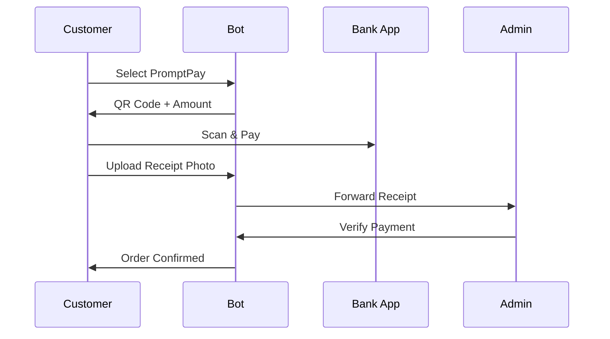

# Card 1: PromptPay QR Payment Generation + Verification

## Implementation Status

> **90% Complete** | `██████████████████░░` | Models + QR generation + tests done. Receipt upload handler exists in `order_handler.py`; separate handler file not created.

## Flow Diagram



**Phase:** 1 — Core Thailand Differentiators
**Priority:** High
**Effort:** Medium (1-2 days)
**Dependencies:** None

---

## Why

PromptPay is Thailand's #1 payment method (90%+ adoption via SCB, KBank, TrueMoney). Users expect to scan a QR code and pay instantly from their banking app. The current repo only supports Bitcoin and Cash on Delivery — neither is practical for Bangkok restaurant delivery.

## Scope

- New payment method `promptpay` alongside existing `bitcoin` and `cash`
- Generate dynamic PromptPay QR code with amount embedded (EMVCo standard)
- User uploads payment receipt photo (slip) after paying
- Admin verifies payment manually via bot button or CLI
- PromptPay account configurable via env vars

## Files to Create

| File | Purpose |
|------|---------|
| `bot/payments/promptpay.py` | QR generation using `promptpay` + `qrcode` Python libs |
| `bot/handlers/user/payment_promptpay_handler.py` | User-facing receipt upload flow |

## Files to Modify

| File | Changes |
|------|---------|
| `bot/database/models/main.py` | Add `payment_receipt_photo` (String, file_id), `payment_verified_by` (BigInteger), `payment_verified_at` (DateTime) to `Order` |
| `bot/config/env.py` | Add `PROMPTPAY_ID`, `PROMPTPAY_ACCOUNT_NAME` env vars |
| `bot/handlers/user/order_handler.py` | Add `promptpay` as third payment method. After selection: generate QR, send to user, transition to receipt upload state |
| `bot/states/payment_state.py` | Add `waiting_receipt_photo` state |
| `bot/handlers/admin/main.py` | Add "Verify Payment" inline button on order view |
| `bot_cli.py` | Add `--verify-payment` flag to `order` command |
| `bot/payments/notifications.py` | Add `notify_payment_received()` for admin alert when receipt uploaded |
| `bot/i18n/strings.py` | Add promptpay-related strings (en/ru/th) |
| `bot/keyboards/inline.py` | Add promptpay payment button, verify payment button |
| `requirements.txt` | Add `promptpay>=1.1`, `qrcode[pil]>=7.4` |

## Implementation Details

### QR Generation Flow
```
User selects PromptPay → bot generates QR with:
  - PromptPay ID (from config)
  - Amount (order total in THB)
  - Note: order_code
→ QR sent as photo message to user
→ User pays via bank app
→ User uploads screenshot/receipt photo
→ Bot saves file_id to Order.payment_receipt_photo
→ Admin notified with receipt photo + order details
→ Admin clicks "Verified" → order status → confirmed
```

### PromptPay QR Payload
- Use EMVCo standard (same as all Thai banks)
- `promptpay` Python lib handles payload encoding
- `qrcode` lib renders to PNG
- Send via `bot.send_photo()` with caption showing amount + instructions

### Receipt Verification
- **MVP:** Admin manual verification via inline button
- **Future (optional):** OCR auto-check via Google Vision or OpenAI

### Config
```env
PROMPTPAY_ID=0812345678
PROMPTPAY_ACCOUNT_NAME=Restaurant Name
```

### Model Changes
```python
# Add to Order class
payment_receipt_photo = Column(String(255), nullable=True)  # Telegram file_id
payment_verified_by = Column(BigInteger, nullable=True)     # Admin who verified
payment_verified_at = Column(DateTime, nullable=True)
```

### New Dependencies
```
promptpay>=1.1
qrcode[pil]>=7.4
Pillow>=10.0
```

## Acceptance Criteria

- [x] User can select PromptPay at checkout
- [x] QR code with correct amount is generated and sent
- [x] User can upload receipt photo
- [x] Admin receives notification with receipt
- [x] Admin can verify payment via bot button or CLI
- [x] Order transitions to confirmed after verification
- [x] PromptPay account configurable via env vars and CLI

## Test Plan

| Test File | Tests | What to Assert |
|-----------|-------|----------------|
| `tests/unit/payments/test_promptpay.py` | `test_generate_qr_payload` | QR payload contains correct PromptPay ID + amount in EMVCo format |
| | `test_generate_qr_image` | Returns valid PNG bytes, correct dimensions |
| | `test_qr_with_zero_amount` | Raises ValueError — amount must be > 0 |
| | `test_qr_with_invalid_promptpay_id` | Raises ValueError for malformed phone/ID |
| `tests/unit/database/test_models.py` | `test_order_payment_receipt_fields` | `payment_receipt_photo`, `payment_verified_by`, `payment_verified_at` nullable, default None |
| | `test_order_promptpay_payment_method` | Order with `payment_method="promptpay"` persists correctly |
| `tests/unit/database/test_crud.py` | `test_verify_payment` | Sets verified fields, transitions order to confirmed |
| | `test_save_receipt_photo` | Updates `payment_receipt_photo` with file_id string |
| `tests/integration/test_order_lifecycle.py` | `test_promptpay_order_full_flow` | Create order → select promptpay → upload receipt → admin verify → confirmed → delivered |
| | `test_promptpay_order_without_receipt` | Cannot verify without receipt photo |

### New Fixtures Needed
```python
# conftest.py additions
@pytest.fixture
def test_promptpay_order(db_session, test_user, test_goods):
    """Order with promptpay payment method"""
    order = Order(buyer_id=test_user.telegram_id, payment_method="promptpay",
                  total_price=Decimal("450.00"), order_code="PP0001",
                  order_status="reserved")
    db_session.add(order)
    db_session.commit()
    return order
```
