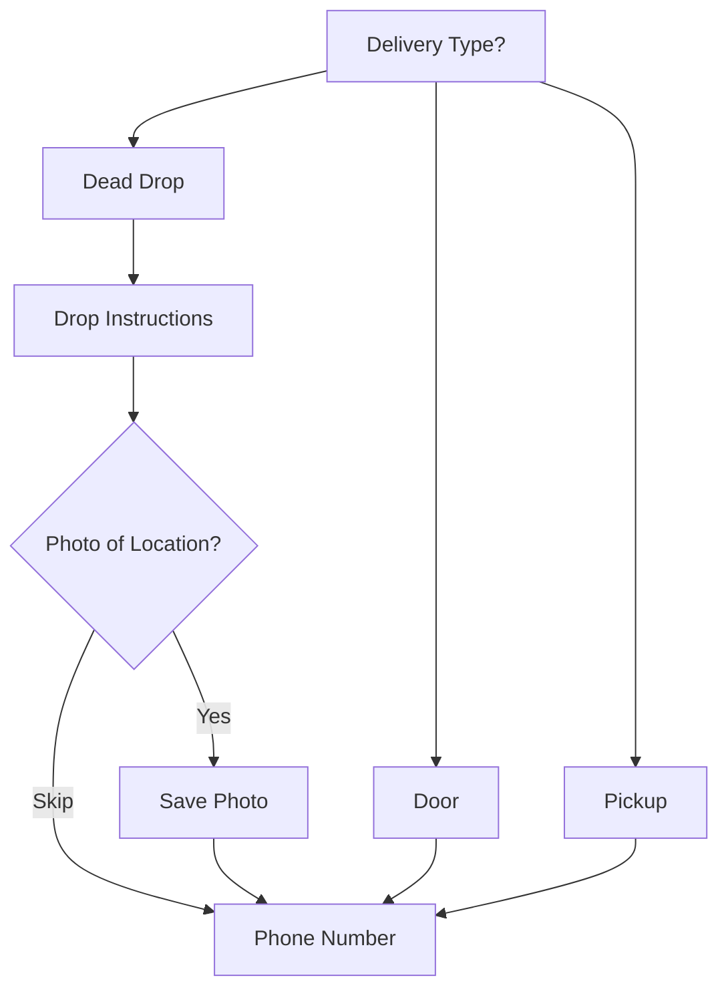

# Card 3: Dead Drop Option + Custom Delivery Instructions

## Implementation Status

> **100% Complete** | `████████████████████` | Model fields + handler + tests done. Dead drop instructions, GPS, multi-media, photo proof all implemented.

## Flow Diagram



**Phase:** 1 — Core Thailand Differentiators
**Priority:** High
**Effort:** Low (half day)
**Dependencies:** None

---

## Why

Condos with security guards, offices with reception desks, gated communities — Bangkok customers frequently need "leave with guard", "put at door", "lobby shelf". This is standard in Thai delivery apps (Grab calls it "Leave at Door"). Without this, riders can't complete deliveries when customers are unavailable.

## Scope

- New delivery type selection: Door delivery / Dead drop / Self-pickup
- Dead drop: collect specific instructions + optional photo of drop location
- Photo of drop location stored for rider reference
- Pickup flow skips address collection entirely

## Files to Modify

| File | Changes |
|------|---------|
| `bot/database/models/main.py` | Add `delivery_type` (String, default "door"), `drop_location_photo` (String, file_id), `drop_instructions` (Text) to `Order` |
| `bot/handlers/user/order_handler.py` | New step after address/location: select delivery type. Dead drop: collect instructions + optional photo. Pickup: skip address. |
| `bot/states/user_state.py` | Add `waiting_delivery_type`, `waiting_drop_instructions`, `waiting_drop_photo` states |
| `bot/keyboards/inline.py` | Delivery type selection buttons (Door / Dead Drop / Pickup) |
| `bot_cli.py` | Display delivery type + drop instructions in order view |
| `bot/payments/notifications.py` | Include delivery type and drop instructions in admin notifications |
| `bot/i18n/strings.py` | Add delivery type strings |

## Implementation Details

### Updated Checkout Flow
```
Address → Location (opt) → Delivery Type Selection → [Dead Drop Instructions + Photo] → Phone → Note → Payment
```

### Delivery Type Values
```python
DELIVERY_TYPES = {
    "door": "Deliver to Door",
    "dead_drop": "Dead Drop / Leave at Location",
    "pickup": "Self Pickup"
}
```

### Dead Drop Flow
```
User selects "Dead Drop"
→ Bot: "Please describe where to leave your order"
→ User types instructions
→ Bot: "Want to send a photo of the drop location? (optional)"
→ User sends photo or skips
→ Instructions + photo saved to Order
```

### Pickup Flow
```
User selects "Self Pickup"
→ Skip address/location collection
→ Bot shows restaurant address + operating hours
→ Continue to payment
```

### Model Changes
```python
# Add to Order class
delivery_type = Column(String(20), default="door")  # door | dead_drop | pickup
drop_location_photo = Column(String(255), nullable=True)  # Telegram file_id
drop_instructions = Column(Text, nullable=True)
```

## Acceptance Criteria

- [x] User can select delivery type (door/dead drop/pickup)
- [x] Dead drop collects text instructions
- [x] Dead drop optionally accepts photo of location
- [x] Pickup skips address collection
- [x] Admin sees delivery type + instructions in order view
- [x] CLI shows delivery type details

## Test Plan

| Test File | Tests | What to Assert |
|-----------|-------|----------------|
| `tests/unit/database/test_models.py` | `test_order_delivery_type_default` | Default is `"door"` |
| | `test_order_delivery_type_values` | Accepts `door`, `dead_drop`, `pickup` |
| | `test_order_drop_fields` | `drop_instructions` (Text) + `drop_location_photo` (String) nullable |
| `tests/unit/database/test_crud.py` | `test_create_dead_drop_order` | Order with delivery_type=dead_drop, instructions, and photo persists |
| | `test_create_pickup_order` | Order with delivery_type=pickup, no address required |
| `tests/integration/test_order_lifecycle.py` | `test_dead_drop_order_flow` | Full flow with dead drop type + instructions + photo |
| | `test_pickup_order_flow` | Pickup order skips address, completes successfully |
