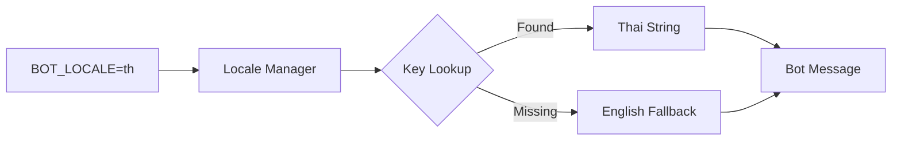

# Card 5: Full Thai Language (i18n)

## Implementation Status

> **100% Complete** | `████████████████████` | All Thai translations, locale loading, and tests fully implemented.

## Flow Diagram



**Phase:** 2 — Thailand Localization
**Priority:** Medium
**Effort:** Low (half day)
**Dependencies:** Cards 1-4 (need to translate new feature strings too)

---

## Why

Most Bangkok customers prefer Thai. The bot currently supports Russian and English only. Thai language support is essential for mass adoption in Thailand.

## Scope

- Add `th` locale with full translation of all strings
- Update locale loading to support Thai
- Thai as default locale in config
- Include translations for all Phase 1 features

## Files to Modify

| File | Changes |
|------|---------|
| `bot/i18n/strings.py` | Add `th` key to every translation dict (~80+ strings). Full Thai translations for all UI text, buttons, messages, errors, admin panels. |
| `bot/config/env.py` | Change `BOT_LOCALE` default to `"th"` |
| `bot/i18n/main.py` | Ensure locale manager handles `th` (likely works already since it's dict-based) |

## Key Translation Groups

```python
# Buttons
"btn.shop": "ร้านค้า"
"btn.profile": "โปรไฟล์"
"btn.rules": "กฎ"
"btn.support": "ติดต่อเรา"
"btn.referral": "แนะนำเพื่อน"

# Order flow
"order.select_payment": "เลือกวิธีชำระเงิน"
"order.enter_address": "กรุณาใส่ที่อยู่จัดส่ง"
"order.enter_phone": "กรุณาใส่หมายเลขโทรศัพท์"
"order.confirmed": "คำสั่งซื้อได้รับการยืนยัน"
"order.delivered": "คำสั่งซื้อจัดส่งแล้ว"

# PromptPay (Card 1)
"payment.promptpay.scan": "สแกน QR เพื่อชำระเงิน"
"payment.promptpay.upload_receipt": "อัปโหลดสลิปการโอนเงิน"

# Delivery types (Card 3)
"delivery.door": "จัดส่งถึงหน้าประตู"
"delivery.dead_drop": "วางไว้ที่จุดรับ"
"delivery.pickup": "รับเอง"

# COD (Card 11)
"payment.cod": "เก็บเงินปลายทาง"
```

## Acceptance Criteria

- [x] All UI strings available in Thai
- [x] Bot displays Thai when `BOT_LOCALE=th`
- [x] All new Phase 1 features have Thai translations
- [x] Admin panel strings translated
- [x] Error messages in Thai

## Test Plan

| Test File | Tests | What to Assert |
|-----------|-------|----------------|
| `tests/unit/i18n/test_strings.py` | `test_all_keys_have_th_translation` | Every key in strings dict has `th` entry |
| | `test_th_strings_not_empty` | No empty Thai translations |
| | `test_th_format_placeholders_match` | Thai strings have same `{placeholders}` as English |
| | `test_locale_switch_to_th` | `localize(key)` returns Thai when `BOT_LOCALE=th` |
