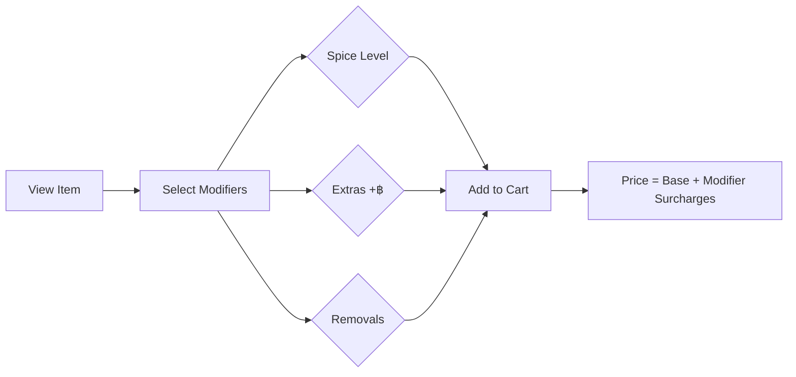

# Card 8: Restaurant Menu Enhancers (Modifiers + Categories)

## Implementation Status

> **100% Complete** | `████████████████████` | All features implemented: model fields, price calculation, modifier selection UI, cart display, admin config (JSON schema), JSON menu loader, category sort order.

## Flow Diagram



**Phase:** 3 — Restaurant Flow Polish
**Priority:** Medium
**Effort:** Medium (1-2 days)
**Dependencies:** None

---

## Why

Restaurant orders need customization: spice level, toppings, protein choice, "no onion", "extra rice". The current `Goods` model has no modifier support. Categories exist but need restaurant-style ordering (Starters → Mains → Drinks → Desserts).

## Scope

- Add modifier system to products (spice level, extras, removals) with optional price adjustments
- Restaurant-style category ordering via sort_order
- Modifier selection during add-to-cart flow
- Modifiers stored with cart items and order items

## Files to Modify

| File | Changes |
|------|---------|
| `bot/database/models/main.py` | Add `modifiers` (JSON) to `Goods`. Add `selected_modifiers` (JSON) to `ShoppingCart` and `OrderItem`. Add `sort_order` (Integer) to `Categories`. |
| `bot/handlers/user/shop_and_goods.py` | Show modifiers on product view. After "Add to Cart": present modifier selection (inline buttons). |
| `bot/handlers/user/cart_handler.py` | Display selected modifiers in cart view. Include modifiers in order summary. |
| `bot/handlers/user/order_handler.py` | Pass modifiers through to OrderItem creation |
| `bot/handlers/admin/adding_position_states.py` | Add modifier configuration step when adding product |
| `bot/handlers/admin/update_position_states.py` | Edit modifiers for existing products |
| `bot_cli.py` | Display modifiers in order details. Add modifier management commands. |
| `bot/keyboards/inline.py` | Modifier selection buttons (multi-select with checkmarks) |
| `bot/i18n/strings.py` | Modifier-related strings |

## Implementation Details

### Modifier Schema (JSON on Goods)
```python
{
    "spice_level": {
        "label": "Spice Level",
        "type": "single",        # single choice
        "required": true,
        "options": [
            {"id": "mild", "label": "Mild", "price": 0},
            {"id": "medium", "label": "Medium", "price": 0},
            {"id": "hot", "label": "Hot", "price": 0},
            {"id": "thai_hot", "label": "Thai Hot", "price": 0}
        ]
    },
    "extras": {
        "label": "Extras",
        "type": "multi",          # multiple choices
        "required": false,
        "options": [
            {"id": "extra_rice", "label": "Extra Rice", "price": 20},
            {"id": "egg", "label": "Fried Egg", "price": 15},
            {"id": "extra_meat", "label": "Extra Meat", "price": 40}
        ]
    },
    "removals": {
        "label": "Remove",
        "type": "multi",
        "required": false,
        "options": [
            {"id": "no_onion", "label": "No Onion", "price": 0},
            {"id": "no_cilantro", "label": "No Cilantro", "price": 0},
            {"id": "no_peanut", "label": "No Peanuts", "price": 0}
        ]
    }
}
```

### Selected Modifiers (stored on CartItem / OrderItem)
```python
{
    "spice_level": "thai_hot",
    "extras": ["extra_rice", "egg"],
    "removals": ["no_onion"]
}
```

### Price Calculation
```python
def calculate_item_price(goods, selected_modifiers):
    base_price = goods.price
    modifier_total = Decimal(0)
    for group_key, selection in selected_modifiers.items():
        group = goods.modifiers[group_key]
        if isinstance(selection, list):  # multi
            for opt_id in selection:
                opt = next(o for o in group["options"] if o["id"] == opt_id)
                modifier_total += Decimal(str(opt["price"]))
        else:  # single
            opt = next(o for o in group["options"] if o["id"] == selection)
            modifier_total += Decimal(str(opt["price"]))
    return base_price + modifier_total
```

### Category Sort Order
```python
sort_order = Column(Integer, default=0)
# Admin sets: Starters=1, Mains=2, Drinks=3, Desserts=4
# Query: order_by(Categories.sort_order)
```

## Acceptance Criteria

- [x] Products can have configurable modifiers (single/multi choice) (`Goods.modifiers` JSON field)
- [x] Modifiers with price adjustments calculate correctly (`bot/utils/modifiers.py` with tests)
- [x] User selects modifiers when adding to cart (`cart_handler.py` modifier selection FSM flow)
- [x] Cart displays items with selected modifiers (`_format_selected_modifiers` in cart display)
- [x] Order items store selected modifiers (`OrderItem.selected_modifiers`, `ShoppingCart.selected_modifiers`)
- [x] Admin can configure modifiers per product (JSON schema input in product creation + manage modifiers menu)
- [x] Categories have sort order for restaurant-style menu (`Categories.sort_order`)
- [x] JSON menu loader for importing menus with modifiers (`tests/e2e/menu_loader.py`)
- [x] Item details show available modifiers with prices (`shop_and_goods.py`)

## Test Plan

| Test File | Tests | What to Assert |
|-----------|-------|----------------|
| `tests/unit/database/test_models.py` | `test_goods_modifiers_json` | Goods stores/retrieves modifier schema JSON |
| | `test_order_item_selected_modifiers` | OrderItem stores selected modifier choices |
| | `test_cart_item_selected_modifiers` | ShoppingCart stores selected modifiers |
| | `test_categories_sort_order` | Categories have `sort_order` integer, default 0 |
| `tests/unit/utils/test_modifiers.py` | `test_calculate_item_price_no_modifiers` | Base price unchanged when no modifiers |
| | `test_calculate_item_price_single_choice` | Single-choice modifier with price adds correctly |
| | `test_calculate_item_price_multi_extras` | Multiple extras sum correctly |
| | `test_calculate_item_price_free_removals` | Removals with price=0 don't change total |
| | `test_calculate_item_price_combined` | Single + multi + removals all together |
| | `test_validate_modifier_selection_required` | Required modifier group raises error if missing |
| | `test_validate_modifier_selection_invalid_id` | Invalid option ID raises error |
| `tests/unit/database/test_cart.py` | `test_add_to_cart_with_modifiers` | Cart stores item + selected modifiers |
| | `test_cart_total_with_modifier_prices` | Cart total includes modifier price adjustments |
| `tests/integration/test_order_lifecycle.py` | `test_order_with_modifiers_flow` | Add item with modifiers → checkout → order items have correct modifiers + prices |
