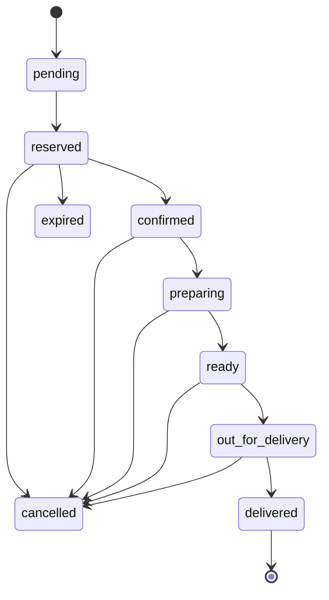

# Card 9: Kitchen & Delivery Status Workflow + Group Notifications

## Implementation Status

> **100% Complete** | `████████████████████` | Full order management handler with status filtering, transitions, kitchen/rider group notifications with action buttons, customer status notifications, delivery photo enforcement, and i18n for all 7 locales.

## Flow Diagram



**Phase:** 3 — Restaurant Flow Polish
**Priority:** Medium
**Effort:** Medium (1-2 days)
**Dependencies:** Cards 1-4 (uses GPS links, delivery types, photo proof)

---

## Why

Restaurant orders need real-time status updates: kitchen prep, ready for pickup, out for delivery. The current flow (`pending→reserved→confirmed→delivered`) doesn't distinguish kitchen and delivery stages. Kitchen staff and riders need separate Telegram group notifications with role-appropriate information.

## Scope

- Extended order statuses: `pending → reserved → confirmed → preparing → ready → out_for_delivery → delivered`
- Auto-forward confirmed orders to kitchen Telegram group
- Notify rider group when order is ready
- Customer receives status updates at each stage
- Admin/kitchen/rider can update status via inline buttons in their respective groups

## Files to Modify

| File | Changes |
|------|---------|
| `bot/database/models/main.py` | Extend `order_status` allowed values. Add `kitchen_group_message_id` and `rider_group_message_id` to `Order`. |
| `bot/config/env.py` | Add `KITCHEN_GROUP_ID`, `RIDER_GROUP_ID` env vars |
| `bot/handlers/admin/main.py` | Status transition buttons per current state. Kitchen: "Preparing" → "Ready". Rider: "Out for Delivery" → "Delivered". |
| `bot/payments/notifications.py` | Add `notify_kitchen_group()`, `notify_rider_group()`, `notify_customer_status_update()`. Kitchen sees items+modifiers, rider sees address+GPS. |
| `bot_cli.py` | Add `--status-preparing`, `--status-ready`, `--status-out-for-delivery` flags |
| `bot/keyboards/inline.py` | Status transition buttons for kitchen/rider groups |
| `bot/i18n/strings.py` | Status labels in Thai/English |
| `bot/tasks/reservation_cleaner.py` | Only expire `reserved` orders, not `preparing`/`ready` |

## Implementation Details

### Extended Status Flow
```
pending → reserved → confirmed → preparing → ready → out_for_delivery → delivered
                   ↘ cancelled                                        ↘ cancelled
                   ↘ expired
```

### Group Notification Flow
```
Order Confirmed (admin verifies payment)
  → Forward to Kitchen Group with items, modifiers, order code
  → Kitchen clicks "Start Preparing"
  → Customer notified: "Your order is being prepared!"

Kitchen clicks "Ready"
  → Forward to Rider Group with address, GPS link, phone, COD amount
  → Customer notified: "Your order is ready!"

Rider clicks "Picked Up"
  → Customer notified: "Your order is on the way!"

Rider uploads delivery photo (Card 4)
  → Auto-delivered
  → Customer notified with photo
```

### Kitchen Group Message Format
```
New Order: ABCDEF
14:30

1x Pad Thai (hot, no onion)
2x Fried Rice + Egg
1x Thai Iced Tea

Note: Extra spicy please

[Start Preparing]
```

### Rider Group Message Format
```
Order ABCDEF — READY FOR PICKUP

Door Delivery
Google Maps: [link]
081-234-5678
Gate code: 1234, building B

COD: ฿450

[Mark Picked Up]
```

### Config
```env
KITCHEN_GROUP_ID=-1001234567890
RIDER_GROUP_ID=-1001234567891
```

## Acceptance Criteria

- [x] Order flows through all extended statuses
- [x] Kitchen group receives formatted order on confirmation (with inline buttons)
- [x] Rider group notified when order is ready (address, phone, GPS, payment details with buttons)
- [x] Customer receives status updates at each stage
- [x] Kitchen can mark "Start Preparing" and "Mark Ready" via inline buttons
- [x] Rider can mark "Picked Up" and "Delivered" via inline buttons
- [x] CLI supports all new status transitions
- [x] Reservation cleaner only expires `reserved` orders
- [x] `bot/handlers/admin/order_management.py` with order list, detail view, status filtering
- [x] Status change validation (`is_valid_transition`)
- [x] Delivery photo enforcement for dead drop orders
- [x] Admin console has Orders button
- [x] i18n strings for all 7 locales (th/en/ru/ar/fa/ps/fr)

## Test Plan

| Test File | Tests | What to Assert |
|-----------|-------|----------------|
| `tests/unit/database/test_models.py` | `test_order_extended_statuses` | All statuses valid: pending, reserved, confirmed, preparing, ready, out_for_delivery, delivered, cancelled, expired |
| | `test_order_group_message_ids` | `kitchen_group_message_id`, `rider_group_message_id` nullable |
| `tests/unit/database/test_crud.py` | `test_update_order_status_preparing` | confirmed → preparing transition works |
| | `test_update_order_status_ready` | preparing → ready transition works |
| | `test_update_order_status_out_for_delivery` | ready → out_for_delivery transition works |
| | `test_invalid_status_transition` | Cannot skip statuses (e.g., confirmed → delivered directly) |
| `tests/unit/notifications/test_group_notifications.py` | `test_format_kitchen_message` | Kitchen message contains items, modifiers, order code |
| | `test_format_rider_message` | Rider message contains address, GPS link, phone, COD amount |
| `tests/integration/test_order_lifecycle.py` | `test_full_kitchen_to_delivery_flow` | confirmed → preparing → ready → out_for_delivery → delivered |
| | `test_reservation_cleaner_ignores_preparing` | Only `reserved` orders get expired |
