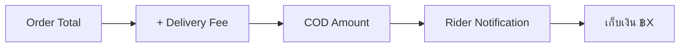

# Card 11: Cash on Delivery — Thai Localization

## Implementation Status

> **100% Complete** | `████████████████████` | Thai COD labels, rider notification amounts, and tests fully implemented.

## Flow Diagram

**Phase:** 3 — Restaurant Flow Polish
**Priority:** Low
**Effort:** Very Low (1-2 hours)
**Dependencies:** Card 5 (Thai language), Card 10 (delivery fee for COD total)

---

## Why

Cash on Delivery already exists in the repo and works correctly. This card simply relocalizes it for Thailand — Thai labels, prominent cash amount display for riders, and inclusion of delivery fee in the total the rider needs to collect.

## Scope

- Rename COD labels to Thai
- Add "waiting for cash" status indicator
- Rider notification prominently shows cash amount to collect (order total + delivery fee)

## Files to Modify

| File | Changes |
|------|---------|
| `bot/i18n/strings.py` | Add Thai COD strings: `"เก็บเงินปลายทาง"` (COD), `"รอเก็บเงิน"` (Waiting for Cash) |
| `bot/handlers/user/order_handler.py` | Update COD payment method label to Thai |
| `bot/payments/notifications.py` | Rider notification includes COD amount: `"เก็บเงิน ฿450"` |
| `bot_cli.py` | Show COD indicator in order details |

## Implementation Details

- Minimal changes — COD flow already works
- Main addition: rider sees cash amount prominently in their notification
- Cash amount = order total + delivery fee (from Card 10)
- Thai label: `"เก็บเงินปลายทาง"` = "Collect money at destination"

## Acceptance Criteria

- [x] COD labels in Thai
- [x] Rider notification shows cash amount to collect
- [x] COD includes delivery fee in total

## Test Plan

| Test File | Tests | What to Assert |
|-----------|-------|----------------|
| `tests/unit/i18n/test_strings.py` | `test_cod_thai_label` | COD string key returns `"เก็บเงินปลายทาง"` in th locale |
| `tests/unit/notifications/test_group_notifications.py` | `test_rider_cod_amount_includes_delivery_fee` | COD amount = order total + delivery fee |
