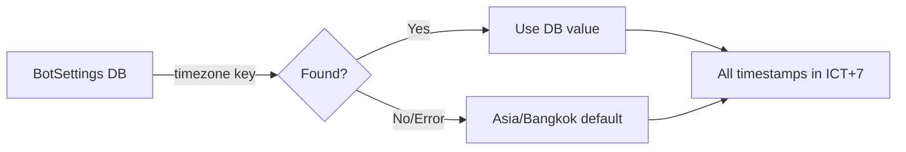

# Card 12: Timezone + Background Tasks (ICT +07)

## Implementation Status

> **100% Complete** | `████████████████████` | Bangkok timezone config, aware timestamps, reservation cleaner, and tests fully implemented.

## Flow Diagram



**Phase:** 3 — Restaurant Flow Polish
**Priority:** High (foundational — do first)
**Effort:** Very Low (1-2 hours)
**Dependencies:** None

---

## Why

Thailand is UTC+7 (ICT). All timestamps, reservation expiry, time slots, and scheduled tasks must use Bangkok time. The repo has timezone support but defaults to UTC. Incorrect timezone causes reservation expiry bugs and confusing timestamps for admins and customers.

## Scope

- Set default timezone to Asia/Bangkok
- Verify all timestamp operations use configured timezone
- Ensure reservation_cleaner respects timezone
- CLI time displays in Bangkok time

## Files to Modify

| File | Changes |
|------|---------|
| `bot/config/timezone.py` | Set default to `"Asia/Bangkok"` |
| `.env.example` | Update timezone example |
| `bot/tasks/reservation_cleaner.py` | Verify timezone-aware datetime comparisons |
| `bot_cli.py` | Ensure CLI time displays in Bangkok time |
| `bot/database/models/main.py` | Verify all `DateTime` columns use timezone-aware defaults |

## Implementation Details

### Config Change
```python
# bot/config/timezone.py
DEFAULT_TIMEZONE = "Asia/Bangkok"
```

### Verification Checklist
- `Order.created_at` — uses timezone-aware `func.now()`?
- `Order.reserved_until` — calculated with correct TZ?
- `reservation_cleaner.py` — compares with TZ-aware `now()`?
- CLI time displays — formatted in Bangkok time?
- Time slot labels (Card 10) — match Bangkok time?

## Acceptance Criteria

- [x] Default timezone is Asia/Bangkok
- [x] All displayed times in ICT (+07)
- [x] Reservation expiry works correctly in Bangkok timezone
- [x] CLI shows Bangkok time
- [x] No UTC/ICT mismatch bugs

## Test Plan

| Test File | Tests | What to Assert |
|-----------|-------|----------------|
| `tests/unit/config/test_timezone.py` | `test_default_timezone_bangkok` | Default is `"Asia/Bangkok"` |
| | `test_timezone_aware_now` | `get_now()` returns UTC+7 aware datetime |
| | `test_reservation_expiry_timezone` | `reserved_until` calculated in correct TZ |
| `tests/unit/tasks/test_reservation_cleaner.py` | `test_cleaner_uses_timezone_aware_comparison` | Expired check uses TZ-aware now(), not naive UTC |
| | `test_cleaner_does_not_expire_future_orders` | Order with `reserved_until` in future (ICT) not expired |
