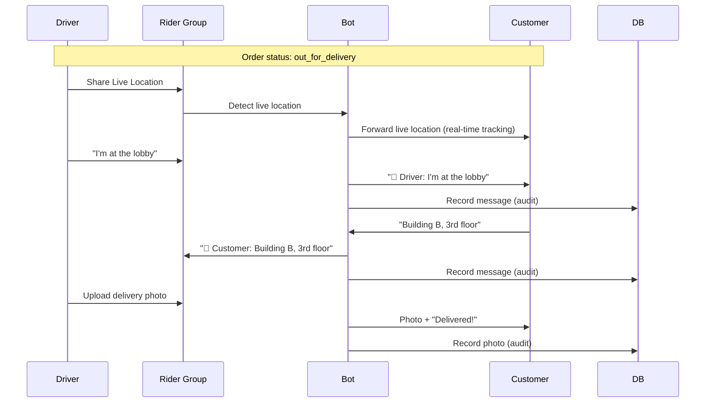

# Card 13: Driver-Customer Chat Relay + Live Location Tracking

**Phase:** 4 — Delivery Experience
**Priority:** High
**Effort:** Medium (1 day)
**Dependencies:** Card 9 (Kitchen/Rider groups)

---

## Implementation Status: 85% Complete

- [x] Model: `DeliveryChatMessage` table for audit trail
- [x] Model: `driver_id`, `driver_live_location_message_id` on Order
- [x] Handler: `delivery_chat_handler.py` with relay functions
- [x] i18n: Chat strings in ru/en/th
- [x] Tests: 7 tests passing
- [ ] Handler: Wire into rider group message listener
- [ ] Handler: Wire customer reply detection for active deliveries

---

## Why

Drivers need to communicate with customers during delivery ("which building?", "gate code?", "I'm at the lobby"). Customers need to track where the driver is. All messages must be recorded for dispute resolution and quality control. Telegram's live location feature (up to 8 hours) is perfect for real-time tracking.

## Flow Diagram



## Scope

- Driver sends messages in rider group → bot relays to customer with "Driver:" prefix
- Customer replies via bot → bot relays to rider group with "Customer:" prefix
- All messages (text, photo, location) recorded in `delivery_chat_messages` table
- Driver shares Telegram live location → forwarded to customer for real-time tracking
- Chat history retrievable for admin dispute resolution

## Files Created

| File | Purpose |
|------|---------|
| `bot/handlers/user/delivery_chat_handler.py` | Chat relay logic + live location forwarding |
| `tests/unit/database/test_delivery_chat.py` | 7 tests for chat recording + driver fields |

## Files Modified

| File | Changes |
|------|---------|
| `bot/database/models/main.py` | Added `DeliveryChatMessage` model + `driver_id`, `driver_live_location_message_id` on Order |
| `bot/i18n/strings.py` | Chat strings in ru/en/th |

## Model: DeliveryChatMessage

```python
class DeliveryChatMessage(Base):
    id = Column(Integer, primary_key=True)
    order_id = Column(Integer, ForeignKey('orders.id'))
    sender_id = Column(BigInteger)           # Telegram ID
    sender_role = Column(String(20))         # 'driver' or 'customer'
    message_text = Column(Text, nullable=True)
    photo_file_id = Column(String(255), nullable=True)
    location_lat = Column(Float, nullable=True)
    location_lng = Column(Float, nullable=True)
    telegram_message_id = Column(Integer, nullable=True)
    created_at = Column(DateTime, server_default=func.now())
```

## Model: Order additions

```python
driver_live_location_message_id = Column(Integer, nullable=True)
driver_id = Column(BigInteger, nullable=True)
```

## Key Implementation Details

### Live Location Forwarding
- Telegram's `live_period` in location messages enables real-time tracking (up to 8 hours)
- When driver shares live location in rider group, bot forwards it to customer
- Customer sees a moving pin on the map that updates automatically
- `driver_live_location_message_id` stored on Order for reference

### Message Recording
- Every relayed message is stored in `delivery_chat_messages` with:
  - Who sent it (driver/customer)
  - What was sent (text/photo/location)
  - When it was sent
  - Original Telegram message ID
- Indexed by `(order_id, created_at)` for fast history retrieval

### Chat History API
```python
history = await get_chat_history(order_id)
# Returns list of dicts with sender_role, message_text, photo_file_id, timestamps
```

## Test Plan

| Test | What to Assert |
|------|----------------|
| `test_create_driver_text_message` | Driver text recorded with correct role |
| `test_create_customer_text_message` | Customer text recorded with correct role |
| `test_record_photo_message` | Photo file_id stored, text is None |
| `test_record_location_message` | Lat/lng stored correctly |
| `test_chat_history_ordered` | Messages returned in chronological order |
| `test_driver_fields_nullable` | driver_id and live_location_msg_id default None |
| `test_assign_driver_and_live_location` | Can assign driver + live location message |
