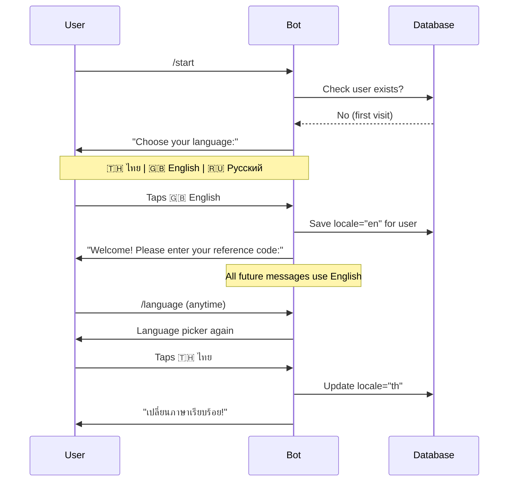

# Card 14: Language Picker at Start + Per-User Locale Memory

**Phase:** 4 — User Experience
**Priority:** High
**Effort:** Medium (1 day)
**Dependencies:** Card 5 (Thai i18n — all 3 locales must exist)

---

## Implementation Status: 100% Complete

- [x] `User.locale` column added to model + DB migration
- [x] `AVAILABLE_LOCALES` registry with 7 languages (th/en/ru/ar/fa/ps/fr)
- [x] `language_picker_keyboard()` with flag buttons
- [x] `/start` shows picker before reference code for new users
- [x] `/language` command to change anytime
- [x] `set_locale_` callback saves to DB + confirms in selected language
- [x] `localize()` accepts `locale` param for per-user override
- [x] `set_request_locale()` middleware-style per-request override
- [x] `get_user_locale()` reads from User table
- [x] `create_user()` accepts `locale` parameter
- [x] Full translations: th, en, ru, ar (401 keys each)
- [x] 17 tests in `test_language_picker.py`
- [x] Partial translations: fa, ps, fr (fallback to Thai/English works for missing keys)

---

## Why

The bot currently uses a single global locale (`BOT_LOCALE=th`). All users see Thai regardless of their preference. Bangkok has a large expat and tourist population who need English. The bot already has full `th`, `en`, and `ru` translations — but no way for users to choose.

A language picker shown immediately after `/start` (before the reference code prompt) lets each user select their preferred language. The choice is stored per-user and respected for all future interactions. New languages can be added by simply adding a locale dict to `strings.py` and an emoji flag to the picker.

## Flow Diagram



## Scope

- Language picker shown on first `/start` before reference code prompt
- `/language` command available anytime to change preference
- Per-user locale stored in `User` model (new `locale` column)
- `localize()` function reads user's locale instead of global `BOT_LOCALE`
- Extensible: adding a new language = add dict to `strings.py` + flag to picker
- Global `BOT_LOCALE` becomes the fallback for users who haven't chosen yet

## Files to Modify

| File | Changes |
|------|---------|
| `bot/database/models/main.py` | Add `locale` (String(5), default=None) to `User` model |
| `bot/i18n/main.py` | Change `localize()` to accept optional `user_locale` param. Add `get_user_locale(telegram_id)` function that reads from User table with fallback to `BOT_LOCALE`. |
| `bot/i18n/strings.py` | Add `AVAILABLE_LOCALES` dict: `{"th": "🇹🇭 ไทย", "en": "🇬🇧 English", "ru": "🇷🇺 Русский"}` |
| `bot/handlers/user/main.py` | In `/start` handler: if user has no locale set → show language picker before reference code. Add `/language` command handler. |
| `bot/states/user_state.py` | Add `waiting_language` state |
| `bot/keyboards/inline.py` | Add `language_picker_keyboard()` that builds buttons from `AVAILABLE_LOCALES` |
| `bot/middleware/security.py` or new middleware | Inject user's locale into handler context so `localize()` can use it without explicit param |

## Files to Create

| File | Purpose |
|------|---------|
| `tests/unit/i18n/test_language_picker.py` | Tests for locale storage, retrieval, fallback, picker rendering |

## Implementation Details

### User Model Addition
```python
# In User model
locale = Column(String(5), nullable=True)  # 'th', 'en', 'ru', etc. None = use BOT_LOCALE default
```

### Available Locales Registry
```python
# In bot/i18n/strings.py
AVAILABLE_LOCALES = {
    "th": "🇹🇭 ไทย",
    "en": "🇬🇧 English",
    "ru": "🇷🇺 Русский",
}
# To add a new language:
# 1. Add translations to TRANSLATIONS["xx"] dict
# 2. Add entry here: "xx": "🏳️ Language Name"
# That's it — picker auto-includes it
```

### Language Picker Keyboard
```python
def language_picker_keyboard():
    buttons = [
        (label, f"set_locale_{code}")
        for code, label in AVAILABLE_LOCALES.items()
    ]
    return simple_buttons(buttons, per_row=2)
```

### Localize with Per-User Locale
```python
def localize(key: str, /, user_locale: str = None, **kwargs) -> str:
    # Priority: explicit user_locale > user's saved locale > BOT_LOCALE > DEFAULT_LOCALE
    loc = user_locale or get_locale()
    text = TRANSLATIONS.get(loc, {}).get(key)
    if text is None:
        text = TRANSLATIONS.get(DEFAULT_LOCALE, {}).get(key)
    if text is None:
        text = key
    if kwargs:
        try:
            text = text.format(**kwargs)
        except (KeyError, ValueError, TypeError):
            pass
    return str(text)
```

### Middleware Approach (Recommended)
Instead of passing `user_locale` everywhere, inject it into the handler context via middleware:

```python
# In middleware or handler registration
async def inject_user_locale(handler, event, data):
    user_id = event.from_user.id if event.from_user else None
    if user_id:
        # Cache-friendly: read from User table (cached)
        locale = get_user_locale(user_id)  # returns 'th'/'en'/'ru' or None
        if locale:
            data['user_locale'] = locale
            # Override the LRU-cached get_locale for this request
    return await handler(event, data)
```

### /start Flow Change
```
Current:  /start → reference code prompt (if new user)
New:      /start → language picker (if no locale set) → reference code prompt (if new user)
          /start → main menu (if returning user with locale already set)
```

### /language Command
```
User sends /language → bot shows picker → user taps flag → locale saved → confirmation in new language
```

## Acceptance Criteria

- [x] New users see language picker on first `/start`
- [x] Picker shows all languages from `AVAILABLE_LOCALES`
- [x] Selected language saved to `User.locale` column
- [x] All subsequent messages use the selected language
- [x] `/language` command shows picker anytime to change
- [x] Confirmation message shown in the newly selected language
- [x] Users without a locale preference fall back to `BOT_LOCALE` (th)
- [x] Adding a new language requires only: translations dict + `AVAILABLE_LOCALES` entry
- [x] Existing users (locale=None) continue to see Thai (default)

## Test Plan

| Test File | Tests | What to Assert |
|-----------|-------|----------------|
| `tests/unit/i18n/test_language_picker.py` | `test_user_locale_field_nullable` | User.locale defaults to None |
| | `test_user_locale_stores_value` | Can set locale='en' and persist |
| | `test_available_locales_has_all_languages` | AVAILABLE_LOCALES has th, en, ru |
| | `test_available_locales_match_translations` | Every key in AVAILABLE_LOCALES exists in TRANSLATIONS |
| | `test_localize_with_user_locale_override` | `localize(key, user_locale='en')` returns English |
| | `test_localize_falls_back_to_default` | Unknown locale falls back to DEFAULT_LOCALE |
| | `test_localize_missing_key_returns_key` | Missing key returns the key string itself |
| | `test_picker_buttons_match_available_locales` | Keyboard has one button per AVAILABLE_LOCALES entry |
| `tests/unit/database/test_models.py` | `test_user_locale_column` | Column exists, nullable, String(5) |

## Extensibility

To add a new language (e.g., Chinese):

```python
# 1. In bot/i18n/strings.py — add translations
TRANSLATIONS["zh"] = {
    "btn.shop": "🏪 商店",
    "btn.profile": "👤 个人资料",
    # ... all keys
}

# 2. In bot/i18n/strings.py — register in picker
AVAILABLE_LOCALES["zh"] = "🇨🇳 中文"

# Done — picker auto-shows the new option
```
