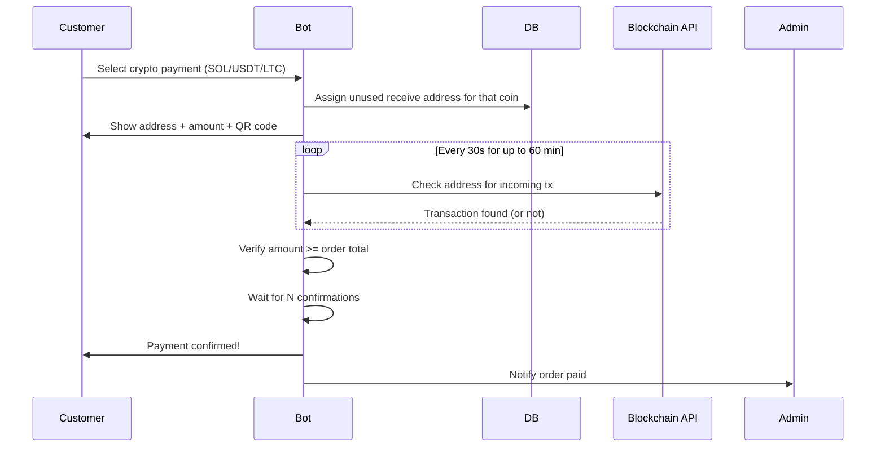

# Card 18: Multi-Crypto Payments (SOL, USDT, LTC) with On-Chain Verification

## Implementation Status

> **100% Complete** | `███████████████████` | Shipped in commit 74ef596 — multi-coin verifiers (BTC/LTC/SOL/USDT-SPL), address pool with SKIP LOCKED claim, CoinGecko price feed, background payment checker, 43 new tests.

**Phase:** 2 — Payment Infrastructure
**Priority:** High
**Effort:** High (5-7 days)
**Dependencies:** Existing Bitcoin address pool system, Order model

---

## Flow Diagram



---

## Why

The current BTC payment flow assigns an address but has **zero on-chain verification** — the admin must manually confirm every payment. This doesn't scale and is error-prone. Additionally, customers want to pay with coins beyond just Bitcoin:

- **Solana (SOL)** — fast finality (~400ms), very low fees, popular with younger users
- **USDT (Tether)** — stablecoin pegged to USD, no volatility risk for the shop, available on multiple chains (we'll support Solana SPL + ERC-20/TRC-20 as future options)
- **Litecoin (LTC)** — faster block times than BTC (2.5 min), low fees, widely supported

By querying public blockchain APIs we can **automatically detect and confirm payments** to the receive addresses we provide, eliminating manual admin work.

---

## Scope

- Add `solana`, `usdt_sol`, and `litecoin` as new payment methods alongside existing `bitcoin` and `cash`
- Generalize the address pool system to support multiple coin types
- Implement on-chain payment verification via public blockchain APIs (no node required)
- Background polling task that checks pending crypto orders for incoming transactions
- Auto-confirm orders once payment is detected with sufficient confirmations
- **Retrofit BTC** — the existing Bitcoin flow also gets on-chain verification (no more manual-only)
- Admin notification when payment is detected and when it's fully confirmed

---

## Blockchain APIs

All APIs are free-tier / no-auth for basic usage. We use public block explorers with JSON APIs:

| Coin | API | Endpoint | Rate Limit (free) |
|------|-----|----------|-------------------|
| **BTC** | Blockstream.info | `GET /api/address/{addr}/txs` | ~10 req/s |
| **LTC** | BlockCypher | `GET /v1/ltc/main/addrs/{addr}` | 200 req/hr (no key), 2000/hr (free key) |
| **SOL** | Solana public RPC / Helius | `getSignaturesForAddress` + `getTransaction` | Public RPC: ~10 req/s; Helius free: 10 req/s |
| **USDT (SPL on Solana)** | Solana RPC / Helius | `getTokenAccountsByOwner` + parse amount | Same as SOL |

### Fallback Strategy

Each coin has a primary and fallback API to handle outages:

| Coin | Primary | Fallback |
|------|---------|----------|
| BTC | Blockstream.info | mempool.space |
| LTC | BlockCypher | Blockchair |
| SOL/USDT-SPL | Helius (free tier) | Solana public RPC |

---

## Database Changes

### New: `CryptoAddress` table (replaces `BitcoinAddress`)

```python
class CryptoAddress(Database.BASE):
    __tablename__ = 'crypto_addresses'

    id = Column(Integer, primary_key=True)
    coin = Column(String(10), nullable=False, index=True)  # 'btc', 'ltc', 'sol', 'usdt_sol'
    address = Column(String(200), nullable=False)
    is_used = Column(Boolean, nullable=False, default=False, index=True)
    used_by = Column(BigInteger, ForeignKey('users.telegram_id', ondelete="SET NULL"), nullable=True)
    used_at = Column(DateTime(timezone=True), nullable=True)
    order_id = Column(Integer, ForeignKey('orders.id', ondelete="SET NULL"), nullable=True)

    __table_args__ = (
        UniqueConstraint('coin', 'address', name='uq_coin_address'),
        Index('ix_crypto_coin_unused', 'coin', 'is_used'),
    )
```

### New: `CryptoPayment` table (tracks on-chain verification state)

```python
class CryptoPayment(Database.BASE):
    __tablename__ = 'crypto_payments'

    id = Column(Integer, primary_key=True)
    order_id = Column(Integer, ForeignKey('orders.id', ondelete="CASCADE"), nullable=False, unique=True)
    coin = Column(String(10), nullable=False)             # 'btc', 'ltc', 'sol', 'usdt_sol'
    receive_address = Column(String(200), nullable=False)
    expected_amount = Column(Numeric(20, 8), nullable=False)  # In native coin units
    expected_amount_usd = Column(Numeric(12, 2), nullable=True)  # USD equivalent at time of order
    tx_hash = Column(String(200), nullable=True)           # Filled when tx detected
    received_amount = Column(Numeric(20, 8), nullable=True)
    confirmations = Column(Integer, nullable=False, default=0)
    required_confirmations = Column(Integer, nullable=False)  # Varies per coin
    status = Column(String(20), nullable=False, default='awaiting')
        # awaiting -> detected -> confirmed -> expired
    detected_at = Column(DateTime(timezone=True), nullable=True)
    confirmed_at = Column(DateTime(timezone=True), nullable=True)
    expires_at = Column(DateTime(timezone=True), nullable=False)  # Stop polling after this
    last_checked_at = Column(DateTime(timezone=True), nullable=True)
    created_at = Column(DateTime(timezone=True), nullable=False, server_default=func.now())
```

### Modify: `Order` model

```python
# Rename column for generality
crypto_address = Column(String(200), nullable=True)  # Replaces bitcoin_address
payment_coin = Column(String(10), nullable=True)      # 'btc', 'ltc', 'sol', 'usdt_sol'

# payment_method values expand:
# 'bitcoin', 'litecoin', 'solana', 'usdt_sol', 'cash', 'promptpay'
```

### Migration: `BitcoinAddress` -> `CryptoAddress`

```python
# Alembic migration
# 1. Create crypto_addresses table
# 2. Copy all bitcoin_addresses rows with coin='btc'
# 3. Create crypto_payments table
# 4. Add payment_coin column to orders
# 5. Backfill: UPDATE orders SET payment_coin='btc' WHERE payment_method='bitcoin'
# 6. Rename orders.bitcoin_address -> orders.crypto_address
# 7. Drop bitcoin_addresses table (after verifying migration)
```

---

## Address Pool Management

### Address files (one per coin)

```
crypto_addresses/
  btc_addresses.txt       # Existing file, moved here
  ltc_addresses.txt
  sol_addresses.txt
  usdt_sol_addresses.txt  # Solana wallet addresses that hold USDT SPL token accounts
```

### Loader

```python
# bot/payments/crypto_addresses.py

COIN_ADDRESS_FILES = {
    'btc': 'crypto_addresses/btc_addresses.txt',
    'ltc': 'crypto_addresses/ltc_addresses.txt',
    'sol': 'crypto_addresses/sol_addresses.txt',
    'usdt_sol': 'crypto_addresses/usdt_sol_addresses.txt',
}

def load_addresses_for_coin(coin: str) -> int:
    """Load addresses from file into crypto_addresses table."""

def get_available_address(coin: str) -> Optional[str]:
    """Get next unused address for the given coin."""

def mark_address_used(coin: str, address: str, user_id: int, order_id: int) -> bool:
    """Mark address as used, remove from file."""
```

---

## On-Chain Verification Module

### Core interface

```python
# bot/payments/chain_verify.py

from abc import ABC, abstractmethod
from dataclasses import dataclass
from decimal import Decimal
from typing import Optional

@dataclass
class TxResult:
    found: bool
    tx_hash: Optional[str] = None
    amount: Optional[Decimal] = None       # Amount received in native units
    confirmations: Optional[int] = None
    from_address: Optional[str] = None
    block_height: Optional[int] = None
    timestamp: Optional[int] = None

class ChainVerifier(ABC):
    """Base class for blockchain payment verifiers."""

    @abstractmethod
    async def check_payment(self, address: str, expected_amount: Decimal) -> TxResult:
        """Check if a payment >= expected_amount was received at address."""

    @abstractmethod
    def required_confirmations(self) -> int:
        """Minimum confirmations before payment is considered final."""

    @abstractmethod
    def coin_name(self) -> str:
        """Human-readable coin name for display."""
```

### BTC Verifier

```python
# bot/payments/verifiers/btc.py

class BTCVerifier(ChainVerifier):
    API_URL = "https://blockstream.info/api"
    FALLBACK_URL = "https://mempool.space/api"

    async def check_payment(self, address: str, expected_amount: Decimal) -> TxResult:
        """
        GET /api/address/{address}/txs
        Parse transactions, find one sending >= expected_amount to our address.
        Check confirmation count via block height delta.
        """
        async with httpx.AsyncClient(timeout=10) as client:
            try:
                resp = await client.get(f"{self.API_URL}/address/{address}/txs")
                resp.raise_for_status()
            except httpx.HTTPError:
                resp = await client.get(f"{self.FALLBACK_URL}/address/{address}/txs")
                resp.raise_for_status()

            txs = resp.json()
            # Get current block height for confirmation count
            tip_resp = await client.get(f"{self.API_URL}/blocks/tip/height")
            tip_height = int(tip_resp.text)

            for tx in txs:
                received = Decimal(0)
                for vout in tx.get("vout", []):
                    if vout.get("scriptpubkey_address") == address:
                        received += Decimal(vout["value"]) / Decimal(100_000_000)  # satoshis -> BTC

                if received >= expected_amount:
                    block_height = tx.get("status", {}).get("block_height")
                    confirmations = (tip_height - block_height + 1) if block_height else 0
                    return TxResult(
                        found=True, tx_hash=tx["txid"], amount=received,
                        confirmations=confirmations, block_height=block_height,
                    )

        return TxResult(found=False)

    def required_confirmations(self) -> int:
        return 2  # ~20 min; 1 is acceptable for smaller amounts

    def coin_name(self) -> str:
        return "Bitcoin (BTC)"
```

### LTC Verifier

```python
# bot/payments/verifiers/ltc.py

class LTCVerifier(ChainVerifier):
    API_URL = "https://api.blockcypher.com/v1/ltc/main"

    async def check_payment(self, address: str, expected_amount: Decimal) -> TxResult:
        """
        GET /v1/ltc/main/addrs/{address}?limit=10
        BlockCypher returns balance, txrefs with confirmations included.
        """
        async with httpx.AsyncClient(timeout=10) as client:
            params = {"limit": 10}
            if BLOCKCYPHER_API_KEY:
                params["token"] = BLOCKCYPHER_API_KEY

            resp = await client.get(f"{self.API_URL}/addrs/{address}", params=params)
            resp.raise_for_status()
            data = resp.json()

            for tx_ref in data.get("txrefs", []):
                if tx_ref.get("tx_output_n", -1) >= 0:  # Receiving side
                    amount = Decimal(tx_ref["value"]) / Decimal(100_000_000)
                    if amount >= expected_amount:
                        return TxResult(
                            found=True, tx_hash=tx_ref["tx_hash"],
                            amount=amount, confirmations=tx_ref.get("confirmations", 0),
                            block_height=tx_ref.get("block_height"),
                        )

        return TxResult(found=False)

    def required_confirmations(self) -> int:
        return 3  # ~7.5 min

    def coin_name(self) -> str:
        return "Litecoin (LTC)"
```

### SOL Verifier

```python
# bot/payments/verifiers/sol.py

class SOLVerifier(ChainVerifier):
    RPC_URL = os.getenv("SOLANA_RPC_URL", "https://api.mainnet-beta.solana.com")

    async def check_payment(self, address: str, expected_amount: Decimal) -> TxResult:
        """
        1. getSignaturesForAddress — list recent txs touching our address
        2. getTransaction for each — parse SOL transfer amount
        Solana has instant finality after ~400ms, but we check 'finalized' commitment.
        """
        async with httpx.AsyncClient(timeout=10) as client:
            # Get recent signatures
            sig_resp = await client.post(self.RPC_URL, json={
                "jsonrpc": "2.0", "id": 1,
                "method": "getSignaturesForAddress",
                "params": [address, {"limit": 10, "commitment": "finalized"}]
            })
            signatures = sig_resp.json().get("result", [])

            for sig_info in signatures:
                if sig_info.get("err"):
                    continue  # Skip failed txs

                # Fetch full transaction
                tx_resp = await client.post(self.RPC_URL, json={
                    "jsonrpc": "2.0", "id": 1,
                    "method": "getTransaction",
                    "params": [sig_info["signature"], {
                        "encoding": "jsonParsed",
                        "commitment": "finalized"
                    }]
                })
                tx = tx_resp.json().get("result")
                if not tx:
                    continue

                # Parse SOL transfer from pre/post balances
                received = self._parse_sol_received(tx, address)
                if received and received >= expected_amount:
                    return TxResult(
                        found=True, tx_hash=sig_info["signature"],
                        amount=received,
                        confirmations=1,  # 'finalized' = confirmed
                        block_height=tx.get("slot"),
                        timestamp=sig_info.get("blockTime"),
                    )

        return TxResult(found=False)

    def _parse_sol_received(self, tx: dict, address: str) -> Optional[Decimal]:
        """Calculate SOL received by comparing pre/post balances."""
        meta = tx.get("meta", {})
        accounts = tx.get("transaction", {}).get("message", {}).get("accountKeys", [])

        for i, acct in enumerate(accounts):
            pubkey = acct if isinstance(acct, str) else acct.get("pubkey")
            if pubkey == address:
                pre = meta.get("preBalances", [])[i]
                post = meta.get("postBalances", [])[i]
                diff = post - pre
                if diff > 0:
                    return Decimal(diff) / Decimal(1_000_000_000)  # lamports -> SOL
        return None

    def required_confirmations(self) -> int:
        return 1  # Solana finalized = confirmed

    def coin_name(self) -> str:
        return "Solana (SOL)"
```

### USDT on Solana (SPL Token) Verifier

```python
# bot/payments/verifiers/usdt_sol.py

USDT_MINT = "Es9vMFrzaCERmJfrF4H2FYD4KCoNkY11McCe8BenwNYB"  # USDT SPL mint address

class USDTSolVerifier(ChainVerifier):
    RPC_URL = os.getenv("SOLANA_RPC_URL", "https://api.mainnet-beta.solana.com")

    async def check_payment(self, address: str, expected_amount: Decimal) -> TxResult:
        """
        1. getSignaturesForAddress on the USDT token account
        2. Parse SPL token transfer instructions for USDT amount
        """
        async with httpx.AsyncClient(timeout=10) as client:
            # First, find the associated token account for USDT
            ata_resp = await client.post(self.RPC_URL, json={
                "jsonrpc": "2.0", "id": 1,
                "method": "getTokenAccountsByOwner",
                "params": [address, {"mint": USDT_MINT},
                           {"encoding": "jsonParsed"}]
            })
            token_accounts = ata_resp.json().get("result", {}).get("value", [])

            if not token_accounts:
                return TxResult(found=False)  # No USDT account yet

            token_account_pubkey = token_accounts[0]["pubkey"]

            # Get recent transactions on the token account
            sig_resp = await client.post(self.RPC_URL, json={
                "jsonrpc": "2.0", "id": 1,
                "method": "getSignaturesForAddress",
                "params": [token_account_pubkey, {"limit": 10, "commitment": "finalized"}]
            })
            signatures = sig_resp.json().get("result", [])

            for sig_info in signatures:
                if sig_info.get("err"):
                    continue

                tx_resp = await client.post(self.RPC_URL, json={
                    "jsonrpc": "2.0", "id": 1,
                    "method": "getTransaction",
                    "params": [sig_info["signature"], {
                        "encoding": "jsonParsed",
                        "commitment": "finalized"
                    }]
                })
                tx = tx_resp.json().get("result")
                if not tx:
                    continue

                # Parse SPL token transfer amount
                received = self._parse_usdt_received(tx, token_account_pubkey)
                if received and received >= expected_amount:
                    return TxResult(
                        found=True, tx_hash=sig_info["signature"],
                        amount=received, confirmations=1,
                        timestamp=sig_info.get("blockTime"),
                    )

        return TxResult(found=False)

    def _parse_usdt_received(self, tx: dict, token_account: str) -> Optional[Decimal]:
        """Parse USDT amount from SPL token transfer instructions."""
        meta = tx.get("meta", {})
        pre_balances = {b["accountIndex"]: Decimal(b["uiTokenAmount"]["uiAmountString"])
                        for b in meta.get("preTokenBalances", [])
                        if b.get("mint") == USDT_MINT}
        post_balances = {b["accountIndex"]: Decimal(b["uiTokenAmount"]["uiAmountString"])
                         for b in meta.get("postTokenBalances", [])
                         if b.get("mint") == USDT_MINT}

        # Find increase in our token account
        for idx in post_balances:
            pre = pre_balances.get(idx, Decimal(0))
            post = post_balances[idx]
            if post > pre:
                return post - pre
        return None

    def required_confirmations(self) -> int:
        return 1  # Solana finalized

    def coin_name(self) -> str:
        return "USDT (Solana)"
```

### Verifier Registry

```python
# bot/payments/chain_verify.py (continued)

VERIFIERS: dict[str, ChainVerifier] = {
    'btc': BTCVerifier(),
    'ltc': LTCVerifier(),
    'sol': SOLVerifier(),
    'usdt_sol': USDTSolVerifier(),
}

def get_verifier(coin: str) -> ChainVerifier:
    verifier = VERIFIERS.get(coin)
    if not verifier:
        raise ValueError(f"No verifier for coin: {coin}")
    return verifier
```

---

## Background Payment Polling Task

```python
# bot/tasks/payment_checker.py

POLL_INTERVAL = 30  # seconds

async def payment_checker_loop(bot: Bot):
    """
    Background task: poll blockchain APIs for all pending crypto payments.
    Runs every POLL_INTERVAL seconds.
    """
    while True:
        try:
            await check_pending_payments(bot)
        except Exception as e:
            logger.error(f"Payment checker error: {e}")
        await asyncio.sleep(POLL_INTERVAL)

async def check_pending_payments(bot: Bot):
    """Check all crypto_payments with status='awaiting' or 'detected'."""
    with Database().session() as session:
        pending = session.query(CryptoPayment).filter(
            CryptoPayment.status.in_(['awaiting', 'detected']),
            CryptoPayment.expires_at > datetime.now(timezone.utc),
        ).all()

        for payment in pending:
            verifier = get_verifier(payment.coin)
            result = verifier.check_payment(payment.receive_address, payment.expected_amount)

            if result.found:
                payment.tx_hash = result.tx_hash
                payment.received_amount = result.amount
                payment.confirmations = result.confirmations
                payment.last_checked_at = datetime.now(timezone.utc)

                if payment.status == 'awaiting':
                    # First detection
                    payment.status = 'detected'
                    payment.detected_at = datetime.now(timezone.utc)
                    await notify_payment_detected(bot, payment)

                if result.confirmations >= payment.required_confirmations:
                    # Fully confirmed
                    payment.status = 'confirmed'
                    payment.confirmed_at = datetime.now(timezone.utc)
                    await auto_confirm_order(session, payment.order_id)
                    await notify_payment_confirmed(bot, payment)
            else:
                payment.last_checked_at = datetime.now(timezone.utc)

        # Expire old payments
        expired = session.query(CryptoPayment).filter(
            CryptoPayment.status == 'awaiting',
            CryptoPayment.expires_at <= datetime.now(timezone.utc),
        ).all()
        for payment in expired:
            payment.status = 'expired'
            await expire_order(session, payment.order_id)
            await notify_payment_expired(bot, payment)

        session.commit()

async def auto_confirm_order(session, order_id: int):
    """Transition order from pending -> confirmed once payment is verified."""
    order = session.query(Order).get(order_id)
    if order and order.order_status in ('pending', 'reserved'):
        order.order_status = 'confirmed'
```

---

## Confirmation Requirements Per Coin

| Coin | Required Confirmations | Approx. Wait Time | Payment Timeout |
|------|----------------------|-------------------|-----------------|
| BTC | 2 | ~20 min | 60 min |
| LTC | 3 | ~7.5 min | 60 min |
| SOL | 1 (finalized) | ~400ms | 30 min |
| USDT (SOL) | 1 (finalized) | ~400ms | 30 min |

---

## User-Facing Flow

### Payment Method Selection

```
Choose your payment method:

[PromptPay]  [Bitcoin]  [Litecoin]
[SOL]  [USDT (Solana)]  [Cash]
```

### After Selecting a Crypto Payment

```
Order #XKJF92

Total: ฿1,350.00 THB
Rate: 1 BTC = ฿2,450,000 THB
Amount due: 0.00055102 BTC

Send exactly this amount to:
bc1qxy2kgdygjrsqtzq2n0yrf2493p83kkfjhx0wlh

[QR CODE]

⏳ Waiting for payment...
This address expires in 60 minutes.
Rate locked for 2 minutes — refreshes automatically if unpaid.

Your order will be automatically confirmed
once the payment is detected on-chain.
```

### USDT Example (THB → USD conversion shown)

```
Order #XKJF92

Total: ฿1,350.00 THB
Rate: 1 USDT = ฿34.50 THB
Amount due: 39.13 USDT (Solana)

Send exactly this amount to:
7xKXtg2CW87d97TXJSDpbD5jBkheTqA83TZRuJosgAsU

[QR CODE]

⏳ Waiting for payment...
```

### Payment Detected (auto-updated message)

```
Order #XKJF92

✅ Payment detected!
TX: abc123...def456
Amount: 0.00055102 BTC
Confirmations: 1/2

⏳ Waiting for 1 more confirmation...
```

### Payment Confirmed (auto-updated message)

```
Order #XKJF92

✅ Payment confirmed!
TX: abc123...def456
Amount: 0.00055102 BTC
Confirmations: 2/2

Your order is now being processed.
```

---

## Price Conversion

We need to convert the shop's order total (in the shop's configured `PAY_CURRENCY`, default **THB**) to the native crypto amount at the moment the user checks out. CoinGecko supports THB natively (`vs_currencies=thb`), so no USD intermediary is needed.

### How the conversion works

1. User's cart total is in THB (e.g., ฿1,350)
2. At checkout, we call CoinGecko: "What is 1 BTC in THB right now?" → e.g., 2,450,000 THB
3. We compute: `1350 / 2450000 = 0.00055102 BTC` — this is the amount shown to the user
4. This amount + a 2-minute cache TTL is locked into the `CryptoPayment` record
5. The on-chain verifier checks that the received amount >= this locked amount

For **USDT**, since it's pegged to USD (not THB), we first convert THB→USD via CoinGecko's exchange rate, then the USDT amount = the USD equivalent.

```python
# bot/payments/price_feed.py

import httpx
from decimal import Decimal
from datetime import datetime, timedelta
from bot.config.env import EnvKeys

# CoinGecko free API (no key needed, 10-30 req/min)
COINGECKO_URL = "https://api.coingecko.com/api/v3/simple/price"

COIN_IDS = {
    'btc': 'bitcoin',
    'ltc': 'litecoin',
    'sol': 'solana',
    'usdt_sol': None,  # Special case — needs THB->USD conversion
}

_price_cache: dict[str, tuple[Decimal, datetime]] = {}
CACHE_TTL = timedelta(minutes=2)

async def get_crypto_amount(coin: str, fiat_amount: Decimal) -> tuple[Decimal, Decimal]:
    """
    Convert shop currency amount to crypto amount using live price.

    Uses PAY_CURRENCY from config (default: THB).
    CoinGecko supports THB natively — no USD intermediary needed for BTC/LTC/SOL.

    Returns:
        (crypto_amount, exchange_rate) — e.g., (Decimal('0.00055102'), Decimal('2450000'))
    """
    shop_currency = EnvKeys.PAY_CURRENCY.lower()  # 'thb'

    if coin == 'usdt_sol':
        # USDT is pegged to USD, so we need THB->USD conversion
        if shop_currency == 'usd':
            return fiat_amount, Decimal('1')
        # Get USD/THB rate: ask CoinGecko "how much is 1 USD in THB?"
        usd_in_thb = await _get_price('tether', shop_currency)  # e.g., 34.5 THB per USDT
        usdt_amount = (fiat_amount / usd_in_thb).quantize(Decimal('0.01'))  # 2 decimals for USDT
        return usdt_amount, usd_in_thb

    coin_id = COIN_IDS[coin]
    # Get coin price in shop currency (e.g., BTC price in THB)
    price_in_fiat = await _get_price(coin_id, shop_currency)  # e.g., 2,450,000 THB per BTC
    crypto_amount = fiat_amount / price_in_fiat

    # Round appropriately per coin
    if coin == 'btc':
        crypto_amount = crypto_amount.quantize(Decimal('0.00000001'))  # 8 decimals (satoshi)
    elif coin == 'ltc':
        crypto_amount = crypto_amount.quantize(Decimal('0.00000001'))
    elif coin == 'sol':
        crypto_amount = crypto_amount.quantize(Decimal('0.000000001'))  # 9 decimals (lamport)

    return crypto_amount, price_in_fiat

async def _get_price(coin_id: str, fiat_currency: str) -> Decimal:
    """Fetch current price with 2-minute cache. Supports THB, USD, EUR, etc."""
    cache_key = f"{coin_id}_{fiat_currency}"
    if cache_key in _price_cache:
        price, cached_at = _price_cache[cache_key]
        if datetime.now() - cached_at < CACHE_TTL:
            return price

    async with httpx.AsyncClient(timeout=10) as client:
        resp = await client.get(COINGECKO_URL, params={
            "ids": coin_id,
            "vs_currencies": fiat_currency,
        })
        resp.raise_for_status()
        price = Decimal(str(resp.json()[coin_id][fiat_currency]))

    _price_cache[cache_key] = (price, datetime.now())
    return price
```

---

## Config

```env
# New env vars
CRYPTO_PAYMENTS_ENABLED=true
CRYPTO_POLL_INTERVAL=30          # seconds between blockchain checks
CRYPTO_PAYMENT_TIMEOUT_BTC=60    # minutes before payment expires
CRYPTO_PAYMENT_TIMEOUT_LTC=60
CRYPTO_PAYMENT_TIMEOUT_SOL=30
CRYPTO_PAYMENT_TIMEOUT_USDT=30

# Optional API keys (increase rate limits)
BLOCKCYPHER_API_KEY=             # Free tier: register at blockcypher.com
SOLANA_RPC_URL=https://api.mainnet-beta.solana.com  # Or Helius/Alchemy for higher limits
COINGECKO_API_KEY=               # Optional, free tier works without key

# Enabled coins (comma-separated)
CRYPTO_COINS_ENABLED=btc,ltc,sol,usdt_sol
```

---

## Files to Create

| File | Purpose |
|------|---------|
| `bot/payments/chain_verify.py` | `ChainVerifier` ABC + verifier registry |
| `bot/payments/verifiers/__init__.py` | Package init |
| `bot/payments/verifiers/btc.py` | BTC on-chain verification via Blockstream/mempool |
| `bot/payments/verifiers/ltc.py` | LTC on-chain verification via BlockCypher |
| `bot/payments/verifiers/sol.py` | SOL on-chain verification via Solana RPC |
| `bot/payments/verifiers/usdt_sol.py` | USDT SPL token verification via Solana RPC |
| `bot/payments/crypto_addresses.py` | Multi-coin address pool management |
| `bot/payments/price_feed.py` | Live crypto price conversion via CoinGecko |
| `bot/tasks/payment_checker.py` | Background polling task for payment verification |
| `crypto_addresses/btc_addresses.txt` | BTC address pool (migrate from `btc_addresses.txt`) |
| `crypto_addresses/ltc_addresses.txt` | LTC address pool |
| `crypto_addresses/sol_addresses.txt` | SOL address pool |
| `crypto_addresses/usdt_sol_addresses.txt` | USDT (Solana) address pool |
| `tests/unit/payments/test_chain_verify.py` | Unit tests for all verifiers (mocked API responses) |
| `tests/unit/payments/test_price_feed.py` | Price conversion tests |
| `tests/unit/payments/test_crypto_addresses.py` | Address pool tests |

## Files to Modify

| File | Changes |
|------|---------|
| `bot/database/models/main.py` | Add `CryptoAddress`, `CryptoPayment` models. Add `payment_coin`, rename `bitcoin_address` -> `crypto_address` on `Order` |
| `bot/handlers/user/order_handler.py` | Add SOL/LTC/USDT payment method buttons. Refactor `process_bitcoin_payment_new_message` into generic `process_crypto_payment`. Show live price conversion. Store `CryptoPayment` record |
| `bot/payments/bitcoin.py` | Deprecate — redirect to `crypto_addresses.py` with `coin='btc'` |
| `bot/payments/__init__.py` | Export new modules |
| `bot/utils/constants.py` | Add `PAYMENT_LITECOIN`, `PAYMENT_SOLANA`, `PAYMENT_USDT_SOL` |
| `bot/config/env.py` | Add all new `CRYPTO_*` env vars |
| `bot/main.py` | Start `payment_checker_loop` background task on bot startup |
| `bot/i18n/strings.py` | Add strings for new payment methods, detection/confirmation messages |
| `bot/tasks/file_watcher.py` | Watch `crypto_addresses/` directory for new address files |
| `bot/monitoring/metrics.py` | Add crypto payment metrics (detection time, confirmation time, expiry rate) |
| `docker-compose.yml` | Add new env vars |
| `.env.example` | Add new env vars |
| `requirements.txt` | Add `httpx` (if not present), `qrcode[pil]` for address QR codes |
| `bot/ai/schemas.py` | Update `SearchOrdersAction.payment_method` to include new coin types |

---

## Acceptance Criteria

- [ ] User can select SOL, USDT (Solana), or Litecoin at checkout
- [ ] Correct receive address is assigned from the per-coin address pool
- [ ] Live price conversion shows the exact crypto amount to send
- [ ] QR code with address is displayed to the user
- [ ] Background task polls blockchain APIs and detects incoming transactions
- [ ] User's payment message auto-updates when tx is detected (shows tx hash + confirmations)
- [ ] Order auto-confirms once required confirmations are reached
- [ ] Admin is notified on payment detection and confirmation
- [ ] Payments expire after the configured timeout and order is cancelled
- [ ] Existing BTC payments now also verify on-chain (retrofit)
- [ ] Fallback APIs are used when primary API is unreachable
- [ ] Price cache prevents excessive API calls to CoinGecko

---

## Test Plan

| Test File | Test | What to Assert |
|-----------|------|----------------|
| `tests/unit/payments/test_chain_verify.py` | `test_btc_verifier_detects_payment` | Mock Blockstream response, verify `TxResult.found=True` with correct amount |
| | `test_btc_verifier_insufficient_amount` | Payment below expected → `found=False` |
| | `test_btc_verifier_fallback_on_primary_failure` | Primary 500 → falls back to mempool.space |
| | `test_ltc_verifier_detects_payment` | Mock BlockCypher response, correct parsing |
| | `test_sol_verifier_detects_payment` | Mock Solana RPC response, correct lamport->SOL |
| | `test_usdt_sol_verifier_detects_payment` | Mock SPL token transfer parsing |
| | `test_verifier_handles_api_timeout` | httpx.TimeoutException → graceful TxResult(found=False) |
| `tests/unit/payments/test_price_feed.py` | `test_get_crypto_amount_btc` | $100 at BTC=$50000 → 0.002 BTC |
| | `test_usdt_is_1_to_1` | $45 → 45 USDT always |
| | `test_price_cache_ttl` | Second call within 2min uses cache, not API |
| `tests/unit/payments/test_crypto_addresses.py` | `test_load_addresses_per_coin` | Loads only into correct coin bucket |
| | `test_get_available_address_per_coin` | Returns address for requested coin only |
| | `test_mark_used_removes_from_file` | Address removed from txt file after use |
| `tests/unit/payments/test_payment_checker.py` | `test_pending_payment_detected` | Status transitions awaiting→detected, notification sent |
| | `test_detected_payment_confirmed` | Status transitions detected→confirmed, order auto-confirmed |
| | `test_payment_expired` | Past expires_at → status=expired, order cancelled |
| `tests/integration/test_crypto_order_flow.py` | `test_full_sol_order_flow` | Select SOL → address assigned → mock detection → confirmed |
| | `test_full_ltc_order_flow` | Select LTC → address assigned → mock detection → 3 confirms → confirmed |
| `tests/unit/database/test_models.py` | `test_crypto_address_model` | CryptoAddress with coin field persists correctly |
| | `test_crypto_payment_model` | CryptoPayment status transitions work |

---

## Risks & Mitigations

| Risk | Impact | Mitigation |
|------|--------|------------|
| Blockchain API rate limits hit | Payments not detected on time | Use API keys (free tier), cache responses, stagger polling, fallback APIs |
| Price volatility between order and payment | Customer overpays/underpays | 2-min price cache, accept payments within 5% tolerance of expected amount |
| Solana RPC public endpoint unreliable | SOL/USDT payments not detected | Configure Helius or Alchemy as `SOLANA_RPC_URL` (free tiers available) |
| Address pool runs out for a coin | Customers can't pay | Monitor available address count in metrics, admin alert when pool < 5 |
| Customer sends wrong coin to address | Funds lost/undetected | Clear UI labeling, show only the correct coin's address, warn about cross-chain sends |
| Transaction detected but never confirms (stuck/dropped) | Order in limbo | Timeout expires the payment; admin can manually override status |
| Migration breaks existing BTC orders | Data loss | Migration is additive — old `bitcoin_address` column kept as alias until all orders complete |
