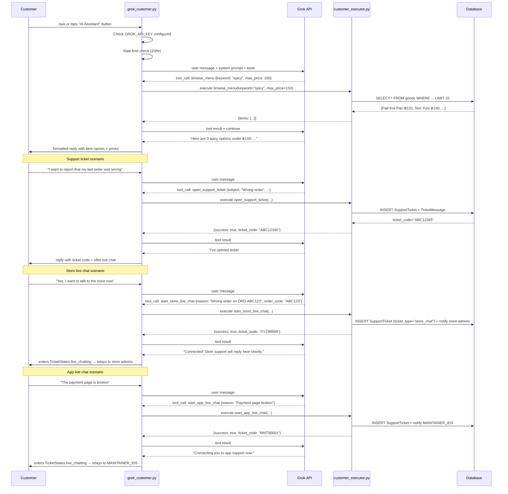

# Card 22: Grok AI Customer Shopping Assistant

## Implementation Status

> **100% Complete** | `███████████████████` | Implemented.

**Phase:** 5 — Customer Intelligence
**Priority:** Medium
**Effort:** Medium (3–5 days)
**Dependencies:** Card 17 (Grok client + rate limiter reusable), Card 21 (cart system stable), SupportTicket model (Card FC6, done)

---

## Why

The current customer experience is entirely button-driven. A customer who wants to know "what's spicy and under ฿150?" must scroll every category manually. Someone who wants to know "is my order arriving soon?" must navigate to order history and decode status codes. A customer who wants to know "which coupon gives me the best deal?" has no way to find out.

A natural language assistant powered by Grok answers all of these immediately — and can also open a support ticket or start a live chat with the maintainers, replacing the `/support` flow with a single conversational entry point.

**Key difference from Card 17 (Admin Assistant):** The customer assistant is **read-only** against the catalog and **scoped to the current user's own data**. It cannot mutate prices, orders, or inventory. Its only write operations are opening support tickets and adding items to cart (future phase).

---

## Architecture Overview

```
┌──────────────────────────────────────────────────────┐
│                  Customer (Telegram)                  │
│  "What's good under ฿150 right now?"                  │
│  "Is there a coupon for my cart?"                     │
│  "Where's my order ORD-ABC123?"                       │
│  "I want to report a bug / open a support ticket"     │
└─────────────────────┬────────────────────────────────┘
                      │
                      ▼
┌──────────────────────────────────────────────────────┐
│            Customer Grok Handler                      │
│  bot/handlers/user/grok_customer.py                   │
│                                                       │
│  • FSM: GrokCustomerStates.chatting                   │
│  • Sends user message + restricted system prompt      │
│  • Rate limit: 20 calls/hour per user                 │
│  • Passes user_id + location into executor context    │
│  • Loops on tool calls until plain-text reply         │
│  • Support ticket / live chat triggered as tool call  │
└──────────┬───────────────────────────────────────────┘
           │
           ▼
┌────────────────────────┐   ┌─────────────────────────┐
│  Customer Schemas      │   │   Grok API (xAI)         │
│  bot/ai/customer_      │   │                          │
│  schemas.py            │   │  Model: grok-3-mini       │
│                        │   │  History: per user FSM   │
│  BrowseMenuAction         │   │  System prompt: scoped   │
│  GetTodaySpecialsAction   │   │  to read + own-account   │
│  FindDealsAction          │   │  tools only              │
│  FindNearbyStoresAction   │   └─────────────────────────┘
│  GetOrderStatusAction     │
│  GetMyAccountAction       │
│  CheckCouponAction        │
│  OpenSupportTicketAction  │
│  StartAppLiveChatAction   │  ← chat with platform maintainers
│  StartStoreLiveChatAction │  ← chat with store admin/staff
└──────────┬────────────────┘
           │
           ▼
┌──────────────────────────────────────────────────────┐
│           Customer Executor                           │
│  bot/ai/customer_executor.py                          │
│                                                       │
│  • All queries scoped to user_id (no cross-user data) │
│  • browse_menu → DB query on Goods + Categories       │
│  • get_today_specials → availability window filter    │
│  • find_deals → active Coupon rows (no personal data) │
│  • find_nearby_stores → Haversine on Store coords     │
│  • get_order_status → Orders WHERE buyer_id=user_id  │
│  • get_my_account → User + bonus + referral_code      │
│  • check_coupon → Coupon validity check               │
│  • open_support_ticket → creates SupportTicket row    │
│  • start_app_live_chat → live session w/ maintainers  │
│    (MAINTAINER_IDS / SUPPORT_CHAT_ID env vars)        │
│  • start_store_live_chat → live session w/ store admin│
│    (notifies Permission.USERS_MANAGE holders via bot) │
└──────────────────────────────────────────────────────┘
```

---

## Customer Tool Definitions

### Read-only catalog tools

#### `browse_menu`
Search the catalog by keyword, category, dietary tag, or price range. Returns matching items with prices, descriptions, and availability.

```python
class BrowseMenuAction(BaseModel):
    action: Literal["browse_menu"] = "browse_menu"
    keyword: Optional[str] = None           # "pad thai", "spicy", "vegan"
    category: Optional[str] = None          # exact category name
    max_price: Optional[Decimal] = None     # e.g. 150.00
    min_price: Optional[Decimal] = None
    in_stock_only: bool = True              # skip sold-out items
    limit: int = Field(default=10, ge=1, le=20)
```

#### `get_today_specials`
Return items whose `available_from`/`available_until` window is currently active (Bangkok time). Useful for "what can I get for breakfast right now?".

```python
class GetTodaySpecialsAction(BaseModel):
    action: Literal["get_today_specials"] = "get_today_specials"
    category: Optional[str] = None
```

#### `find_deals`
Return currently active coupon codes (public ones — no personal/single-use codes). Shows discount type, value, minimum order, and expiry.

```python
class FindDealsAction(BaseModel):
    action: Literal["find_deals"] = "find_deals"
    min_order_max: Optional[Decimal] = None   # filter to coupons requiring ≤ this min order
```

#### `find_nearby_stores`
Given the user's GPS coordinates, return stores sorted by distance with estimated delivery availability.

```python
class FindNearbyStoresAction(BaseModel):
    action: Literal["find_nearby_stores"] = "find_nearby_stores"
    latitude: float = Field(..., ge=-90, le=90)
    longitude: float = Field(..., ge=-180, le=180)
    max_distance_km: float = Field(default=10.0, gt=0, le=50)
```

#### `check_coupon`
Validate a coupon code — is it active, not expired, and what discount does it give?

```python
class CheckCouponAction(BaseModel):
    action: Literal["check_coupon"] = "check_coupon"
    code: str = Field(..., min_length=1, max_length=50)
    order_total: Optional[Decimal] = None   # to show effective discount
```

### Own-account tools (scoped to authenticated user)

#### `get_order_status`
Look up the customer's own recent orders. Cannot access other users' orders.

```python
class GetOrderStatusAction(BaseModel):
    action: Literal["get_order_status"] = "get_order_status"
    order_code: Optional[str] = None    # if None, returns last 5 orders
    limit: int = Field(default=5, ge=1, le=10)
```

#### `get_my_account`
Return the customer's bonus balance, referral code, total orders, and total spent.

```python
class GetMyAccountAction(BaseModel):
    action: Literal["get_my_account"] = "get_my_account"
```

### Support tools

#### `open_support_ticket`
Create a support ticket on behalf of the customer. Notifies maintainers.

```python
class OpenSupportTicketAction(BaseModel):
    action: Literal["open_support_ticket"] = "open_support_ticket"
    subject: str = Field(..., min_length=5, max_length=200)
    description: str = Field(..., min_length=10, max_length=2000)
    priority: Literal["low", "normal", "high"] = "normal"
    order_code: Optional[str] = None    # link to an order if relevant
```

#### `start_app_live_chat`
Escalate to a live chat session with the **platform maintainers** (the developers of this bot). Uses `MAINTAINER_IDS` / `SUPPORT_CHAT_ID` for relay. Calls the existing `TicketStates.live_chatting` flow. Use this for bot bugs, payment failures, or technical issues with the app itself.

```python
class StartAppLiveChatAction(BaseModel):
    action: Literal["start_app_live_chat"] = "start_app_live_chat"
    reason: str = Field(..., min_length=5, max_length=500)
```

#### `start_store_live_chat`
Escalate to a live chat session with the **store's own support staff** (admins who have `Permission.USERS_MANAGE`). Creates a `SupportTicket` with `ticket_type="store_chat"` and notifies all online store admins via the bot. Use this for order issues, food quality complaints, delivery questions, or anything specific to this store's service.

```python
class StartStoreLiveChatAction(BaseModel):
    action: Literal["start_store_live_chat"] = "start_store_live_chat"
    reason: str = Field(..., min_length=5, max_length=500)
    order_code: Optional[str] = None    # attach to a specific order if relevant
```

> **Routing summary:**
> - Bot broken / payment not working / app bug → `start_app_live_chat`
> - Wrong item / late delivery / refund / food complaint → `start_store_live_chat`
> - Either can be preceded by `open_support_ticket` to leave a written record

---

## Conversation Flow



---

## System Prompt (Outline)

```
You are a friendly AI shopping assistant for [Store Name].
You help customers find menu items, check available deals, look up their orders,
and get support.

Rules:
- You can ONLY read catalog data and the current customer's own orders.
- You CANNOT modify prices, orders, or any menu items.
- Never reveal other customers' data.
- For support issues, always offer to open a ticket or start a live chat.
- Respond in the same language the customer writes in.
- Keep responses concise — Telegram messages are short.
- If the customer shares their location, use find_nearby_stores to help them.

Support routing:
- For app/bot/payment bugs → use start_app_live_chat (reaches platform developers)
- For order/food/delivery issues → use start_store_live_chat (reaches store staff)
- Either can be preceded by open_support_ticket to leave a written record first

Available tools: browse_menu, get_today_specials, find_deals, find_nearby_stores,
                 check_coupon, get_order_status, get_my_account,
                 open_support_ticket, start_app_live_chat, start_store_live_chat
```

---

## Entry Points

| Trigger | Location | Notes |
|---------|----------|-------|
| `/ask` command | Any private chat | Direct entry |
| "🤖 AI Assistant" button | Main menu | Below Shop/Cart/Support |
| "Ask AI" button | Item detail view | Pre-loaded with item context |
| `/support` replacement | Support menu | "Chat with AI Support" option added |

The existing `/support` FSM flow is **not removed** — the AI assistant is an additional entry point alongside the existing support menu buttons.

---

## Rate Limiting

Reuses `_check_rate_limit()` logic from Card 17 with tighter limits:

| Parameter | Value |
|-----------|-------|
| Window | 3600s (1 hour) |
| Max calls | 20 per user per window |
| Env var | `GROK_CUSTOMER_RATE_LIMIT` (default 20) |
| On exceeded | Friendly message + offer to open ticket instead |

---

## Files to Create

| File | Purpose |
|------|---------|
| `bot/handlers/user/grok_customer.py` | FSM handler — entry, chat loop, exit |
| `bot/ai/customer_schemas.py` | Pydantic schemas for all 10 customer tools |
| `bot/ai/customer_executor.py` | DB queries + support ticket creation |
| `bot/ai/customer_tool_defs.py` | OpenAI-compatible tool definitions |

## Files to Modify

| File | Change |
|------|--------|
| `bot/main.py` | Register `grok_customer.router` |
| `bot/handlers/user/main_menu.py` | Add "🤖 AI Assistant" button |
| `bot/handlers/user/ticket_handler.py` | Export `_generate_ticket_code`, `_notify_maintainers` so executor can call them |
| `bot/states/user_state.py` | Add `GrokCustomerStates` FSM states (`chatting`, `app_live_chat`, `store_live_chat`) |
| `bot/config/env.py` | Add `GROK_CUSTOMER_RATE_LIMIT` |

---

## Security Constraints

- **No cross-user data leakage** — every query in `customer_executor.py` filters by `user_id` from Telegram auth, never from the AI's requested payload.
- **No mutation tools** — the AI cannot add items, change prices, or touch orders. `open_support_ticket` is the only write operation.
- **Coupon codes shown publicly** — only coupons with `is_active=True` and no `single-use` restriction are surfaced. Personal referral bonuses are not exposed.
- **GPS is optional** — `find_nearby_stores` only runs if the customer explicitly shares location in chat.
- **No admin tool bleedthrough** — customer handler imports `customer_schemas` and `customer_tool_defs` only; never imports from `bot/ai/schemas.py` or `bot/ai/tool_defs.py`.

---

## Acceptance Criteria

- [ ] Customer can ask for menu items by keyword / price / category and receive a list
- [ ] Customer can ask "what's available now?" and get availability-windowed results
- [ ] Customer can share location in chat and receive nearest stores with distances
- [ ] Customer can ask for deals/coupons and receive active ones with conditions
- [ ] Customer can check a coupon code's validity and discount
- [ ] Customer can ask for their order status by code or get last N orders
- [ ] Customer can ask for their bonus balance and referral code
- [ ] Customer can say "open a support ticket" and have the AI collect subject + description + create the ticket
- [ ] Customer can say "I need to talk to the store" and be escalated to store live chat (notifies store admins)
- [ ] Customer can say "the app is broken" and be escalated to app live chat (notifies maintainers via `MAINTAINER_IDS`)
- [ ] Grok correctly routes: order/food complaints → store live chat; app/payment bugs → app live chat
- [ ] Both live chat modes enter `TicketStates.live_chatting` with correct relay targets
- [ ] Rate limit of 20 calls/hour enforced per user — friendly message when exceeded
- [ ] API errors do not charge the rate limit
- [ ] History trimmed to `GROK_MAX_HISTORY` (shared env var with Card 17)
- [ ] Entry from main menu, `/ask`, and Support menu all work
- [ ] No admin tools accessible by any path
- [ ] Responses in same language as customer's message

---

## Out of Scope

- Adding items to cart via AI (future phase — needs deep cart integration)
- AI-driven reorder ("reorder my last order") — future phase
- Personalised recommendations based on order history (future phase — privacy review needed)
- Admin operations of any kind
